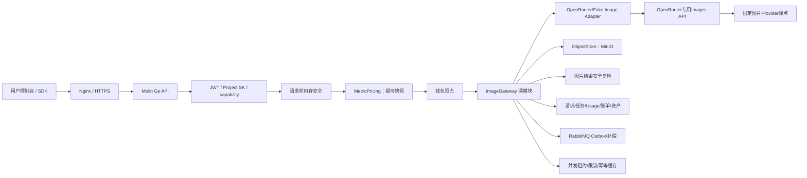

# 墨灵图片网关与计费开发计划

> 文档状态：`ENGINEERING_REVIEWED / OPENROUTER_REAL_POC_PASS / IMG-G0 AUTO_PASS / IMG-G1 AUTO_PASS / IMG-G2 AUTO_PASS / IMG-G3 AUTO_PASS / IMG-G4 AUTO_PASS / IMG-G5 AUTO_PASS / IMG-G6 AUTO_PASS / IMG-G7 AUTO_PASS / IMG-G8 AUTO_PASS / IMG-G0-G8 COMPLETE`
>
> 编制日期：2026-08-24
>
> 代码基线：`origin/main@4e272776ecbbfa40445267badbedae8ad237f481`
>
> 前置阶段：`G8_STAGE_ACCEPTANCE=PASS`、`G8_SOFTWARE_CLOSED_LOOP=COMPLETED`
>
> OpenRouter图片POC：`CATALOG_CHECK=PASS`、`REAL_REQUEST_ATTEMPTED=YES`、`MODEL_AVAILABLE=PASS`、`COST_MATCH=YES`
>
> 适用工作区：`D:\molingproject\molin-gateway-worktree`
>
> 本文规划并记录已完成的IMG-G0～IMG-G8图片网关与计费工程以及一次OpenRouter直连POC；工程完成不代表测试环境当前保留图片链路、生产已经开放或商业验收已经完成。

## 1. 文档目的

本文把长期多模态蓝图收窄为可执行的图片网关专项，回答以下问题：

1. 现有文字 AI 网关有哪些能力可以直接复用。
2. 图片生成为什么不能继续堆入 `ForwardService` 和文字 `PricingService`。
3. 第一版图片转接网关应提供哪些接口、页面、数据表和状态。
4. 图片按张、尺寸和质量如何报价、预占、结算、释放和对账。
5. OpenRouter、MinIO、RabbitMQ、MySQL、Redis 和钱包如何协作。
6. 开发阶段如何拆分，每个阶段用什么证据验收。
7. 哪些动作属于本地工程，哪些动作需要测试环境或真实费用授权。

本文同时承担三类用途：

- **架构解释**：说明为什么采用图片深模块、Provider Adapter、不可变价格快照和三轴状态。
- **开发参考**：冻结第一版候选接口、字段、数据模型、计费公式和错误边界。
- **实施指南**：提供按阶段任务、测试矩阵、部署顺序、回滚方案和完成定义。

IMG-G0～IMG-G8工程已经实现，功能说明、API参考、测试证据和部署回滚边界由各阶段文档承载。本文仍不提供真实付费请求教程，也不表示当前测试服务器、生产或客户流量已经开放。

## 2. 当前基线与证据边界

### 2.1 已具备能力

当前 `token_gateway` 已具备以下可复用基础：

- JWT 与平台 Project SK 双模式鉴权。
- 模型目录、模型可见范围、Project 与 SK 模型 scope。
- 逻辑模型到渠道和 `provider/model` 的版本化路由。
- Native/Bifrost 文字执行驱动。
- 请求前内容安全、输出后内容安全和访问限制。
- 用户、Project、SK、模型多层预算与 Redis 资源治理。
- AI 请求账本、执行尝试、标准化 Usage、请求级不可变价格快照。
- 人民币价格版本、成本价、销售价、毛利门禁和审批发布。
- 钱包预占、结算、释放、异常终结和 Outbox。
- 用户模型市场、模型详情、Project/SK、用量账单和争议入口。
- 管理端模型、价格、Bifrost 路由、安全、预算和补偿工作台。
- Bifrost 双节点、内部 Nginx LB、内部 Token、Prometheus/Grafana 基线。

### 2.2 尚未具备能力

| 范围 | 当前状态 | 图片专项必须补充 |
|---|---|---|
| 公开调用 | 只有文字 `/v1/chat/completions` | `/v1/images/generations` 和平台图片任务接口 |
| 请求校验 | Chat 明确拒绝多模态内容 | 图片 prompt、张数、尺寸、质量和返回格式白名单 |
| 执行 Interface | 只有 Chat 普通与流式方法 | 图片生成执行、返回资产归一化和异步能力描述 |
| 图片Provider配置 | Bifrost只承载现有Chat | OpenRouter原生Images Adapter、模型目录、参数和费用门禁 |
| 计价 | 强制四种文字 Token SKU | `image_count`、可选 `image_megapixels` 和图片 variant |
| 报价 | 使用 `max_tokens` 估算 | 使用张数、尺寸、质量和最坏允许规格确定性报价 |
| 数据库约束 | `ai_requests.modality` 只允许 `chat` | 允许 `image` 并记录 `image.generate` capability |
| 任务 | 无图片任务状态机 | 图片任务、执行尝试、恢复和查询 |
| 资产 | Token 网关未接入 MinIO | 结果抓取、校验、存储、签名 URL、留存与删除 |
| 内容安全 | 文字规则为主 | 图片结果隔离、OCR/图像审核 Adapter 和发布前复检 |
| 用户端 | 模型市场类型固定为 `chat` | 图片模型筛选、图片工作台、画廊、任务和图片账单 |
| 管理端 | 价格 SKU 类型固定为 Token | 图片能力、规格、价格矩阵、任务、资产和对账页面 |

### 2.3 当前不能直接复用的实现

以下实现是文字阶段的正确约束，但不能原样套到图片：

1. `PricingService.Quote` 强制解析 `max_tokens`，并要求 `input_tokens`、`output_tokens`、`cached_tokens`、`reasoning_tokens` 四个 SKU 同时存在。
2. `ai_price_skus` 数据库检查约束只允许四种文字 Token meter。
3. `ai_price_versions` 强制 `max_input_tokens > 0` 和 `max_output_tokens > 0`。
4. `ai_requests` 检查约束只允许 `modality = 'chat'`。
5. 用户模型目录类型把 `modality` 冻结为 `'chat'`，页面文案和筛选也只展示文字模型。
6. 当前 `ExecutionDriver` 只暴露 Chat 普通、Chat 流式和 SSE 归一化方法。

### 2.4 外部事实边界

截至2026-08-24，OpenRouter官方已经提供专用`POST /api/v1/images`、图片模型目录和逐端点能力/价格接口；图片Base64必返，`media_type`可选，存在时必须与完整解码格式一致。Bifrost当前Provider支持矩阵仍把OpenRouter Images标记为不支持，因此MVP选择原生`OpenRouterImageAdapter`，Bifrost继续只承载文字Chat。

实施前必须对OpenRouter专用Images端点和候选模型做目录/沙箱POC，核实：

- 实际启用的图片端点路径。
- `provider/model` 写法和模型 allowlist。
- 非流式响应 URL/Base64 字段。
- Usage、成本、上游请求 ID 和错误结构。
- 超时、取消、重试和结果未知语义。
- Prompt、结果、Key是否会进入OpenRouter或Molin普通日志。

参考：

- [Bifrost Provider 支持矩阵](https://docs.getbifrost.ai/providers/supported-providers/overview)
- [OpenRouter Image Generation](https://openrouter.ai/docs/guides/overview/multimodal/image-generation)
- [OpenRouter图片模型目录](https://openrouter.ai/api/v1/images/models)

## 3. 第一版产品范围

### 3.1 目标用户

- **平台 API 客户**：通过 Project SK 调用 OpenAI-compatible 图片生成接口。
- **登录用户**：在用户控制台选择图片模型、配置参数、生成、预览和下载图片。
- **运营管理员**：配置图片模型、路由、规格、成本价、销售价、发布状态和留存策略。
- **财务/对账管理员**：查看图片请求、成本、销售额、钱包流水、异常和调账。
- **安全审核人员**：处理图片安全事件、隔离资产、限制访问和申诉。
- **运维人员**：注入OpenRouter受限凭据，部署MinIO、队列、监控、告警和回滚资产。

### 3.2 MVP 必须交付

第一版只完成一个可验收的文生图商业闭环：

```text
用户发现图片模型
  → 创建具备 image:generate capability 的 Project SK
  → 提交 prompt、张数、尺寸和质量
  → 请求前安全审核
  → 冻结人民币价格快照并预占钱包
  → Molin通过原生OpenRouterImageAdapter调用专用Images API
  → 下载/解码结果并写入 MinIO
  → 校验文件和图片安全
  → 按实际可交付图片结算并释放差额
  → 返回资产 ID 和短效签名 URL
  → 用户查询任务、用量、账单和钱包流水
  → 管理员完成请求、成本和资产对账
```

MVP 范围：

- 文生图 `image.generate`。
- 一个真实 Provider、一个 Fake Provider。
- 一个主路由；MVP 不自动跨供应商 fallback。
- `n`、`size`、`quality`、`output_format` 使用模型白名单。
- 公开 SDK 端点和平台任务端点。
- `image_count + variant` 计费。
- MinIO 结果存储、短效下载地址和留存元数据。
- 图片请求前后安全链路。
- 管理端模型/价格/路由/任务/资产最小运营入口。
- 用户端图片工作台、结果画廊、任务状态和账单明细。
- 1440、768、375 三档响应式验收，所有按钮有可观察反馈。

### 3.3 MVP 不包含

- 图片编辑、蒙版和图片 variation。
- 图生图、参考图上传和任意公网 URL 抓取。
- 视频、音频和 Embedding。
- ComfyUI 任意工作流 JSON。
- OpenRouter Chat 返回图片的专用解析 Adapter。
- 多 Provider 自动 fallback 和复杂权重路由。
- Bifrost Virtual Key、预算或成本直接扣减 Molin 钱包。
- `b64_json` 大文件直接回传；MVP 默认只返回 Molin 短效 URL。
- 永久用户素材库；MVP 可保留“后续保存到资产”的扩展位。
- 生产部署、客户开放和商业观察。

### 3.4 候选默认值

下列产品候选值已经在 [IMG-GATE-00](./image-gateway-img-g0-gate.md) 收敛为工程开发默认值；正式人民币商业价格与合规政策仍须项目负责人确认，确认前模型发布和真实钱包计费必须失败关闭：

| 项目 | 候选默认值 |
|---|---|
| 张数 | 首批仅 `1`；后续有独立证据后再扩张 |
| 同步端点 | 只允许具备同步返回能力的模型 |
| 返回格式 | `url` |
| 签名 URL | 15 分钟 |
| 成功结果留存 | 30 天 |
| 失败/取消临时对象 | 24 小时 |
| 计费 | 按成功且可交付图片张数 |
| 价格规格 | 首批固定 `2K + 1:1 + standard + provider_default + url` |
| 结果安全拒绝 | 用户销售额 0，平台记录 Provider 成本 |
| 上游自动重试 | 0；结果未知不得自动重试 |

## 4. 核心设计决策

### 4.1 图片网关是独立深模块

不能继续向 `ForwardService` 增加 `if modality == image`。图片引入了任务、二进制、结果抓取、MinIO、图片安全、留存和按产物结算，这些复杂度应由一个小 Interface 隐藏。

候选 Interface：

```go
// Generate 提交一次图片生成；同步模型可直接完成，异步模型返回任务。
Generate(ctx context.Context, command GenerateImageCommand) (ImageGenerationResult, error)

// GetTask 返回调用人有权查看的任务、结算状态和可公开资产。
GetTask(ctx context.Context, actor Actor, taskID uint64) (ImageTask, error)

// CancelTask 只取消仍可取消的任务，不自行假设供应商未产生费用。
CancelTask(ctx context.Context, actor Actor, taskID uint64) (CancelResult, error)
```

HTTP Handler、用户工作台和后续内部应用只依赖该 Interface，不直接：

- 解密供应商 Key。
- 拼接OpenRouter地址或绕过固定Provider路由。
- 操作钱包。
- 写 MinIO object key。
- 计算金额。
- 推动任务内部状态。

### 4.2 Provider Adapter 只处理供应商协议

候选内部 seam：

```go
type ImageProviderAdapter interface {
    Name() string
    Generate(ctx context.Context, req ProviderImageRequest) (ProviderImageResult, error)
    Query(ctx context.Context, ref ProviderTaskRef) (ProviderImageResult, error)
    Cancel(ctx context.Context, ref ProviderTaskRef) error
}
```

第一阶段至少存在：

- `OpenRouterImageAdapter` 真实Adapter。
- `FakeImageAdapter`，覆盖成功、部分成功、拒绝、超时、损坏结果和结果未知。

Adapter 不负责用户鉴权、价格、钱包、业务幂等、资产归属和内容安全最终决策。

### 4.3 Molin 是商业和财务事实源

OpenRouter负责图片模型聚合和Provider路由，不是Molin的销售价格和钱包事实源：

- 用户只携带 Molin JWT 或 Project SK。
- Molin使用受限`OPENROUTER_API_KEY`直接访问OpenRouter专用Images API。
- OpenRouter Key只存在测试Linux/生产Secret环境中。
- OpenRouter `usage.cost`和端点pricing只能作为Provider成本候选证据。
- 用户结算必须读取 Molin 请求级 CNY 价格快照。
- OpenRouter目录价格变化不能改写已报价请求。

### 4.4 Usage 事实与计费结果逻辑分层、物理同源

图片实际产物是事实，价格计算是结果，两者不能互相覆盖：

```text
Usage 事实：生成成功 3 张，规格 1024x1024/standard
计费行：3 ÷ 1 × ¥0.30 = ¥0.90
Provider 成本：按冻结成本版本或核定账单记录
钱包流水：用户实际扣减 ¥0.90
```

MVP 冻结一个物理事实源：继续使用现有 `ai_usage_items`，不在图片阶段引入只服务图片的 `ai_request_billing_lines`。通过新增 `record_kind` 和现有 `source/sequence_no` 区分：

```text
usage_fact   原始或归一化实际用量
sale_line    用户销售计费行
cost_line    Provider 成本计费行
adjustment   只追加调账行
```

请求总额、销售计费行、钱包流水和可交付资产必须通过同一个 `request_id` 对账。若后续决定拆出独立账单行表，必须在独立阶段同时迁移 Chat 与图片的写入、查询和对账，禁止只迁移图片形成双事实源。

### 4.5 三轴状态不能合并

图片请求至少保留三个正交状态：

1. **执行状态**：是否已发送、生成、失败或结果未知。
2. **计费状态**：是否报价、预占、结算、释放或待对账。
3. **资产状态**：是否抓取、校验、隔离、可用、过期或删除。

不能用一个 `task_status=success` 同时代表“供应商生成成功、图片已安全交付、用户已正确扣费”。

## 5. 总体架构



### 5.1 同步公开调用

同步能力模型使用：

```text
POST /v1/images/generations
  → 参数与权限门禁
  → Quote + Hold
  → Provider 执行
  → 结果抓取、校验、落盘、审核
  → Settle/Release
  → HTTP 200 返回 Molin 短效 URL
```

公开端点只允许通过 POC 证明能在批准超时内完成的模型，并冻结以下兼容规则：

- `/v1/images/generations` 永远不返回平台 `202 + task_id` 结构；正常完成只返回 HTTP 200 的 OpenAI-compatible 图片响应。
- 超过 HTTP 执行期限且结果未知时，返回 HTTP 504、稳定错误 `request_timeout_unknown` 和 `request_id`，请求进入 `pending_reconcile`。
- 客户端使用现有 `GET /v1/requests/{request_id}` 查询执行、计费和图片结果；该端点在图片阶段扩展公开结果字段，但不得暴露 Provider、成本和内部资产地址。
- 客户端使用相同 `Idempotency-Key` 重放时只能返回原请求状态或原结果，不得创建第二次 Provider 调用。
- Provider 不具备同步完成能力时，只允许走平台任务接口，不得发布到 `/v1/images/generations` 的可调用模型列表。

### 5.2 平台任务调用

平台页面和异步模型使用：

```text
POST /api/token/images/generations
  → HTTP 202 + task_id + request_id

GET /api/token/image-tasks/{task_id}
  → 返回任务、结算和资产状态

DELETE /api/token/image-tasks/{task_id}
  → 只发起可验证的取消，不直接判定免费
```

### 5.3 结果处理

```text
Provider URL/Base64
  → 大小上限
  → URL SSRF 与重定向校验，或 Base64 解码上限
  → MIME 魔数、像素、尺寸和图片解压校验
  → 写 ai-upload-temp/ai-result 或隔离 Bucket
  → 图片安全复检
  → 可交付资产或隔离资产
```

供应商临时 URL 不能作为永久业务地址，Base64 不能写入 MySQL、RabbitMQ 或普通日志。

## 6. OpenRouter原生Images对接计划

### 6.1 已冻结执行路径

现有 `infra/bifrost/config.json` 继续只服务文字Chat。Bifrost当前官方矩阵不支持OpenRouter Images，因此图片MVP不修改Bifrost Provider配置，也不通过Chat工具绕行。

图片阶段采用：

```text
Molin ImageGateway
  → OpenRouterImageAdapter
  → POST https://openrouter.ai/api/v1/images
  → OpenRouter专用图片模型
```

OpenRouter返回必填Base64、可选`media_type`和可用时的Usage/美元成本；`media_type`存在时必须与完整解码格式一致。Molin必须有界解码、校验签名、写入MinIO并使用核定CNY价格结算，禁止把Base64直接返回平台页面或写入普通日志。

### 6.2 首批POC配置

配置文件：`infra/openrouter/image-gateway-poc.json`。

| 项目 | 当前冻结值 |
|---|---|
| Provider | OpenRouter专用Images API |
| Adapter | 原生`OpenRouterImageAdapter`候选，不经过Bifrost |
| POC模型 | `bytedance-seed/seedream-5-0-lite` |
| OpenRouter端点Provider | `seed` |
| 生成端点 | `/api/v1/images` |
| 返回 | 非流式Base64必填；`media_type`可选且存在时必须匹配；Usage可用时返回 |
| 分辨率 | `2K` |
| 宽高比 | `1:1` |
| 张数 | `n=1`；IMG-G0～G8固定不放宽，扩展张数必须另立Goal和价格/容量证据 |
| fallback | `allow_fallbacks=false`、`only=[seed]` |
| 目录成本门禁 | `output_image / image / 0.035 USD`，变化即停止 |
| 单次实际成本上限 | `0.04 USD` |
| 上游重试 | `0` |
| ChangeId | `IMG-OPENROUTER-POC-20260824-001` |

目录价格只是POC费用门禁，不是Molin用户销售价，也不能直接扣CNY钱包。

### 6.3 已完成的零费用验证

唯一入口：

```powershell
python -I -W error::ResourceWarning infra\scripts\probe-openrouter-image-model-once.py --catalog-check
```

2026-08-24实测结果：

```text
CATALOG_CHECK=PASS
MODEL_AVAILABLE=PASS
PARAMETERS_MATCH=PASS
PRICING_UNIT=image
CATALOG_COST_USD=0.035
REAL_REQUEST_ATTEMPTED=NO
ERROR_CLASS=none
ZERO_RETRY=YES
```

该证据证明模型当前可发现、`seed`端点支持`2K/1:1/n=1`且目录按张成本未漂移；它不证明当前SK鉴权、真实图片生成、实际账单、Molin计费或MinIO可用。

### 6.4 一次性真实POC门禁

真实执行脚本同时要求：

```text
OPENROUTER_API_KEY                     有效且只存在受限环境
IMAGE_GATEWAY_ALLOW_REAL_MODEL_TEST    YES
IMAGE_GATEWAY_REAL_REQUEST_LIMIT       1
IMAGE_GATEWAY_REAL_CHANGE_ID           IMG-OPENROUTER-POC-20260824-001
IMAGE_GATEWAY_REAL_RECEIPT_PATH        仓库外绝对JSON路径且初始不存在
```

脚本先重新执行零费用目录/价格门禁，再独占创建低敏回执，最后只发送一次真实`n=1`请求。任何失败零重试；回执存在时禁止重放。输出不包含Key、Prompt、请求体、响应正文或图片Base64。

### 6.5 测试服务器一次性真实POC结果

2026-08-24在测试服务器复用受限测试运行时中的`OPENROUTER_API_KEY`，具体节点与来源不写入公开仓库；没有把Key复制到`.env.test`或新增密钥文件。执行固定回执路径和唯一一次真实POST，结果：

```text
EXECUTION_AUTHORIZED=YES
REAL_REQUEST_ATTEMPTED=YES
HTTP_SUCCESS=YES
HTTP_STATUS=200
DURATION_MS=84031
IMAGE_COUNT=1
IMAGE_DECODE_VALID=YES
IMAGE_SIGNATURE=jpeg
IMAGE_WIDTH=2048
IMAGE_HEIGHT=2048
IMAGE_ASPECT_RATIO=1:1
IMAGE_BYTES=177486
IMAGE_SHA256=88eb30342d4a61cb029c53532954a6de3135b2adb53690aeff1740430aa5424b
USAGE_COST_PRESENT=YES
CATALOG_COST_USD=0.035
ACTUAL_COST_USD=0.035
COST_LIMIT_USD=0.04
COST_MATCH=YES
PENDING_RECONCILE=NO
MODEL_AVAILABLE=PASS
ERROR_CLASS=none
ZERO_RETRY=YES
```

测试前后API health/ready与Bifrost health均为200；未重启服务、未执行migration、未修改数据库。仓库外低敏回执为`completed`、mode 600，且不含Key、Key摘要/尾号、Prompt、请求/响应正文、Base64或图片正文。

真实调用完成后，`IMG-OPENROUTER-POC-20260824-001`已进入`consumed`终态，本地和测试服现行配置都会在联网前拒绝再次执行并返回`ERROR_CLASS=change_id_consumed`。测试服执行前版本保存在受限运维备份目录中，具体路径不写入公开仓库；该备份只用于审计与回滚核对，不授权恢复后重放付费请求。

该POC只证明固定`Seedream 5.0 Lite / seed / 2K / 1:1 / n=1`的OpenRouter直连、Base64返回、完整JPEG解码和Usage成本信号通过。它不证明Molin图片公开接口、钱包计费、MinIO、内容安全、并发/幂等或生产开放完成。

测试服仍保留历史可疑二进制，具体路径记录在受限安全事件材料中；虽然相关恶意服务与进程当前未运行，但该主机未完成可信重建。现有OpenRouter测试Key应在POC后从可信环境轮换，生产Key不得注入该主机。

## 7. HTTP 接口候选契约

### 7.1 OpenAI-compatible 图片生成

```text
POST /v1/images/generations
鉴权：Project SK；旧 Key 默认没有 image:generate
幂等：强制要求 Idempotency-Key；Molin SDK/Quick Start 必须显式生成并复用
```

强制 `Idempotency-Key` 是Molin针对高成本图片生成的有意兼容差异。模型文档和SDK示例必须明确该Header；缺失时在Quote、钱包和Provider之前返回400，不允许静默生成随机键后失去重试去重能力。

MVP 请求字段：

| 字段 | 类型 | 必填 | MVP 规则 |
|---|---|---:|---|
| `model` | string | 是 | Molin 公开逻辑模型代码 |
| `prompt` | string | 是 | 非空、长度受模型限制、调用前审核 |
| `n` | integer | 否 | 默认 1，候选范围 1～4 |
| `size` | string | 否 | 只能选择模型 `limits_json` 白名单 |
| `quality` | string | 否 | 只能选择模型白名单 |
| `output_format` | string | 否 | MVP 固定 `url` |
| `user` | string | 否 | 只作为低敏客户引用，不参与鉴权和归属 |

候选成功响应：

```json
{
  "created": 1787500800,
  "data": [
    {
      "url": "https://<approved-download-host>/<short-lived-signature>",
      "molin_asset_id": "asset_public_id",
      "expires_at": "2026-08-24T12:15:00Z"
    }
  ],
  "molin_request_id": "req_public_id"
}
```

说明：

- 示例只表示候选字段结构，不是已上线响应。
- `url` 必须指向 Molin/MinIO 短效签名地址，不返回 Provider 临时 URL。
- 不返回 Provider、渠道、内部模型名、成本、利润、上游请求 ID 或安全证据。
- OpenAI-compatible 扩展字段必须通过 SDK 兼容测试后冻结。

### 7.2 平台图片任务

```text
POST   /api/token/images/generations
GET    /api/token/image-tasks/{task_id}
DELETE /api/token/image-tasks/{task_id}
GET    /api/token/image-assets/{asset_id}/download-url
```

平台任务接口支持 JWT 和 Project SK；浏览器 JWT 只能访问本人数据，Project SK 只能访问所属 Project 数据。所有详情查询在 Repository 层强制用户/Project 归属，不能只靠前端过滤。

平台正式生成请求必须携带后端 Quote 返回的 `quote_id` 和 `Idempotency-Key`。生成事务锁定 Quote 后校验：

- Quote 属于当前用户、Project 和 API Key。
- Quote 的规范化请求指纹与本次 `model/prompt_hash/n/size/quality/output_format` 完全一致。
- Quote 未过期、未被其他请求消费，或者已绑定到相同幂等请求。
- Quote 中的价格版本仍允许用于该已报价请求；活动价格后来变化不影响已冻结 Quote。

校验通过后将 Quote 与唯一 `request_id` 绑定；重复请求返回原任务。Quote 过期或指纹冲突时不得自动换成新价格，应返回明确错误并要求用户重新确认报价。

其中 `prompt_hash` 是使用仓库外专用密钥计算的 HMAC-SHA256 指纹，不是可被离线枚举的普通 SHA，也不保存 Prompt 明文。专用密钥通过环境变量/Secret 注入，不复用 Provider Key、Project SK 或身份证件 HMAC 密钥。

### 7.3 模型与报价

```text
GET  /api/token/catalog/models?capability=image.generate
GET  /api/token/catalog/models/{model_code}
POST /api/token/images/quotes
```

Quote API 输入必须与正式生成使用相同的参数规范化逻辑，输出候选字段：

```json
{
  "quote_id": "quote_public_id",
  "logical_model_code": "molin/image-model",
  "price_version_no": 1,
  "currency": "CNY",
  "estimated_amount": "0.30000000",
  "expires_at": "2026-08-24T12:05:00Z",
  "lines": [
    {
      "metric_code": "image_count",
      "variant": {
        "size": "1024x1024",
        "quality": "standard",
        "output_format": "png"
      },
      "usage_amount": "1",
      "unit_size": "1",
      "sale_unit_price": "0.30000000",
      "subtotal": "0.30000000"
    }
  ]
}
```

示例金额仅用于说明精度和公式，不能作为真实销售价格。

新增 `ai_gateway_quotes` 保存有界、不可变且可消费的报价事实：

```text
id, public_id, user_id, project_id, api_key_id,
logical_model_code, capability, request_fingerprint,
price_version_id, price_snapshot_json,
quoted_amount, held_amount, currency,
expires_at, consumed_request_id, created_at, consumed_at
```

Quote 默认只能消费一次。相同幂等请求重放可读取原绑定关系；不同请求不得复用。`/v1/images/generations` 不要求客户端先调用 Quote API，由服务端在创建请求的同一事务中生成、消费并预占内部 Quote。

### 7.4 管理端候选接口

复用现有模型、路由和价格端点，扩展图片 capability 与 SKU；新增：

```text
GET  /api/admin/token/image-tasks
GET  /api/admin/token/image-tasks/{task_id}
GET  /api/admin/token/image-assets
POST /api/admin/token/image-assets/{asset_id}/quarantine
POST /api/admin/token/image-requests/{request_id}/reconcile
GET  /api/admin/token/image-reconciliation/summary
```

新增接口必须遵守 D-95 扁平分页 `{items,page,page_size,total}`。资金处置、隔离和调账要求管理员二次认证、细粒度权限、操作原因和前置审计。

MVP 沿用现有 `/api/token/*`、`/api/admin/token/*` 命名空间和中间件，页面路由仍使用 `/ai/*`。将全部 Token 网关业务接口迁移为 `/api/ai-gateway/*` 属于后续独立兼容项目，不在图片 MVP 中局部改名。

### 7.5 错误契约

实现阶段应复用现有 OpenAI-compatible 错误壳和统一业务响应，至少冻结以下稳定错误分类：

| 分类 | 语义 | 是否已调用上游 |
|---|---|---:|
| `model_not_configured` | 模型未发布、无价格或无健康路由 | 否 |
| `image_option_unsupported` | 张数、尺寸、质量或格式不支持 | 否 |
| `capability_not_allowed` | SK 没有 `image:generate` | 否 |
| `content_policy_violation` | 请求前审核拒绝 | 否 |
| `insufficient_balance` | 钱包无法完成预占 | 否 |
| `upstream_error` | 上游明确失败 | 可能 |
| `result_invalid` | 返回文件损坏或规格不可信 | 是 |
| `asset_storage_failed` | 结果无法安全写入 MinIO | 是 |
| `output_policy_rejected` | 输出图片审核拒绝 | 是 |
| `settlement_pending` | 执行或用量事实尚不能安全终结 | 是/未知 |
| `idempotency_conflict` | 相同幂等键对应不同参数 | 否 |

错误码的 HTTP 状态和业务数字码必须在实现时同步 `docs/full-api-design.md`、`docs/frontend-api-reference.md`，禁止只在 Handler 内新增私有规则。

## 8. 数据模型与 Migration 计划

### 8.1 迁移原则

- 从 `main` 实施时的最新 migration 编号顺延，本文不提前占用编号。
- 所有 up/down 先在隔离 MySQL 验证。
- 请求、Usage、账单、钱包、任务和资产属于审计事实，不允许 down 破坏性删除历史事实。
- 共享测试 Linux 执行前检查 metadata lock、备份、磁盘和回滚点。
- 新权限码必须通过 seed migration 创建。

### 8.2 扩展 `token_models`

建议补充或正式启用：

```text
capabilities_json      image.generate
limits_json            n、size、quality、format、prompt 长度和同步能力
default_options_json   服务端允许的默认参数
fallback_channel_id    后续主备路由扩展，MVP 可为空
```

`modality` 保留兼容，但 capability 是新逻辑权威。模型发布必须检查：

- 至少一个健康、已验证的图片路由。
- 所有可产生的图片计量项都有唯一 active 价格。
- 规格白名单和价格 variant 完整对应。
- 内容安全策略和结果留存策略已发布。
- 文档 URL 已发布且健康。

### 8.3 泛化 `ai_price_versions`

当前价格版本强制文字 Token 上下限。建议采用向后兼容扩展：

```text
capability             chat / image.generate 等
pricing_template       token / image_variant / image_megapixel
limits_json            报价所需的不可变模型上限
minimum_charge         请求级最低收费，Decimal 字符串
cost_source            人工核定成本表来源标识
cost_source_version    成本表版本或生效日期
```

文字阶段的 `max_input_tokens`、`max_output_tokens` 继续保留并由 `token` 模板校验；图片价格不能填写伪造 Token 上限绕过检查。Migration 需要替换 `chk_ai_price_limits`，按 `pricing_template` 分支校验。

### 8.4 扩展 `ai_price_skus`

新增 meter：

```text
image_count
image_megapixels（MVP 后按需要启用）
```

`variant_json` 使用规范化 JSON：

```json
{
  "size": "1024x1024",
  "quality": "standard",
  "output_format": "png"
}
```

规则：

- JSON key 排序、枚举大小写和空值处理必须唯一。
- `variant_hash` 由规范化 JSON 计算。
- 同一价格版本、meter、variant 只能有一条 SKU。
- `cost_unit_price >= 0`、`sale_unit_price > 0`、`scale > 0`。
- 成本和销售价均使用 CNY 八位精度。MVP 不在请求链路自动换汇，由运营录入已经财务核定的 CNY 成本价，并冻结成本来源、版本、更新时间和过期时间。

### 8.4.1 价格快照 V2

现有 `PriceSnapshot.SKUs map[meter_type]SKU` 无法保存同一 `image_count` 下的多个尺寸/质量 variant。图片阶段新增快照 schema version 2：

```text
schema_version = 2
pricing_template
selected_lines[]
  meter_type
  variant_hash
  variant_json
  usage_unit
  unit_size
  cost_unit_price
  sale_unit_price
  currency
```

Quote 只冻结本次请求实际选中的计费行；查找键为 `meter_type + variant_hash`，不得只用 meter。结算只读取快照 `selected_lines`，不重新查当前 active 价格。

兼容规则：

- 历史 Chat 快照没有 `schema_version` 时按 V1 解析，保持现有四种 Token meter 语义。
- 新图片请求只能写 V2 快照。
- V2 解码器必须拒绝重复 `meter_type + variant_hash`、未知 meter、空 variant 和非正 scale。
- Chat 向 V2 迁移属于后续独立任务，图片阶段不得改写历史 V1 JSON。

### 8.5 扩展 `ai_requests`

将 `modality` 约束从只允许 `chat` 扩展为 `chat/image`，并建议增加：

```text
capability          image.generate
task_id             关联图片任务，可空
delivery_status     pending/available/rejected/expired
```

请求只保存规范化参数摘要或 hash，不保存完整 Prompt。是否提供用户自选 Prompt 历史属于独立隐私功能，不得复用普通账本字段。

### 8.6 新建 `ai_gateway_tasks`

候选字段：

```text
id, public_id, request_id, user_id, project_id, api_key_id,
logical_model_code, capability, status, progress,
provider_task_id, attempt_count, next_poll_at,
input_json, result_json, error_code, error_message_safe,
cancel_requested_at, completed_at, created_at, updated_at
```

`input_json` 只保存非敏感规格和对象 ID；`result_json` 只保存资产 ID 和公开元数据。不得保存完整 Prompt、Base64、Provider Key 或供应商原始错误。

### 8.7 新建 `ai_gateway_assets`

候选字段：

```text
id, public_id, user_id, project_id, request_id, task_id,
result_index, asset_role, parent_asset_id, is_billable_output,
bucket, object_key, mime_type, size_bytes, sha256,
width, height, source, moderation_status,
lifecycle_state, retention_policy_id, expires_at,
legal_hold, deleted_at, created_at, updated_at
```

资产唯一约束为 `request_id + result_index + asset_role`。`asset_role` 至少区分 `primary_output`、`thumbnail`、`moderation_copy`、`derived`；只有 `primary_output + is_billable_output=true + moderation_status=passed + lifecycle_state=available` 参与 `image_count` 结算。缩略图、审核副本和派生文件不得增加用户图片张数。

对象 key 使用用户/Project 不可逆散列、日期和随机 ID，不使用原文件名、Prompt、手机号或邮箱。

### 8.8 扩展 `ai_usage_items`

MVP 继续复用 `ai_usage_items` 作为唯一图片用量与计费明细事实表，补充：

```text
record_kind       usage_fact/sale_line/cost_line/adjustment
price_version_id  计费结果对应的冻结价格版本，Usage 原始事实可空
variant_hash      图片规格 variant，文字旧数据可空
variant_json      本次规范化规格快照
usage_unit        count/megapixels/tokens 等
unit_size         单价展示与计算基数
currency          CNY；原始 Usage 可空
```

写入规则：

- `usage_fact` 记录可确认的实际成功图片数和实际规格，不含用户销售金额。
- `sale_line` 使用冻结销售价生成，`settled_amount = Σ sale_line.amount`。
- `cost_line` 使用核定成本版本或受控对账结果生成，不进入用户钱包。
- `adjustment` 只追加，不覆盖原行；关联管理员、复核人、原因和证据。
- 唯一键扩展为能区分 `request_id + meter_type + variant_hash + record_kind + sequence_no`。
- 历史 Chat 行通过兼容映射解释为现有 `source/sequence_no` 语义；图片查询不得改变历史金额。

新增独立 `ai_request_billing_lines` 被明确移出图片 MVP。若未来拆表，必须通过双写比对、单次钱包结算和全量查询切换独立立项。

## 9. 图片计费设计

### 9.1 第一版计量选择

第一版推荐：

```text
metric_code = image_count
usage_unit = count
unit_size = 1
variant = size + quality + output_format
```

适用场景：Provider 按固定尺寸/质量阶梯收费。每种允许规格对应唯一价格 SKU。

只有 Provider 成本确实按像素线性变化时，才启用：

```text
metric_code = image_megapixels
usage_unit = megapixels
usage_amount = 成功图片宽度 × 高度 ÷ 1,000,000
```

默认不同时收取 `image_count` 和 `image_megapixels`，避免重复收费。若商业规则确实包含基础张数费和像素附加费，必须创建明确的复合价格模板并通过金样测试。

### 9.2 报价公式

按张 variant：

```text
line_quote = requested_count / unit_size × sale_unit_price
held_amount = round_ceil_8(Σ line_quote)
```

像素计价：

```text
requested_megapixels = n × width × height ÷ 1,000,000
line_quote = requested_megapixels / unit_size × sale_unit_price
held_amount = round_ceil_8(Σ line_quote)
```

报价必须在调用上游前确定。请求参数无法唯一匹配 SKU、成本过期、毛利不足或价格版本不完整时，模型应停止新请求，禁止零价放行。

### 9.3 结算公式

```text
actual_billable_count = 实际成功、已存储、已通过安全审核且可交付的图片数
line_amount = actual_usage / unit_size × frozen_sale_unit_price
settled_amount = round_ceil_8(Σ line_amount)
release_amount = held_amount - settled_amount
```

任何实际金额超过预占金额的情况都进入 `billing_exception/pending_reconcile`，禁止直接透支钱包。常见防护：

- Provider 返回张数不能大于请求 `n`。
- 实际规格必须属于报价 variant。
- Provider 擅自提升质量或尺寸时不能自动向用户加价。
- fallback 若可能产生更高成本，用户销售价仍以冻结快照为准；额外成本默认由平台承担。

### 9.4 成本与销售额

```text
Provider 成本：平台付给供应商的费用
用户销售额：Molin 从钱包结算的费用
毛利：销售额 - Provider 成本
```

- OpenRouter `usage.cost`只作为候选成本来源，必须通过端点目录、请求Usage和账户账单对账。
- OpenRouter端点pricing和Usage以美元提供，不能直接扣Molin CNY钱包。
- MVP 只允许运营录入经过财务核定的 CNY 成本价；`exchange_rate` 继续固定为 1，不在请求链路调用汇率服务。
- 成本版本必须记录原始成本币种、人工换算说明、核定后的 CNY 成本、来源、来源版本、更新时间和过期时间。
- 税费、支付手续费和合同折扣是否进入成本，由财务在 `IMG-GATE-00` 形成固定口径；未核定时不得发布价格。
- 调价必须创建新版本，不能修改 active 版本。
- 历史请求只读自己的价格快照。

自动汇率、自动同步OpenRouter动态价格和供应商账单自动调账不属于图片MVP；后续实施时必须创建新成本版本，不能追溯改写历史快照。

### 9.5 部分成功

例如请求 4 张，只有 3 张形成可交付资产：

```text
预占：4 × 冻结销售单价
结算：3 × 冻结销售单价
释放：1 × 冻结销售单价
```

Provider 是否对失败图片收费属于平台成本事实，不能在没有用户销售规则的情况下自动转嫁。

### 9.6 失败、安全和取消政策

| 场景 | 用户销售额 | 预占处理 | 平台成本 |
|---|---:|---|---|
| 参数/权限/请求前安全拒绝 | 0 | 不预占或立即释放 | 无模型成本 |
| 请求确定未发送 | 0 | 全额释放 | 0 |
| Provider 明确失败且无产物 | 0 | 全额释放 | 按账单记录 |
| 成功且可交付 | 按实际产物 | 结算并释放差额 | 按实际记录 |
| 部分成功 | 按可交付部分 | 部分结算 | 按实际记录 |
| 输出安全拒绝 | 0 | 全额释放 | 记平台安全成本 |
| MinIO 写入失败 | 0，除非后续补偿成功交付 | `pending_reconcile` 或释放 | 按实际记录 |
| 超时且结果未知 | 不立即收费 | 保留有界 hold，进入对账 | 未知/待核对 |
| 用户取消且 Provider 确认无产物 | 0 | 全额释放 | 按实际记录 |
| 用户取消但已有可交付产物 | 按明确政策结算 | 部分/全部结算 | 按实际记录 |

MVP 默认：未交付用户的内容安全拒绝图片不收销售金额。

### 9.7 幂等键

```text
请求：user_id + Idempotency-Key
预占：{request_id}:reserve
结算：{request_id}:settle
释放：{request_id}:release
资产：{request_id}:{result_index}:{asset_role}
调账：{request_id}:adjust:{adjustment_id}
```

相同幂等键与相同请求指纹返回原任务/原结果；相同幂等键与不同指纹返回冲突。任何 HTTP 重放、worker 重投、Provider 回调重放和 Outbox 重放均不能创建第二次生成或第二次钱包变化。

### 9.8 财务事务

报价预占事务：

```text
锁定 active 价格版本或平台 Quote
  → 校验 Quote 归属、指纹、有效期和消费状态
  → 写 ai_requests + price_snapshot
  → 将 Quote 绑定唯一 request_id
  → 创建 wallet hold
  → 写 request-wallet link
  → 写 billing_held Outbox
  → 提交事务
```

成功结算事务：

```text
锁定请求和 hold
  → 校验唯一终态
  → 写最终 Usage 事实
  → 写 ai_usage_items sale_line/cost_line
  → settle hold
  → 写请求 settled_amount
  → 将 primary_output 资产切换为 available
  → 写 billing_settled Outbox
  → 提交事务
```

资产二进制不能参与 MySQL 事务。Provider 结果先写 MinIO 临时区，审核通过后在 MySQL 结算事务中把资产元数据从 `temporary` 切换为 `available`；只有事务提交后才能签发下载 URL。实现必须采用任务状态和补偿，使“图片已在 MinIO、账本提交失败”或“账本预留资产、MinIO 写入失败”都能重放到唯一终态。

## 10. 状态机

### 10.1 执行状态

复用并扩展当前执行状态：

```text
pending → running → succeeded
                 → failed
                 → cancelled
                 → unknown
```

`unknown` 表示请求可能已发送但没有足够证据确认最终产物，禁止自动 fallback。

### 10.2 计费状态

```text
unquoted → held → settlement_pending → settled
          └──────────────────────────→ released
                          └───────────→ exception
```

### 10.3 图片任务状态

```text
created → reserved → submitted → processing → storing → moderating → succeeded
       └→ failed / cancelled / expired / pending_reconcile
```

### 10.4 资产状态

```text
temporary → available → expiring → deleting → deleted
          → quarantined
          → delete_failed → deleting
```

只有满足以下全部条件才能向用户报告图片成功：

- Provider 产物可确认。
- 文件校验通过。
- MinIO 写入成功。
- 图片安全复检通过。
- 资产归属已持久化。
- 计费已进入 `settled`，且 `settled_amount` 与销售计费行、钱包流水一致。
- `primary_output` 资产已经进入 `available`。

MVP 明确禁止在 `settlement_pending`、`exception` 或 hold 丢失时签发下载 URL。此时任务只返回“结算处理中/待人工核对”和 `request_id`；结算补偿成功后再切换 `delivery_status=available`。结算最终释放或失败时，临时产物按失败留存策略清理，不向用户交付。

## 11. 安全、隐私与内容治理

### 11.1 输入安全

- Prompt 长度、Unicode 规范化和内容安全检查在 Quote/Hold/Provider 前完成。
- 用户、Project、SK、模型 capability 和访问限制全部通过后才允许预占。
- 普通用户不能传 Provider、渠道、base_url、object_key 或任意额外参数。
- `user` 字段不能替代鉴权上下文。

### 11.2 结果抓取安全

- 不信任 Provider URL、Content-Type、扩展名和文件名。
- 禁止回环、私网、link-local、metadata、multicast 和未批准重定向。
- 每次 DNS 解析和连接目标执行 SSRF 复核。
- 限制响应字节、像素、宽高比、图片数量和解压后内存。
- MIME 魔数与解码器实际格式必须一致。
- 禁止 SVG、HTML、脚本型内容作为图片结果直接交付。
- 清理 EXIF/GPS 等不必要元数据，保留生成标识所需的批准元数据。

### 11.3 内容安全

```text
Prompt 前审
  → Provider 生成
  → 图片进入临时/隔离区
  → OCR + 图片审核 Adapter
  → 通过：写可交付区并结算
  → 拒绝：保持隔离、释放用户预占、记录平台成本
```

公网业务审核依赖不可用时默认 fail-closed。普通日志不保存完整 Prompt、图片正文、Base64、长期 URL、命中关键词、规则表达式或安全阈值。

### 11.4 生成内容标识

MVP 按 [IMG-GATE-00](./image-gateway-img-g0-gate.md) 冻结以下强制工程基线：

- 用户界面和图片本体均包含可明显感知的 AI 生成提示。
- 下载图片包含生成合成属性的隐式元数据。
- 服务提供者编码、内容编号和标识版本。
- 显式或隐式标识写入、复检失败时不得结算或交付。
- 不提供无标识下载模式，用户和管理员不能关闭或删除标识。
- 标识方法写入用户协议，标识与交付审计至少保留 6 个月。

上述规则依据2025-09-01起施行的《人工智能生成合成内容标识办法》和强制性国家标准 `GB 45438-2025`，不能仅依赖上游默认水印。上线前仍须由法务/合规负责人复核适用范围、算法备案、安全评估、应用上架材料和投诉申诉机制；该生产准备结论不由本工程 Goal 代替。

## 12. 对象存储与留存

### 12.1 Bucket 候选

```text
ai-upload-temp       临时下载、处理中间文件
ai-result            审核通过的短期结果
ai-quarantine        审核拒绝或待复核图片
ai-security-evidence 最小必要安全证据
```

MVP 暂不实现长期 `ai-user-assets` 转存，但数据结构保留 `saved_to_asset_id` 扩展位。

### 12.2 签名 URL 与留存分离

- 签名 URL 候选有效期 15 分钟。
- MinIO内部连接地址与浏览器公开签名地址分开配置；公开入口必须是HTTPS域名，本地隔离浏览器验收才允许回环HTTP。
- 成功图片候选留存 30 天是已冻结的生产策略；IMG-G0～G8只实现临时、隔离和失败对象安全清理，不启用 `available` 自动删除，生产生命周期执行与删除窗口属于IMG-G10。
- URL 过期不代表对象删除；用户可重新申请。
- 对象删除后保留 request、Usage、账单、hash、尺寸和删除结果元数据。
- legal hold、申诉和财务争议优先于普通清理策略。

### 12.3 清理和补偿

- 清理任务按 `asset_id + delete_version` 幂等。
- 删除前重新校验 legal hold、任务、申诉和资产状态。
- MinIO “对象不存在”按幂等成功处理，但记录事实。
- 删除失败进入 `delete_failed` 并按上限重试，超过上限转人工。
- 未形成资产元数据的临时、结果或隔离对象删除失败时，使用 `image_object_cleanup` 补偿任务保存脱敏可重建描述符；普通管理DTO不得回传bucket或object key。
- MinIO Lifecycle 只作为兜底，业务 worker 是状态事实执行者。

## 13. 权限设计

### 13.1 Project SK capability

新增：

```text
image:generate
```

旧 Key 默认只有原有 Chat scope，不因升级自动获得高成本图片权限。创建、轮换和编辑 Key 时必须明确显示 capability。

### 13.2 管理权限

复用：

- `ai_gateway:view`
- `ai_gateway:model_manage`
- `ai_gateway:price_manage`
- `ai_gateway:route_manage`
- `ai_gateway:safety_manage`
- `ai_gateway:reconcile_manage`

候选新增：

- `ai_gateway:task_manage`
- `ai_gateway:asset_manage`

任务取消、资产隔离、人工结算、释放和调账必须管理员二次认证、原因说明、前置审计和 maker/checker 复核。新增权限码必须通过 seed migration 授予批准角色。

## 14. 后端代码结构规划

候选目录：

```text
server/internal/modules/token_gateway/
  image/
    command.go               图片生成命令与规范化参数
    gateway.go               ImageGateway 深模块
    task_service.go          图片任务状态机
    asset_service.go         资产抓取、校验、存储和留存
    billing_adapter.go       图片 Metric 与通用计费对接
    errors.go                稳定错误分类
  provider/
    image_adapter.go         Provider Adapter Interface
    openrouter_image.go      OpenRouter专用Images Adapter
    fake_image.go            Fake Adapter
  handler/
    image_handler.go         /v1 与 /api/token 图片入口
    image_admin_handler.go   管理端任务、资产与对账
  repository/
    image_task_repo.go
    image_asset_repo.go
    image_billing_repo.go
  model/
    ai_image_task.go
    ai_gateway_asset.go
    ai_gateway_quote.go
```

现有模块改造：

| 文件/模块 | 计划变更 |
|---|---|
| `module.go` | 装配 ImageGateway、ObjectStore、Provider Adapter 和 worker |
| `route.go` | 注册图片、任务、资产和管理端接口 |
| `pricing_service.go` | 深化为通用 Metric Pricing，保持 Chat 行为不变 |
| `ai_billing_service.go` | 接收通用 Metric 结算结果，复用唯一钱包终态 |
| `g3_pricing_repository.go` | 支持 capability、pricing_template 和 variant |
| `g5_admin_service.go` | 图片模型发布和价格完整性校验 |
| `observability*` | 图片任务、资产、延迟、失败和金额指标 |
| `infra/bifrost/config.json` | 在 POC 后加入受支持 Provider 和模型 allowlist |

实现中的所有源码注释必须使用中文，重点解释计费、幂等、结果未知、资产补偿和安全失败关闭逻辑。

## 15. 前端规划

### 15.1 用户端

复用现有 `/ai/models`、模型详情和 `/ai/usage`，新增 `/ai/images` 图片工作台。

必须改造：

- `AIModelCatalogItem.modality` 从固定 `'chat'` 扩展为受控联合类型。
- 模型市场增加图片 capability、图片规格和按张价格筛选。
- 模型详情按 variant 展示“尺寸/质量/格式/每张价格”。
- `ModelPriceSummary` 支持 `image_count` 和 `image_megapixels`。
- `AIUsageView` 展示图片成功张数、资产、结算、释放和待对账。
- 新增图片工作台：Prompt、模型、尺寸、质量、张数、后端 Quote、余额、提交、进度、画廊、下载和失败恢复。

图片工作台交互：

```text
选择模型
  → 加载该模型 limits/defaults/价格
  → 参数改变时请求后端 Quote
  → 显示预计冻结金额和余额
  → 提交按钮生成唯一幂等键并进入 loading
  → 同步完成展示画廊；异步返回进入任务轮询
  → 下载按钮按需获取新签名 URL
```

禁止前端使用 `Number` 或浮点数重新计算应扣金额；只展示后端返回的 Decimal 字符串和计算行。

### 15.2 管理端

扩展现有 `AIGatewayWorkbenchView`：

- 模型 capability 与图片规格白名单。
- 图片价格矩阵和报价模拟。
- 路由 Provider Images 能力与 POC 状态。
- 图片任务和资产标签页。
- 对账异常、结果未知、隔离和人工处理。
- Provider 成本与用户销售额分权展示。

现有 `AIPriceSKU.meter_type` 只允许文字 Token，必须同步后端契约扩展；价格编辑器不能让管理员手输未知 meter。

### 15.3 响应式与按钮要求

| 视口 | 图片工作台 |
|---|---|
| `≥1200px` | 左侧参数、右侧画廊；画廊保持稳定比例 |
| `768～1199px` | 参数与画廊上下或 40/60 双列 |
| `<768px` | 单列；参数抽屉；生成按钮全宽 |
| `375px` | Prompt、主参数、报价和生成按钮首屏可操作 |

所有按钮必须有真实交互：

- 生成：禁用条件、loading、成功、失败和幂等保护。
- 取消：确认、不可取消提示、处理中和结果反馈。
- 下载：签名 URL 获取中、过期重取和失败重试。
- 复制 request ID：成功提示。
- 刷新任务：局部 loading。
- 参数重置：确认或可撤销反馈。

浏览器验收至少覆盖 1440×900、768×1024、390×844、375×667，无横向溢出、文字重叠、不可见操作或空按钮。

## 16. 可观测性与对账

### 16.1 指标

至少增加：

```text
image_requests_total{model,status}
image_generation_duration_seconds{model,driver}
image_assets_total{status}
image_asset_bytes_total{model}
image_moderation_total{stage,result}
image_billing_amount_cny_total{model,status}
image_provider_cost_cny_total{model,provider}
image_pending_reconcile_total{reason}
image_task_oldest_age_seconds{status}
```

禁止使用 `request_id`、user ID、API Key、Prompt 或 asset ID 作为 Prometheus label。

### 16.2 结构化日志

白名单字段：

```text
request_id, task_id, logical_model_code, capability,
driver, provider_code, execution_status, billing_status,
asset_status, duration_ms, error_class
```

禁止记录：

- 完整 Prompt。
- 图片正文和 Base64。
- 完整签名 URL。
- Molin SK、Bifrost Token 和 Provider Key。
- 上游原始错误正文。
- 用户隐私和内容安全规则明文。

### 16.3 每日对账不变量

每个已结算图片请求必须满足：

```text
settled_amount = Σ 用户 sale 计费行
钱包消费流水金额 = settled_amount
image_count usage_fact = 可计费 primary_output 资产数
每个可交付资产只属于一个 request_id 和用户/Project
每个 request_id 只有一个钱包终态
每个 Provider attempt 的成本可独立追溯
```

报表检查：

- 请求无 Usage。
- Usage 无账单。
- 账单无钱包流水。
- 钱包预占长期未终结。
- 成功任务无资产。
- 资产规格与报价 variant 不一致。
- 重复结算、重复资产和重复 Provider task。
- Provider 成本缺失或超过批准阈值。
- 已删除对象仍生成下载 URL。

差异必须进入人工队列，禁止自动修改历史金额。人工处理只能追加 adjustment，并记录操作人、复核人、原因和证据引用。

### 16.4 性能、容量与SLO门禁

`IMG-GATE-00` 已根据一次固定规格 POC 和安全保守边界冻结下表工程默认值。后续 Fake、隔离环境或新授权真实证据只能在保持失败关闭的前提下收紧这些值；任何值被改为空、为 0 或模糊描述时，IMG-3 均不得部署真实图片路径。

| 指标 | 冻结值 | 验证方式 |
|---|---:|---|
| 单图最大响应字节 | 32 MiB | URL/Base64 超限契约测试 |
| 单请求最大总响应字节 | 32 MiB | 首批 `n=1` 最大规格测试 |
| 单图最大解码像素 | 5,308,416 | DecodeConfig 前置校验和像素炸弹测试 |
| Provider 请求超时 | 180 秒 | 延迟/断连故障注入 |
| Provider 结果下载超时 | 30 秒 | 慢响应和无终止响应测试 |
| 单用户同步并发 | 1 | Redis 四维原子租约并发测试 |
| 单Project同步并发 | 2 | Redis 四维原子租约并发测试 |
| 单API Key同步并发 | 1 | Redis 四维原子租约并发测试 |
| 单模型全局并发 | 4 | 受控压力测试；资源策略只可收紧 |
| 平台任务排队上限 | 1000 | 队列满载和429测试 |
| 任务最长排队时间 | 300 秒 | oldest-age 告警测试 |
| 生成端到端 P95/P99 | 150 秒 / 180 秒 | Fake基线与真实证据分开统计 |
| MinIO容量预警/严重水位 | 70% / 85% | 容量告警演练 |

容量估算必须在 IMG-3 部署前形成可复算结果：

```text
日新增容量 = 日请求数 × 平均成功张数 × 平均原图字节
留存容量 = 日新增容量 × 留存天数 × 副本/纠删码系数
安全余量后容量 = 留存容量 × 至少 1.3
```

缩略图、隔离副本、失败临时文件和日志增长必须单独计入，不能只估算主图。同步处理禁止一次性无界 `ReadAll` Base64/图片正文；必须使用有界 reader、流式解码到临时对象，并在完整校验通过后转入结果区。

## 17. 测试策略

### 17.1 单元测试

- 请求规范化和未知字段拒绝。
- `n`、尺寸、质量、格式和 Prompt 上限。
- variant 规范化和 hash 稳定性。
- 同一 `image_count` 下多个 variant 能精确选价，V2 快照只冻结选中行。
- V1 Chat 快照与 V2 图片快照分别解码，未知 schema version 失败关闭。
- `image_count` 报价和部分成功结算金样。
- Decimal 精度、舍入、最低收费和毛利门禁。
- 重复 SKU、缺 SKU、成本过期和价格切换并发。
- Quote 过期、归属错误、参数指纹冲突、重复消费和相同幂等请求重放。
- 幂等键相同/冲突；缺失 `Idempotency-Key` 在 Provider 调用前拒绝。
- Fake Adapter 六类故障。
- URL SSRF、重定向、MIME、像素炸弹和损坏图片。
- 主图、缩略图、审核副本和派生图共存时只计算 `primary_output`。
- 输出审核拒绝免单但记录平台成本。
- 相同 request 只能 settle/release 一次。

### 17.2 数据库与 Migration 测试

- 最新 main schema → 图片 schema → down 保留事实 → 再 up。
- `chat` 历史请求、价格和 Usage 不改变。
- 新 Schema 部署后，旧版本 API 进程仍能读取和写入 Chat 路径；新版本回滚到旧二进制时图片流量保持关闭且历史图片事实可保留。
- 新 meter、capability、variant 和状态约束生效。
- `request_id + result_index + asset_role` 唯一约束和可计费主图约束生效。
- 并发发布价格时只有一个 active 版本。
- 同一用户幂等键、同一任务 Provider ID 和资产 public ID 唯一。
- 账本/钱包/Outbox 事务失败回滚。
- MySQL 8 实际检查约束和索引验证。

### 17.3 Adapter 契约测试

真实和 Fake Adapter 必须通过同一套 Interface 契约：

- 单张成功。
- 多张成功。
- 部分成功。
- 明确未发送。
- 已发送后超时。
- Provider 4xx、429、5xx。
- URL/Base64 结果。
- Base64 使用有界、流式解码；超限时不形成完整内存副本和可用资产。
- 损坏或超限结果。
- 重复回调/查询。
- 取消支持和不支持。

### 17.4 财务与并发测试

- 100 并发相同幂等键只能调用 Provider 一次、钱包变化一次。
- 100 并发不同请求不能出现负余额或超额预占。
- Provider 结果与客户端断开竞态。
- MinIO 成功、数据库失败后的补偿。
- 数据库成功、Outbox 发布失败后的重放。
- worker 崩溃、租约过期和恢复。
- 价格生效点前后请求各命中唯一版本。
- 页面Quote跨越价格生效点时仍按已消费Quote结算；过期Quote要求重新确认。
- 实际规格高于报价规格时失败关闭。
- MinIO 已写入但结算失败时不签发下载URL，补偿成功后只签发一次。

### 17.5 HTTP 与浏览器测试

- Project SK、JWT、无权限、过期 Key、模型 scope、横向越权。
- OpenAI-compatible SDK 请求和公开错误壳。
- `/v1/images/generations` 同步超时返回504和`request_id`，随后通过`GET /v1/requests/{request_id}`查询原请求，不产生第二次生成。
- 模型市场、详情、Quote、生成、任务、画廊、下载、用量和账单旅程。
- 管理端模型、路由、价格、任务、资产和对账旅程。
- 加载、空、错、余额不足、安全拒绝、处理中、待对账和过期状态。
- 两个浏览器标签页同时轮询同一任务时采用退避、可见性暂停和请求取消，不形成轮询风暴。
- `settlement_pending`、hold丢失、隔离和删除态资产的下载按钮禁用且说明原因。
- 1440/768/375 响应式、键盘操作、控制台错误和横向溢出。
- 所有按钮有可观察反馈。

### 17.6 安全测试

- 完整 SK、内部 Token、Provider Key 不出现在响应、日志、页面和导出。
- Prompt 和图片正文不进入普通日志、MySQL、RabbitMQ。
- SSRF、DNS rebinding、重定向、metadata 和内网目标。
- 图片炸弹、恶意 EXIF、错误 MIME、SVG/HTML 和超大 Base64。
- OCR/图像审核绕过、二维码文字、低置信度和审核超时。
- 签名 URL 越权、过期、删除态和跨用户访问。
- 管理端人工结算、隔离和调账的权限与二次认证。

## 18. 阶段计划与验收门禁

每个阶段必须形成独立PR候选、更新进度并保留可追溯的验收证据；实际提交、推送、创建PR和合并仍按对应授权执行。`IMG-G0`至`IMG-G8`优先由Codex分别按照工程实现、测试工程师验收和产品经理确认三套清单自动裁决；能从现有合同、代码、测试和保守默认值推出的事项不得反复询问人工。未通过不得进入下一阶段。

### 18.1 执行Goal与原阶段映射

| 执行Goal | 对应原阶段 | 主题 |
|---|---|---|
| `IMG-G0` | `IMG-0` | 立项、决策冻结与Provider POC |
| `IMG-G1` | `IMG-1A` | Expand Schema与兼容 |
| `IMG-G2` | `IMG-1B` | 价格variant、快照V2与Quote |
| `IMG-G3` | `IMG-1C` | 任务与资产Repository |
| `IMG-G4` | `IMG-2A` | Fake执行与有界资产处理 |
| `IMG-G5` | `IMG-2B` | 钱包结算、Outbox与补偿 |
| `IMG-G6` | `IMG-2C` | HTTP、鉴权与查询契约 |
| `IMG-G7` | `IMG-3` | OpenRouter、MinIO与测试环境集成 |
| `IMG-G8` | `IMG-4` | 管理端与用户端页面 |
| `IMG-G9` | `IMG-5` | 受控真实Provider验收，不纳入自动授权 |
| `IMG-G10` | `IMG-6` | 生产准备，不纳入自动授权 |

### 18.2 Codex自动门禁裁决规则

`IMG-G0`至`IMG-G8`采用以下状态机：

```text
AUTO_REVIEW
  → 证据完整且全部通过：AUTO_PASS
  → 存在可在既定范围内修复的问题：AUTO_FIX_CONTINUE
  → 依赖或证据缺失但无需人工选择：AUTO_BLOCKED
  → 自动证据完整但仓库规则要求最终人审：AUTO_READY_FOR_HUMAN_REVIEW
  → 需要新的业务取舍、权限或外部授权：HUMAN_REQUIRED
```

执行规则：

1. Codex先读取当前分支、合同、迁移、测试、运行环境和既有验收事实，再作裁决，不得依据历史口头结论直接判定当前状态。
2. 技术方案、接口字段、错误码、状态机、保守容量默认值、Fake行为、测试覆盖和响应式页面问题，能够从现有规则推导时由Codex直接决定并记录理由。
3. 发现可修复的代码、测试、文档或配置问题时，Codex在当前授权范围内继续修复并复验，不因普通缺陷升级人工确认。
4. `AUTO_PASS`必须同时给出精确代码状态、执行命令、测试结果、P0/P1数量、证据边界和下一阶段准入结论；缺一项只能是`AUTO_BLOCKED`。
5. 自动裁决只决定阶段是否满足工程门禁，不自动执行或授权提交、推送、合并、测试服务器migration、远程部署、服务重启、真实付费调用、生产操作或客户流量。
6. 同一阶段仍要分别完成工程、QA和产品一致性检查；不得用“代码能编译”替代业务、财务、安全、并发和浏览器验收。
7. 以下情况才允许输出`HUMAN_REQUIRED`，且必须合并成最少数量的明确问题：
   - 无法从现有合同推出的销售价格、最低毛利、税费、退款、争议处理或法律合规政策；
   - 真实凭据创建/轮换、测试服务器写入或migration、真实费用、生产环境和客户流量授权；
   - 会删除、覆盖、不可逆迁移或改变既有客户财务事实的操作；
   - 两种方案均合理但会实质改变产品范围、数据兼容或商业结果；
   - 仓库规则明确要求人工审查的钱包扣费、权限、资产生成、按量计费、幂等和安全敏感代码。

每次门禁报告使用统一格式：

```text
GATE=IMG-Gx
DECISION=AUTO_PASS|AUTO_FIX_CONTINUE|AUTO_BLOCKED|AUTO_READY_FOR_HUMAN_REVIEW|HUMAN_REQUIRED
CODE_STATE=<branch/commit/worktree>
TEST_EVIDENCE=<命令与结果>
P0=<数量>
P1=<数量>
EXTERNAL_ACTION_AUTHORIZED=YES|NO
NEXT_GOAL_ALLOWED=YES|NO
EVIDENCE_BOUNDARY=<未证明事项>
```

### IMG-0：立项冻结与 Provider POC

**目标**：冻结供应商、模型、规格、成本、销售规则和安全边界。

交付：

- `IMG-GATE-00` 决策记录。
- OpenRouter专用Images目录、端点和一次性真实POC报告。
- API、数据、计费、任务和资产契约评审稿。
- 已填写且非零的性能、容量与SLO门禁表。
- 单一 `ai_usage_items` 事实源、价格快照V2、Quote消费、同步/异步和结算后交付决策记录。
- 真实请求预算、次数、停止条件和凭据回收方案。

验收：

- 不产生未授权费用。
- Provider Images 能力、响应、错误、Usage 和成本事实可验证。
- OpenRouter原生Images与Bifrost文字边界得到明确处理。
- API命名空间、Idempotency-Key、Quote过期、504结果未知查询和下载门禁冻结。
- 容量估算、并发上限、超时和P95/P99目标可复算、可测试。
- Codex完成测试、产品、财务、安全和运维五类证据清单；只有第18.2节列出的授权或人工审查事项才升级人工确认。

### IMG-1：通用 Metric 价格与 Expand Schema

**目标**：在不破坏 Chat 的前提下建立图片价格、任务、资产和账单数据底座。

IMG-1 拆成三个小 PR，按顺序合并；任何子阶段失败都不得把未完成的数据路径交给下一阶段。

#### IMG-1A：Expand Schema 与兼容

交付：

- `ai_gateway_quotes`、任务、资产和 `ai_usage_items` 扩展 migration。
- `ai_requests` 图片模态、交付状态和约束。
- V1 Chat 兼容、旧二进制与新 Schema 兼容测试。
- up/down 保留财务与审计事实。

#### IMG-1B：价格variant与快照V2

交付：

- `meter_type + variant_hash` 唯一选价。
- 价格快照 V2 与 V1 兼容解码。
- 图片 Quote 创建、过期、指纹和一次消费。
- 图片报价与部分成功结算金额金样。

#### IMG-1C：任务与资产Repository

交付：

- 任务/资产 Repository 与 Fake ObjectStore。
- `result_index + asset_role` 和主图计费规则。
- 任务、资产、Quote 横向归属隔离。

IMG-1 总验收：

- Go 全量测试通过。
- 隔离 MySQL 升降级通过。
- 文字价格/结算全量回归通过。
- Quote、价格快照、任务和资产契约全部冻结。
- P0/P1=0，财务代码人工审查通过。

### IMG-2：Fake 图片闭环

**目标**：不用真实 Provider 完成完整业务、计费和补偿链路。

IMG-2 拆成三个小 PR，避免把执行、资金和HTTP契约一次性混合审查。

#### IMG-2A：Fake执行与有界资产处理

交付：

- ImageGateway 与 FakeImageAdapter。
- MinIO 内存 Adapter、Fake 审核 Adapter。
- URL/Base64 有界读取、文件校验、主图/派生资产归一化。

#### IMG-2B：钱包结算与补偿

交付：

- Quote/Hold/Generate/Store/Moderate/Settle/Release。
- `ai_usage_items` usage/sale/cost/adjustment 四类记录。
- 结算成功后交付、结果未知、Outbox 和补偿。

#### IMG-2C：HTTP、鉴权与查询契约

交付：

- `/v1/images/generations` 同步端点和请求状态查询。
- `/api/token/images/*`、任务、资产和Quote端点。
- `/api/admin/token/image-*` 管理端点。
- Project SK capability、归属隔离、错误码和分页。

IMG-2 总验收：

- 成功、部分成功、失败、安全拒绝、超时、断连、重复调用全部通过。
- 请求、Usage、销售行、成本行、钱包、资产和 Outbox 对账为 0 差异。
- `settlement_pending` 不签发下载URL，补偿成功后只交付一次。
- 不产生真实 Provider 请求和费用。

### IMG-3：OpenRouter、MinIO与测试环境集成

**目标**：将批准的 Provider Adapter 和真实基础设施接入关闭态测试环境。

交付：

- OpenRouterImageAdapter配置、受限凭据注入与回滚文件。
- MinIO bucket、策略、健康和清理 worker。
- RabbitMQ 队列、死信和补偿。
- Prometheus、Grafana 和告警。
- 测试环境部署、备份和回滚手册。

验收：

- 关闭流量状态部署成功。
- MySQL schema、Redis、RabbitMQ、MinIO、OpenRouter目录/鉴权和监控健康。
- 不配置真实 Key 时 Fake 路径完整通过。
- 实际回滚后 Chat G8 基线仍可用。

### IMG-4：双端页面与真实合同数据

**目标**：完成管理员运营和用户生成/账单旅程。

交付：

- 管理端图片模型、价格、任务、资产和对账。
- 用户端图片工作台、画廊、任务和图片账单。
- 共享 Metric、状态、价格和任务组件。
- 前端接口文档和功能说明。

验收：

- 关卡 0 最新 main 契约对账通过。
- typecheck、单测、构建通过。
- 1440/768/375 浏览器验收通过。
- 所有按钮有 loading、成功、失败或禁用反馈。
- Mock 页面不能替代真实后端旅程。

### IMG-5：受控真实 Provider 验收

**目标**：在明确授权和费用上限内验证真实文生图与人民币结算。

前置：

- 精确 commit、镜像 digest、配置摘要和回滚点。
- 测试账号、钱包、模型、价格和 Provider Key 已由受控环境注入。
- 固定请求数量、费用上限、零重试和停止条件获得授权。

验收：

- 请求前后健康证据。
- 最低成本真实图片生成成功，产物 hash/尺寸/MIME 低敏记录完整。
- Provider 成本、Molin Usage、`sale_line/cost_line`、钱包和资产 0 差异。
- Key 回收、测试资产清理或留存理由完整。
- QA、产品、财务、安全验收通过，P0/P1=0。

### IMG-6：生产准备，不等于生产开放

交付生产形态隔离、灰度、监控、告警、容量、备份、回滚、凭据轮换、账单异常和客户支持手册。生产部署、真实客户流量和商业验收必须另获逐项授权；完成 IMG-6 不能自动报告生产开放。

## 19. 任务分工

| 任务 | 主要责任 | 协作方 |
|---|---|---|
| 范围、供应商、销售规则与验收门槛 | 产品经理 | 财务、安全、测试 |
| ImageGateway、Provider Adapter、任务与资产 | 后端丁 | 运维、后端乙 |
| 通用 Metric、钱包预占/结算与对账 | 后端乙 | 后端丁、财务 |
| Project SK capability、权限和审计 | 后端甲 | 后端丁 |
| 管理后台图片运营页面 | 前端甲 | 后端丁、产品 |
| 用户图片工作台和账单页面 | 前端乙 | 后端丁、产品 |
| OpenRouter凭据、MinIO、RabbitMQ、监控和部署 | 运维 | 后端丁、测试 |
| 接口、并发、安全、财务和浏览器验收 | 测试工程师 | 全体开发角色 |
| PR 评审、阶段签署和合并 | 产品经理 | 测试工程师 |

Codex应先完成钱包、价格、幂等、内容安全、资产归属和人工调账的自动审查、故障模型与证据包；其中仓库规则明确列为必须人工审查的高风险代码，最终门禁状态为`HUMAN_REQUIRED`或`AUTO_READY_FOR_HUMAN_REVIEW`，不得伪报`AUTO_PASS`。人工只确认无法由自动证据替代的风险点，不重复检查已经机器验证的普通事项。

## 20. 文件变更清单

实现阶段预计影响：

```text
server/internal/modules/token_gateway/
server/internal/modules/billing/
server/migrations/
server/internal/bootstrap/
server/internal/config/
infra/bifrost/
infra/prometheus/
infra/grafana/
infra/alertmanager/
web/admin-console/
web/user-console/
docs/full-api-design.md
docs/frontend-api-reference.md
docs/database-schema-design.md
docs/test-plan.md
README.md
```

每个阶段只修改该阶段必要文件，不顺手重构无关模块。不得在 `D:\molingproject\molin` 或邮件独立 worktree 开发图片网关。

## 21. CI 与验收命令候选

实际命令以实现分支的 `go.mod` 和两个前端 `package.json` 为准。候选本地门禁：

```powershell
cd D:\molingproject\molin-gateway-worktree\server
go test ./...
go test -race ./internal/modules/token_gateway/...

cd D:\molingproject\molin-gateway-worktree\web\admin-console
npm.cmd run type-check
npm.cmd run lint
npm.cmd run build
# 图片阶段新增专用脚本后执行，例如 npm.cmd run test:image-gateway

cd D:\molingproject\molin-gateway-worktree\web\user-console
npm.cmd run type-check
npm.cmd run lint
npm.cmd run build
# 图片阶段新增专用脚本后执行，例如 npm.cmd run test:image-gateway
```

执行前先运行 `npm.cmd run` 核对真实脚本；没有的脚本不得伪造为已执行。测试Linux再完成MySQL、Redis、RabbitMQ、MinIO、OpenRouter目录/鉴权、race、真实浏览器和受控Provider验收。

## 22. 部署与回滚顺序

### 22.1 测试环境部署

```text
只读预检目标与依赖
  → 备份数据库、OpenRouter图片配置和对象存储策略
  → 注入受限OpenRouter凭据但保持图片流量关闭
  → 运行 migration
  → 部署 API、worker 和前端候选
  → Fake 健康与闭环
  → 受控内部灰度
  → 授权后最低成本真实请求
  → 对账、关闸和凭据回收
```

共享测试 Linux 不得覆盖短信、邮件或其他应用的 API、环境文件、端口、数据库和队列。

### 22.2 回滚

代码和配置回滚：

- 关闭图片流量总闸。
- 恢复旧 API/worker/前端制品。
- 恢复OpenRouter图片配置并撤销/轮换测试凭据。
- 保留已创建的图片账本、Usage、计费、任务和资产事实。
- 对 held/unknown 请求运行只读核查，人工确认后 settle/release。
- 禁止通过 down 删除财务和审计事实。

数据库回滚：

- Expand Schema 默认保留新表和列。
- 如果新代码不能识别新数据，流量保持关闭，使用兼容视图或 feature flag。
- 任何批量金额修复必须走 adjustment，不直接 UPDATE 历史结算金额。

对象存储回滚：

- 不删除已交付用户的图片。
- 临时和隔离对象按冻结留存策略处理。
- 清理 bucket、Lifecycle 或权限前输出影响数量和容量预览。

## 23. 风险清单

| 风险 | 影响 | 主要控制 |
|---|---|---|
| 把OpenRouter图片请求误发到Bifrost | 开发完成后无法调用或协议不匹配 | 原生Adapter、目录门禁和Bifrost文字边界 |
| 动态 Provider 价格直接扣钱包 | 账单漂移和争议 | Molin CNY 不可变价格快照 |
| 图片成功但 MinIO 失败 | 用户无法交付、已产生成本 | 任务状态、补偿、pending reconcile |
| 重试造成重复图片和重复扣费 | 资金与成本损失 | 端到端幂等、结果未知不自动重试 |
| 部分成功按请求张数全扣 | 用户多扣费 | 按可交付成功资产计量 |
| Provider URL SSRF | 访问内网和云 metadata | DNS/连接双校验、白名单抓取 |
| 图片炸弹/恶意元数据 | 内存、磁盘和安全事故 | 字节/像素/解码限制、元数据清理 |
| 输出审核拒绝仍向用户收费 | 投诉和合规风险 | MVP 默认免销售额，平台记成本 |
| 价格 variant 不完整 | 零价或错价 | 发布时穷举允许规格并失败关闭 |
| 前端浮点计算金额 | 展示与结算不一致 | 后端 Decimal 字符串和计费行 |
| 签名 URL 长期泄漏 | 越权下载 | 短效 URL、按次签发、归属校验 |
| 清理任务误删争议资产 | 审计证据丢失 | legal hold、宽限期、删除版本幂等 |
| 图片上线破坏 Chat | 现有客户受影响 | 独立模块、全量 Chat 回归、流量总闸 |

## 24. 开工前必须裁决的决策

`IMG-GATE-00`由Codex按第18.2节优先自动裁决。门禁未完成前，只允许文档、Fake设计、静态检查和不联网单元测试，不进入真实Provider或测试环境migration。

### 24.1 已冻结的工程决策

以下决策已由本轮工程评审收口，实施阶段不得重新引入并行口径：

1. MVP 继续使用 `ai_usage_items` 作为唯一用量、销售、成本和调账事实表。
2. 图片价格快照使用 V2 `selected_lines`，按 `meter_type + variant_hash` 唯一选价；历史 Chat V1 保持兼容。
3. 平台生成必须消费一次性 Quote；`/v1` 调用由服务端内部创建并消费 Quote。
4. `/v1/images/generations` 只提供同步兼容响应，异步任务统一使用 `/api/token/images/*`。
5. 图片接口强制要求 `Idempotency-Key`；相同键重放不得再次调用 Provider。
6. MVP 沿用 `/api/token/*`、`/api/admin/token/*`，不局部迁移命名空间。
7. 只有钱包结算成功且主图资产可用后才签发下载 URL；`settlement_pending` 不交付。
8. MVP 使用财务人工核定的 CNY 成本价，不在请求链路自动换汇或同步动态成本。
9. 图片POC走原生OpenRouter专用Images API，不经过Bifrost；候选模型为`bytedance-seed/seedream-5-0-lite`，固定`seed/2K/1:1/n=1/无fallback/零重试`，单次目录成本0.035 USD且实际成本上限0.04 USD。

### 24.2 仍须由 `IMG-GATE-00` 自动裁决或必要时人工确认

Codex先选择安全、可逆、最小范围的默认值并形成理由；只有涉及第18.2节所列业务、财务、法律或外部授权事项时，才把无法自动确定的最小问题包提交人工确认：

1. 首批正式发布是否沿用POC模型，或在POC后从OpenRouter目录选择其他模型。
2. 第一版是否只做文生图。
3. 正式产品允许的张数、分辨率、宽高比、质量和格式。
4. 用户销售价按张variant还是按像素计费。
5. 核定后的CNY成本、销售价、最低毛利、税费口径和成本过期时间。
6. 输出安全拒绝、部分成功、取消和结果未知的收费政策。
7. 图片审核Adapter与合规标识方案。
8. 成功、失败、隔离和争议图片留存期限。
9. 性能、容量与SLO门禁表中的全部数值。
10. 测试环境和生产环境是否使用独立OpenRouter账号/Key。

## 25. 完成定义

### 25.1 只能报告“截至 commit X 的代码范围完成”

满足：

- 代码、migration、中文功能/开发文档完成。
- Go/前端本地测试和构建通过。
- Fake Adapter 闭环和金额金样通过。

但未完成测试环境、真实 Provider、QA/产品签署时，只能报告代码范围完成。

### 25.2 可以报告“图片网关测试环境工程验收通过”

必须同时满足：

- 精确 commit/制品/配置可追溯。
- Migration、MySQL、Redis、RabbitMQ、MinIO、OpenRouter目录/鉴权和监控健康。
- 管理端和用户端真实后端浏览器旅程通过。
- 受控真实图片调用和 Provider 成本证据通过。
- 请求、Usage、`sale_line/cost_line`、钱包、资产和成本对账为 0 差异。
- 回滚、关闸、凭据回收和资产处理通过。
- 独立代码安全评审、测试工程师和产品经理确认通过。
- P0=0、P1=0。

### 25.3 不代表生产或商业完成

以下仍需独立授权和验收：

- 生产 migration 和部署。
- 生产 Provider Key 和真实费用预算。
- 客户流量和灰度范围。
- 商业价格、毛利和财务结算。
- 客户连续观察、成功率和支持 SLA。
- `G8_COMMERCIAL_ACCEPTED` 或新的图片商业验收状态。

## 26. 相关文档

- [图片网关Goal阶段问题与总执行提示词](./image-gateway-goal-stage-execution-prompt.md)
- [墨灵多模态 AI 网关长期蓝图](./multimodal-ai-gateway-implementation-plan.md)
- [AI 网关 G8 软件闭环执行清单](./ai-gateway-g8-software-closure.md)
- [AI 网关 G8 验收](./ai-gateway-g8-acceptance.md)
- [AI 网关 Phase 1 文字商业闭环计划](./ai-gateway-phase1-commercial-text-plan.md)
- [Bifrost 双节点部署指南](./bifrost-docker-deployment-guide.md)
- [Token 网关独立工作区开发指南](./token-gateway-worktree-development-guide.md)
- [前端完成定义](./frontend-definition-of-done.md)
- [测试计划](./test-plan.md)
