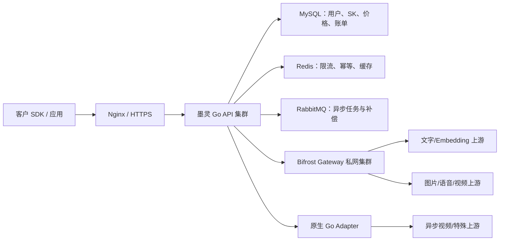
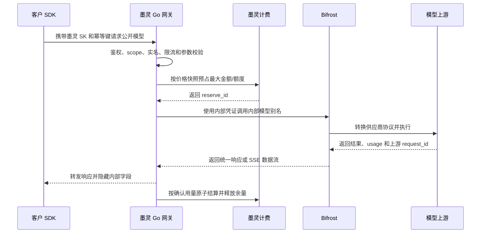
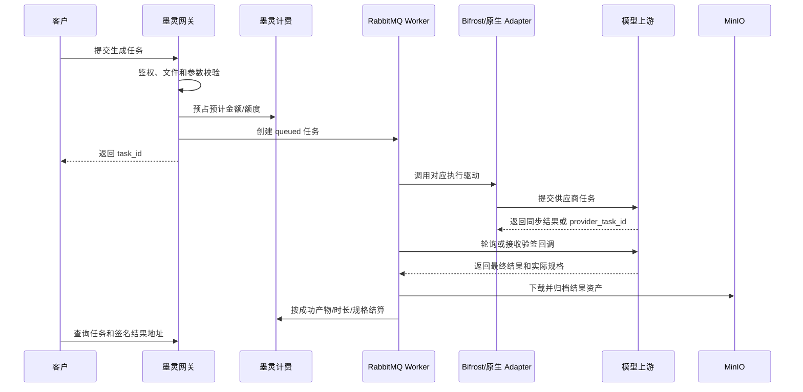
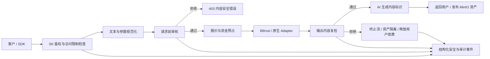
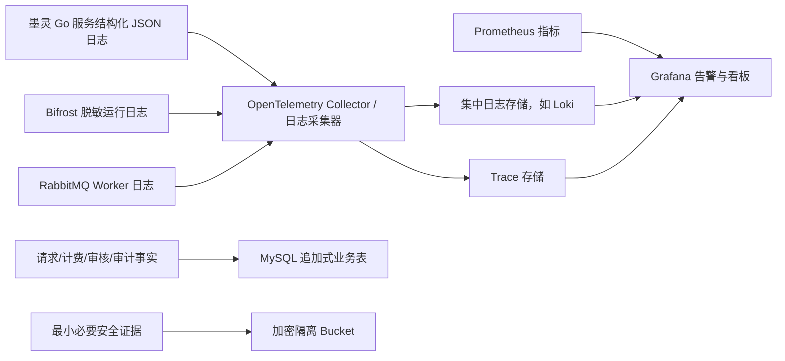
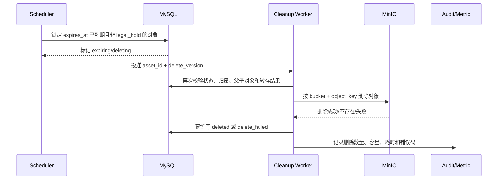

# 墨灵多模态 AI 网关长期蓝图

> **文档定位（2026-07-29 CEO 评审后生效）**
>
> 本文描述文字、图片、音频和视频的一年期目标架构，不再作为 Phase 1 的直接开发排期或验收依据。Phase 1 仅交付文字模型商业闭环，唯一执行计划为 [`ai-gateway-phase1-commercial-text-plan.md`](./ai-gateway-phase1-commercial-text-plan.md)。两份文档冲突时以 Phase 1 执行计划为准；图片、音频和视频必须通过独立商业门槛后另行立项。

> 适用范围：在现有 `token_gateway` 文本聊天门面的基础上，实现 image、audio、video、embedding 的统一中转、鉴权、计费、存储、异步任务和运营管理能力。
>
> 当前基线：提交 `cbe6f6b`。现有 `/v1/chat/completions`、`/v1/models`、平台 API Key、模型可见范围、prepaid/postpaid 计费和用量流水保持兼容。
>
> 本次补充：将 Bifrost 确定为首选内部执行层，LiteLLM 降为可选备用驱动，并增加生产部署拓扑、管理员发布流程、客户调用链路、异步媒体任务、故障补偿和灰度回滚设计。本文是规划，不代表 Bifrost 已部署或生产计费已启用。

> 2026-08-03 G4 实现说明：独立分支已完成 chat 链路的输入/输出内容安全、Redis 四层资源治理、Project/SK 预算和补偿任务后端底座；详见 `ai-gateway-g4-feature.md`、`ai-gateway-g4-development.md`、`ai-gateway-g4-operations-runbook.md` 和 `ai-gateway-g4-acceptance.md`。管理后台 UI、多模态异步任务和生产部署仍按后续阶段执行。

## 1. 总体决策

不能继续在 `forward_service.go` 中增加 `if modality == ...`。应把现有网关深化为统一多模态网关模块，把供应商差异、同步/异步差异、文件存储和计量差异隐藏在模块内部。

上游执行层采用“墨灵商业控制面 + 可替换执行数据面”：墨灵 Go 网关继续负责用户、平台 `sk`、模型目录、人民币销售价格、钱包、账单、幂等和审计；Bifrost 作为首选内部执行驱动，负责供应商协议转换、统一响应、流式转发和受控路由。Bifrost 不直接面向客户，也不是墨灵的财务事实源。对高频核心模型、本地 vLLM 或特殊异步供应商，保留原生 Go Adapter；LiteLLM 只作为后续兼容性备选，不进入第一阶段生产主链路。

对调用方只暴露三个核心能力：

```go
// Execute 执行一次 AI 请求；同步结果直接完成，异步结果返回任务。
Execute(ctx context.Context, req Request) (Result, error)

// GetTask 查询异步任务及其结果资产。
GetTask(ctx context.Context, actor Actor, taskID uint64) (Task, error)

// CancelTask 取消尚可终止的异步任务并释放未结算占额。
CancelTask(ctx context.Context, actor Actor, taskID uint64) error
```

`Request` 统一携带调用人、API Key、幂等键、逻辑模型、能力、输入引用和选项；`Result` 只返回三种结果：

- `completed`：embedding、部分 image/audio 同步完成。
- `streaming`：chat 或语音流式输出。
- `queued`：video 和需要轮询的供应商任务。

HTTP handler、AI 工作台和后续外部应用都复用同一个 Interface，计费、安全和失败释放逻辑只实现一次。

## 2. 长期目标与边界

### 2.1 长期能力目标（不代表 Phase 1 同时交付）

1. 保留现有聊天网关，不破坏 OpenAI-compatible 客户端。
2. 支持图片生成、图片编辑和图片理解结果存储。
3. 支持语音识别、语音翻译和语音合成。
4. 支持视频生成的异步提交、查询、取消、回调和结果存储。
5. 支持文本及批量 embedding。
6. 四种模态统一复用 JWT/sk 鉴权、模型可见范围、套餐额度、钱包计费和用量查询。
7. 输入和结果文件统一进入 MinIO，不把大文件或 Base64 正文写入 MySQL、日志和 RabbitMQ。
8. 异步任务统一使用 RabbitMQ，具备幂等、重试、超时、死信和补偿能力。
9. 通过 Bifrost 快速覆盖主流上游，同时允许按模型切换为原生 Go Adapter 或备用 LiteLLM Adapter，避免执行层锁定。
10. 墨灵管理后台提供网关总览、上游、公开模型、模型价格、请求账单、异步任务、配置发布和对账的完整运营闭环。
11. 采用人民币现金余额的 OpenRouter 式按实际用量计费，不引入积分；每个公开模型可以按不同指标、单位和生效版本独立定价。
12. 建立请求前、输出后和多模态资产发布前的内容安全链路，覆盖黄赌毒等违法和平台禁止内容；命中规则时拒绝请求并支持 API Key/用户访问限制。
13. 建立结构化访问、请求、审核、执行、计费、任务、安全和管理员审计日志，实现 request_id 全链路追踪、脱敏、分级留存和告警。
14. 在用户控制台建立统一的“AI 用量与账单中心”，让用户按本人、API Key、模型、模态和时间查看消费汇总、模型调用记录、异步任务与逐项计价明细。
15. 建立与公开模型绑定的静态网页 URL 发布系统，运营只配置模型介绍、快速入门和 API 参考网址；墨灵负责校验、预览、审批、发布、健康检查和上架门禁，不保存 Markdown/HTML 正文。
16. 建立图片、音频、视频及上传文件的对象存储留存策略，支持全局默认、按模型覆盖、到期提醒、用户转存资产、自动清理、legal hold 和存储容量监控。
17. 建立多实例并发安全控制，支持平台、模型、模态、用户和 API Key 多层并发策略，管理员可单独调整某个用户的同步请求、流式连接和异步任务并发上限。

### 2.2 长期架构边界

- 不同时接入所有供应商；每种能力先选一个真实供应商 Adapter 跑通。
- 不在第一版实现复杂权重负载均衡；先实现主路由和一个备用路由。
- 不允许网关根据用户输入任意抓取公网 URL；外部资源必须经过受控上传或安全抓取模块。
- 不把供应商原始参数直接暴露给普通用户；只开放平台允许的标准化选项。
- 不向用户签发 Bifrost Virtual Key，不使用 Bifrost 内部 cost/budget 直接扣减墨灵钱包，不用 Bifrost 管理台替代墨灵管理后台；备用 LiteLLM 同样遵守该边界。

## 3. 当前差距

| 范围 | 当前状态 | 必须补充 |
|---|---|---|
| 路由 | 只有 `chat/completions` | image/audio/embedding 端点及 video 任务端点 |
| 上游调用 | 固定 Bearer + `/v1/chat/completions` | 按能力选择 Adapter 和上游协议 |
| 模型 | 单一 `modality`，且图片模型被标记为 chat | 能力与 operation 列表、输入限制、输出规格 |
| 用量 | 以 input/output tokens 为中心 | 张数、像素、秒数、字符数、embedding tokens 等指标 |
| 预扣 | 以 `max_tokens × 单价` 为中心 | 通用估算用量和多指标占额 |
| 文件 | Go 服务尚未接入 MinIO | 上传会话、对象元数据、签名 URL、生命周期 |
| 异步任务 | 网关没有任务状态机 | RabbitMQ worker、轮询/回调、重试和补偿 |
| 高可用 | 模型只绑定一个渠道 | 主备路由、健康状态和熔断 |
| 安全 | 渠道 Base URL 仅做非空校验 | SSRF 防护、域名白名单、回调验签、文件校验 |
| 执行层 | Go 代码直接绑定上游协议 | Bifrost/原生 Go/备用 LiteLLM 可切换的执行驱动和统一 DTO |
| 部署发布 | 缺少执行配置版本 | 私网 Bifrost 集群、配置校验、灰度、回滚和审计 |
| 管理后台 | 只有渠道、模型和 Token 用量三页 | 总览、价格中心、请求账单、任务、发布、对账及连通性操作 |
| 价格维度 | `product_billing_rules` 只有商品 + usage_type | 公开模型 + 价格版本 + 多指标 + 单位基数 + 生效时间 |
| 价格发布 | 计费规则编辑后直接生效 | 草稿、校验、定时生效、回滚和请求级不可变快照 |
| 财务精度 | 主要面向每 token 的 `DECIMAL(18,6)` | 明确定价基数、内部计算精度、最小收费和统一舍入规则 |
| 内容安全 | 依赖上游模型自身拒答，缺少平台统一策略 | 关键词/规则/分类器/多模态审核、流式拦截、封禁与申诉 |
| 日志 | 用量日志为主，缺少统一事件模型 | OTel trace + 结构化日志 + 业务审计 + 安全事件证据链 |
| 用户端用量 | `我的用量`仅展示文本 input/output token，`我的消费记录`仅展示通用商品流水 | 统一消费总览、按 SK/模型/模态筛选、图片音视频用量、请求详情、价格快照、异步任务和安全导出 |
| 模型文档 | 模型未绑定介绍和 Quick Start 静态网页入口 | 每模型配置介绍/快速入门/API 参考 URL，完成域名白名单、安全校验、审批发布、失效监测和上架门禁 |
| 文件留存 | 仅保存生命周期字段，未定义图片/音频/视频实际保存时长 | 全局与模型级留存策略、expires_at、短效下载 URL、保存到资产、到期清理、异常重试和容量告警 |
| 并发安全 | API Key 页面仅出现 RPM/TPM/并发概念，缺少分布式占用和用户级设置 | Redis 原子租约、用户/Key/模型多层并发、异步队列上限、崩溃回收、429 契约、后台调整和压力测试 |

## 4. 模块设计

### 4.1 外部 seam：多模态网关

`Gateway` 是 HTTP handler、工作台和内部应用唯一依赖的 Interface。它内部负责：

```text
鉴权上下文
  → 模型与能力校验
  → 可见范围/API Key scope 校验
  → 输入文件与参数校验
  → 估算用量并预占额度/钱包
  → 选择供应商 Adapter
  → 同步执行或创建异步任务
  → 保存资产与用量指标
  → 结算或失败释放
```

调用方不得自行选择渠道、解密上游 Key、调用计费模块或拼接 MinIO 地址。

### 4.2 内部 seam：供应商 Adapter

供应商属于不可控的远程依赖，需要真实 Adapter 和测试 Adapter：

```go
type ProviderAdapter interface {
    Supports(capability Capability) bool
    Execute(ctx context.Context, req ProviderRequest) (ProviderResult, error)
    Query(ctx context.Context, ref ProviderTaskRef) (ProviderResult, error)
    Cancel(ctx context.Context, ref ProviderTaskRef) error
}
```

首批 Adapter：

1. `BifrostProviderAdapter`：通过私网调用 Bifrost，承载 chat、responses、embedding、image/audio/video 及其流式或异步响应。
2. `OpenAICompatibleAdapter`：原生 Go 直连兼容上游，也是 Bifrost 故障时的核心回滚驱动。
3. `OpenRouterMultimodalAdapter`：通过 Chat Completions 返回图片或多模态内容。
4. `AsyncVideoAdapter`：提交供应商任务并轮询/接收回调；Bifrost 无法稳定表达的供应商任务使用该原生 Adapter。
5. `LiteLLMProviderAdapter`：仅作为后续兼容性备用，不纳入第一阶段必交付范围。
6. `FakeProviderAdapter`：单元测试、错误注入和计费幂等测试。

Adapter 只负责协议转换，鉴权、占额、结算、存储和任务状态由网关模块统一负责。

公开模型通过 `execution_driver` 选择执行方式：`bifrost`、`native_openai`、`native_async`、可选 `litellm` 或 `fake`。HTTP handler、计费服务和任务 worker 只能依赖 `ProviderAdapter`，不得直接依赖 Bifrost 或 LiteLLM DTO，从而允许按模型灰度和即时回滚。

### 4.3 对象存储 seam

```go
type ObjectStore interface {
    Put(ctx context.Context, input ObjectInput) (StoredObject, error)
    Open(ctx context.Context, objectKey string) (io.ReadCloser, ObjectMeta, error)
    PresignGet(ctx context.Context, objectKey string, ttl time.Duration) (string, error)
    Delete(ctx context.Context, objectKey string) error
}
```

- 生产 Adapter：MinIO/S3。
- 测试 Adapter：内存对象存储。
- MySQL 只保存 bucket、object_key、MIME、大小、SHA-256、归属人和生命周期，不保存文件正文。
- RabbitMQ 消息只传对象 ID，不传 Base64 或二进制。

### 4.4 队列 seam

- 生产 Adapter：RabbitMQ。
- 测试 Adapter：内存队列。
- 队列建议：`ai.gateway.video.submit`、`ai.gateway.provider.poll`、`ai.gateway.asset.fetch`。
- 每条消息必须包含 `task_id`、`request_id`、`attempt`，消费者按任务状态幂等处理。
- 超过最大重试次数进入死信队列，由补偿任务释放占额并标记失败。

### 4.5 计费 seam

继续复用 `finance_consumer`、`billing` 和 `asset`，但将 Token 专用参数深化为通用计量请求：

```go
type UsageEstimate struct {
    Metrics []Metric
}

type Metric struct {
    Type   string
    Unit   string
    Amount decimal.Decimal
}
```

统一执行 `Reserve → Execute → Settle`，失败执行 `Release`。预付套餐和后付钱包使用同一组指标，差别只由 Billing Adapter 处理。

### 4.6 部署拓扑



部署约束：

1. Nginx 只把 `/v1/*` 和墨灵业务 API 转发给墨灵 Go 服务，Bifrost 端口不映射公网。
2. 用户请求只携带墨灵 `sk`；墨灵使用环境级内部凭证访问 Bifrost，用户 `sk` 永不传入 Bifrost。
3. 生产环境至少两个 Bifrost 实例，通过内部负载均衡和健康检查提供服务；实例保持可替换并允许水平扩容，是否可完全无状态必须由锁定版本 POC 证明。
4. Bifrost 镜像使用经过 POC、漏洞扫描和 Apache-2.0/企业功能边界确认的固定版本及镜像摘要，禁止生产使用浮动 `latest`。
5. 第一阶段不启用 Bifrost 用户、Virtual Key、预算和商业计费。若锁定版本的配置或治理能力需要独立数据库，则与墨灵 MySQL 隔离，严禁作为钱包账本。
6. 上游密钥只通过环境变量或密钥管理系统注入；配置文件只引用变量名，不能写入真实密钥。
7. 图片、音频和视频结果统一落入 MinIO，Bifrost 或供应商返回的临时 URL 不作为永久用户资产地址。

### 4.7 配置事实源与发布

墨灵数据库是公开模型和执行配置的事实源。管理员保存模型后只生成“待发布配置”，不能直接覆盖运行中的 Bifrost 配置。

```text
管理员保存模型/上游
  → 墨灵校验公开模型、能力、计费规则和密钥引用
  → 生成带版本号的 Bifrost 配置草稿
  → 展示配置差异并执行语法/连通性检查
  → 部署到一个灰度实例
  → 执行健康检查和真实沙箱请求
  → 发布到剩余实例
  → 回写 execution_config_version 和审计记录
```

Bifrost 内部模型名使用不可公开的稳定别名，例如 `molin-qwen-plus-aliyun`；用户只看到墨灵公开模型名，例如 `qwen/qwen-plus`。销售价格绑定公开模型和价格版本，不随 Bifrost 的实际路由变化。

## 5. 各能力实现方案

### 5.1 Embedding：第一条 tracer bullet

Embedding 没有文件和异步任务，是验证新网关 Interface、Adapter、鉴权和通用计费的最小闭环。

```text
POST /v1/embeddings
GET  /api/ai/models?capability=embedding
```

规则：

- 支持字符串和字符串数组。
- 限制单项长度、批量数量和整批估算 Token。
- 支持 `dimensions`，但必须在模型配置允许范围内。
- 计费指标：`embedding_input_tokens / tokens`。
- 不记录输入原文和向量正文；向量只在响应中返回。
- API Key 必须拥有对应模型 scope 和 `embedding:invoke` capability。

验收：OpenAI SDK 可直接调用；批量、超限、越权、余额不足、重复幂等键均有测试。

### 5.2 Image

```text
POST /v1/images/generations
POST /v1/images/edits
POST /api/ai/uploads
POST /api/ai/uploads/{upload_id}/complete
GET  /api/ai/models?capability=image.generate
```

operation：`image.generate`、`image.edit`、`image.understand`。

流程：

1. 文生图只接收文本和受控选项。
2. 图片编辑先通过上传会话将原图/蒙版写入 MinIO，再提交对象 ID。
3. Adapter 返回 URL/Base64 时，网关下载或解码后写入 MinIO。
4. 响应默认返回短期签名 URL 和资产 ID；兼容 `b64_json` 时设置严格大小上限。
5. 计费优先使用 `image_count / count`；需要分辨率计价时增加 `image_megapixels / megapixels`。

安全要求：

- 校验 MIME 魔数，不信任文件扩展名。
- 限制大小、像素、宽高比、张数和解压后尺寸。
- 禁止抓取内网、回环、metadata 地址；供应商结果 URL 也必须经过 SSRF 检查。
- 对象路径必须包含用户 ID 和随机 ID，禁止使用用户文件名直接拼接路径。

### 5.3 Audio

```text
POST /v1/audio/transcriptions
POST /v1/audio/translations
POST /v1/audio/speech
GET  /api/ai/models?capability=audio.transcribe
```

operation：`audio.transcribe`、`audio.translate`、`audio.speech`。

规则：

- 识别/翻译输入先写 MinIO，使用媒体探测工具取得真实时长和编码。
- 语音合成支持直接流式返回，也支持 `store=true` 后保存 MinIO。
- 识别结果支持 text/json/srt/vtt，供应商差异由 Adapter 处理。
- 识别/翻译统一使用 `audio_seconds / seconds`；TTS 按模型价格模板固定使用 `characters / characters` 或 `audio_seconds / seconds`，不能在同一模型版本中临时切换口径。
- 超长音频采用异步任务，避免一个 HTTP 请求长期占用连接。

### 5.4 Video

视频必须采用异步任务，不允许在用户请求中等待供应商完成。

```text
POST   /api/ai/video/generations
GET    /api/ai/tasks/{task_id}
GET    /api/ai/tasks/{task_id}/events
DELETE /api/ai/tasks/{task_id}
POST   /api/internal/ai/provider-callbacks/{channel_code}
```

状态机：

```text
created → reserved → queued → submitted → processing
  → succeeded
  → failed / cancelled / expired
```

规则：

- 创建任务时完成参数校验和占额，再写队列。
- worker 调用供应商并保存 `provider_task_id`。
- 优先使用验签回调；供应商无回调时进入延迟轮询队列。
- 成功后下载视频和缩略图到 MinIO，再结算并返回签名 URL。
- 失败、取消、超时和死信都必须幂等释放占额。
- 使用 `video_seconds / seconds`；分辨率差异通过价格规则或 `video_megapixel_seconds` 表达。
- `request_id`、供应商回调事件 ID 和结算事件 ID 均设置唯一约束。

## 6. HTTP 兼容与版本策略

保留现有接口：

```text
GET  /v1/models
POST /v1/chat/completions
GET  /api/token/models
POST /api/token/chat/completions
GET  /api/token/usage
```

OpenAI-compatible 端点用于 SDK 接入；`/api/ai/*` 用于平台任务、上传和资产管理。所有新接口仍使用 `RequireUserAuth`，支持 JWT 和平台 sk。

`GET /v1/models` 继续只返回 Chat Completions 可调用模型；平台前端使用 `/api/ai/models?capability=...` 获取完整多模态目录，避免把 image/audio/video 错当作 chat。

## 7. 数据模型与迁移

迁移编号在实现时从 main 最新编号顺延，禁止提前硬编码编号。

### 7.1 扩展 `token_models`

- `capabilities_json`：如 `image.generate`、`audio.speech`。
- `limits_json`：尺寸、时长、批量、dimensions 等模型限制。
- `default_options_json`：平台允许的默认选项。
- `fallback_channel_id`：第一版只允许一个备用渠道。

保留 `modality` 供旧接口兼容，但新逻辑以 capabilities 为权威。

### 7.2 新建 `ai_gateway_tasks`

关键字段：

- `request_id` 唯一。
- `user_id`、`api_key_id`、`logical_model_code`。
- `capability`、`status`、`progress`。
- `provider_task_id`、`attempt_count`、`next_poll_at`。
- `input_json` 只存非敏感选项和对象 ID。
- `result_json` 只存资产 ID 和非敏感元数据。
- `error_code`、`error_message_safe`。
- `reserved_reference`、`settled_at`。

### 7.3 新建 `ai_gateway_assets`

保存对象归属和元数据：bucket、object_key、MIME、大小、SHA-256、宽高、时长、来源任务、生命周期和删除状态。

### 7.4 新建 `token_usage_metrics`

现有 `token_usage_logs` 继续作为一次调用的主流水，新表保存一对多指标：

```text
usage_log_id
usage_type
usage_unit
usage_amount
sale_amount
```

这样不用持续向主表增加 `image_count`、`audio_seconds`、`video_seconds` 等列。

### 7.5 新建 `ai_upload_sessions`

保存上传归属、用途、最大大小、期望 MIME、过期时间、完成状态和最终资产 ID，防止用户伪造他人的 object key。

## 8. 鉴权、权限与审计

平台 API Key 建议增加 capability：

```text
chat:invoke
embedding:invoke
image:generate
image:edit
audio:transcribe
audio:speech
video:generate
```

旧 Key 默认只拥有 `chat:invoke`，不能因升级自动获得高成本视频权限。

管理权限：

- `token:manage` 仅作为旧渠道/模型页面的兼容权限，新 AI 网关页面使用第 17.3 节的细粒度权限。
- `ai_gateway:task_manage` 查看、取消和补偿异步任务。
- `ai_gateway:price_manage`、`ai_gateway:secret_rotate`、`ai_gateway:release_manage` 和 `ai_gateway:reconcile_manage` 属于高风险权限，要求双重认证和审计。
- 权限码必须通过 seed migration 创建。

必须审计渠道变更、模型能力变更、价格规则变更、管理员取消任务、人工重试和资产删除。审计日志不记录 prompt、文件正文、上游 Key 和签名 URL。

## 9. 计费指标

| 能力 | usage_type | usage_unit | 预估依据 | 结算依据 |
|---|---|---|---|---|
| Chat | input_tokens/output_tokens/cache_read_tokens/cache_write_tokens/reasoning_tokens | tokens | 已知输入 + 最大输出 | 上游 usage |
| Embedding | embedding_input_tokens | tokens | 本地估算 | 上游 usage |
| 图片生成 | image_count | count | n | 实际成功张数 |
| 高分辨率图片 | image_megapixels | megapixels | n × 目标像素 | 实际输出像素 |
| 语音识别 | audio_seconds | seconds | 输入媒体时长 | 实际处理时长 |
| 语音合成 | characters 或 audio_seconds | characters/seconds | 文本长度或目标时长 | 实际供应商用量 |
| 视频生成 | video_seconds | seconds | 目标时长 | 实际输出时长 |
| 高分辨率视频 | video_megapixel_seconds | megapixel_seconds | 分辨率 × 时长 | 实际结果 |

每一种可能产生的 metric_code 都必须在该公开模型的 active 价格版本中有唯一价格项，并通过报价、并发预占和结算测试；找不到模型价格时必须 fail-closed，禁止回退为 0 元。`product_billing_rules` 只承担第 18.10 节定义的旧文本模型兼容，不作为新多模态模型的价格来源。

## 10. 长期候选任务分配（不作为 Phase 1 任务单）

### 10.1 开发前置门槛

本方案属于新阶段。在开始 `MM-C-01` 前，产品经理必须确认当前阶段已经完成：测试工程师验收、产品经理功能确认、0 个 P0/P1、最新 main 前端契约对账。未确认前可以评审方案和准备供应商沙箱，但不得进入下一阶段编码。

### 10.2 任务表

| ID | 负责人 | 任务 | 交付物 | 依赖 | 估算 |
|---|---|---|---|---|---:|
| MM-GATE-00 | 产品经理 + 测试 | 冻结首批供应商、能力、价格单位、文件限制并确认当前阶段验收 | 决策记录、验收结论 | 无 | 1d |
| MM-OPS-01 | 运维 | Go 服务接入 MinIO/RabbitMQ 配置、健康检查、bucket、队列和死信队列 | 配置模板、部署说明 | GATE-00 | 2d |
| MM-BF-01 | 后端 C + 运维 | 锁定 Bifrost 版本并完成双上游、多模态 POC、许可证核对、企业功能边界、漏洞扫描和性能基线 | POC 报告、镜像摘要、功能边界清单 | GATE-00 | 4d |
| MM-BF-02 | 运维 | 部署私网 Bifrost 双实例、健康检查、资源限制、密钥注入和版本化配置 | Compose 配置、运维手册、回滚脚本草稿 | BF-01 | 2d |
| MM-C-01 | 后端 C | 建立 Gateway 深模块、Request/Result/Task Interface、Fake Adapter | 模块骨架、Interface 测试 | GATE-00 | 2d |
| MM-C-02 | 后端 C | 模型能力、任务、资产、上传会话、用量指标迁移 | up/down migration、仓库 | C-01 | 3d |
| MM-B-01 | 后端 B | 将 Token 预扣深化为通用 Metric Reserve/Settle/Release | 计费 Adapter、并发幂等测试 | C-01 | 3d |
| MM-B-02 | 后端 B + 后端 C | 建立模型价格版本、价格项、请求价格快照、销售/成本分账和报价服务 | migration、PricingService、Quote API、金额测试 | B-01,C-02 | 5d |
| MM-A-01 | 后端 A | API Key capability、管理权限、审计事件 | migration、鉴权和审计测试 | C-01 | 2d |
| MM-SAFE-01 | 后端 A + 后端 C | 内容策略引擎、文本规范化、关键词/规则版本、请求前和输出后审核、访问限制 | policy engine、migration、拒绝契约、单元测试 | A-01,C-01 | 5d |
| MM-SAFE-02 | 后端 C + 运维 | 图片 OCR/图像审核、音频 ASR、视频抽帧审核、隔离区、日志采集和安全告警 | 多模态审核 Adapter、OTel/日志配置、告警 | SAFE-01,OPS-01,C-03 | 5d |
| MM-C-03 | 后端 C | MinIO ObjectStore、上传会话、签名 URL、文件校验 | MinIO/内存 Adapter、测试 | OPS-01,C-02 | 3d |
| MM-C-04 | 后端 C | BifrostProviderAdapter、DTO/错误/usage 归一化及执行驱动开关 | Adapter、契约测试、原生回滚路径 | BF-02,C-01 | 3d |
| MM-C-04A | 后端 C | Embedding tracer bullet 和 `/v1/embeddings` | Bifrost/原生 Adapter、计费闭环 | A-01,B-01,C-04 | 2d |
| MM-C-05 | 后端 C | 图片生成/编辑及 OpenRouter 多模态 Adapter | image 端点、资产落盘、计费 | C-03,C-04 | 4d |
| MM-C-06 | 后端 C | 语音识别/翻译/合成 | audio 端点、流式响应、计费 | C-03,C-04 | 4d |
| MM-C-07 | 后端 C + 运维 | 视频状态机、worker、回调/轮询、补偿 | video 端点、worker、死信处理 | OPS-01,C-03,B-01 | 6d |
| MM-C-08 | 后端 C | 主备路由、健康探测、熔断和安全 URL 校验 | fallback、熔断、SSRF 测试 | C-04,C-05,C-06 | 3d |
| MM-C-09 | 后端 B + 后端 C | 建立用户本人 AI 用量汇总、请求明细、消费明细、异步任务和导出接口 | 查询服务、D-95 分页接口、越权与金额对账测试 | B-02,C-07 | 4d |
| MM-C-10 | 后端 C + 运维 | 建立对象留存策略、expires_at、保存到资产、清理 worker 和 MinIO 生命周期兜底 | migration、RetentionService、清理任务、幂等与恢复测试 | C-03,OPS-01 | 4d |
| MM-A-02 | 后端 A + 后端 C | 建立用户/API Key/模型多层并发策略、Redis 原子租约、心跳与崩溃回收 | migration、ConcurrencyLimiter、中间件、并发测试 | A-01,C-01,OPS-01 | 5d |
| MM-DOC-01 | 后端 C + 内容模块 | 建立模型文档 URL 注册、版本、校验、审批发布和健康检查 | migration、URL Validator、发布状态机、接口测试 | C-02,A-01 | 2d |
| MM-UX-01 | 产品经理 + 前端 A/B | 完成 AI 网关前后台信息架构、关键页面线框、组件状态、响应式原型和可用性评审 | 页面清单、桌面/移动原型、交互说明、评审记录 | GATE-00 | 3d |
| MM-FA-01 | 前端 A | 管理端网关总览、上游、公开模型和模型价格中心 | 页面、接口封装、价格模拟器、响应式验证 | C-02,A-01,B-02,UX-01 | 6d |
| MM-FA-02 | 前端 A | 管理端请求账单、异步任务、配置发布、对账和补偿操作 | 页面、审计确认、导出与异常操作 | C-07,B-02,BF-02 | 5d |
| MM-FA-03 | 前端 A | 内容安全策略、关键词规则、安全事件、访问限制和日志查询页面 | 页面、脱敏详情、审批与申诉处理 | SAFE-01,SAFE-02,A-01 | 5d |
| MM-FA-04 | 前端 A | 管理端模型文档 URL 列表、编辑、校验、预览、审批和发布 | 页面、URL 表单、版本差异、发布交互 | DOC-01,UX-01 | 3d |
| MM-FA-05 | 前端 A | 管理端对象存储留存策略、按模型覆盖、容量和清理异常页面 | 策略表单、影响预览、容量趋势、重试操作 | C-10,UX-01 | 3d |
| MM-FA-06 | 前端 A | 管理端并发与限流策略、单用户覆盖、实时占用和异常租约页面 | 策略表单、用户调整、占用详情、审计操作 | A-02,UX-01 | 4d |
| MM-FB-01 | 前端 B | 多模态模型选择和统一任务状态组件 | 模型筛选、任务进度、错误/加载态 | C-04,C-07,UX-01 | 2d |
| MM-FB-02 | 前端 B | 图片生成/编辑页面 | 上传、参数表单、结果画廊 | C-05,FB-01 | 4d |
| MM-FB-03 | 前端 B | 语音识别/合成页面 | 上传/录音、播放、字幕导出 | C-06,FB-01 | 4d |
| MM-FB-04 | 前端 B | 视频生成页面 | 参数、进度、取消、结果播放 | C-07,FB-01 | 4d |
| MM-FB-05 | 前端 B | Embedding 开发者调试页和接入说明 | 批量输入、响应预览、示例 | C-04 | 2d |
| MM-FB-06 | 前端 B | 将现有 Token 用量和通用消费页升级为用户 AI 用量与账单中心 | 总览、调用记录、消费明细、异步任务、详情抽屉、导出和移动端适配 | C-09,FB-01,UX-01 | 5d |
| MM-FB-07 | 前端 B | 在模型详情展示介绍、Quick Start 和 API 参考静态网页入口 | 文档按钮、同源/外部跳转、失效状态和移动端适配 | DOC-01,FA-04,UX-01 | 2d |
| MM-FB-08 | 前端 B | 在任务和资产页面展示到期时间、续存/保存到我的资产和过期状态 | 到期提示、保存交互、结果刷新和移动端适配 | C-10,FB-01 | 2d |
| MM-FB-09 | 前端 B | 用户端展示本人并发上限、当前占用、队列状态和 429 重试提示 | API Key 限额、占用提示、任务排队与移动端适配 | A-02,FB-01 | 2d |
| MM-QA-01 | 测试 | Interface、Fake、异常注入、计费幂等测试 | 自动化测试集 | C-01 起并行 | 5d |
| MM-QA-02 | 测试 | 文件安全、SSRF、越权、回调重放、并发占额测试 | 安全与压力报告 | C-03,C-07,C-08 | 4d |
| MM-QA-03 | 测试 + 运维 | 原生 Go 与 Bifrost 对照压测、流式断连、实例故障和灰度回滚演练 | P50/P95/P99、TTFT、吞吐、资源和回滚报告 | BF-02,C-04 | 3d |
| MM-QA-04 | 测试 + 财务/产品 | 模型调价、生效边界、价格快照、多指标舍入、预占结算、重试和对账验收 | 金额金样、并发与对账报告 | B-02,FA-02 | 4d |
| MM-QA-05 | 测试 + 安全/法务/产品 | 敏感词变形、流式跨块、多模态绕过、误杀、封禁、申诉、日志脱敏和故障降级测试 | 安全用例、误报率、证据和整改报告 | SAFE-02,FA-03 | 5d |
| MM-QA-06 | 测试 + 产品 | 文档 URL 安全、可访问性、发布回滚、失效监测和响应式网页验收 | SSRF/跳转测试、发布与 UI 报告 | DOC-01,FA-04,FB-07 | 2d |
| MM-QA-07 | 测试 + 运维 | 留存边界、签名 URL、保存转移、并发清理、legal hold 和 MinIO 生命周期验收 | 时间边界、幂等恢复、容量与 UI 报告 | C-10,FA-05,FB-08 | 3d |
| MM-QA-08 | 测试 + 运维 | 多实例并发、租约泄漏、流式断连、异步队列、用户覆盖和 Redis 故障验收 | 竞争测试、压力报告、故障恢复与 UI 报告 | A-02,FA-06,FB-09 | 4d |
| MM-PM-01 | 产品经理 | 每个里程碑业务验收、价格和错误文案确认 | 验收记录 | 每个里程碑 | 1d/阶段 |

职责边界：

- 后端 A：认证、API Key、权限、审计，不实现供应商转发。
- 后端 B：商品、价格、钱包、通用计量和结算，不处理媒体文件。
- 后端 C：`token_gateway`、任务、供应商 Adapter、MinIO 对接和工作台集成。
- 前端 A：`web/admin-console`；前端 B：`web/user-console`。
- 运维：环境、队列、对象存储、部署和监控，不实现业务状态机。
- 测试和产品经理独立验收，开发者不能自行宣布阶段通过。

## 11. 长期候选排期（不作为 Phase 1 执行依据）

### M0：决策、Bifrost POC 与底座（第 1 周）

GATE-00、UX-01、BF-01、OPS-01、C-01、C-02、A-01、B-01、SAFE-01 设计与 Fake Adapter。验收前后台信息架构和关键响应式原型、双上游多模态 Bifrost POC、通用 Metric 预占/结算、任务和资产持久化、MinIO/RabbitMQ 健康，以及内容策略、拒绝契约和访问限制模型。POC 未达到性能、字段完整性、稳定性或许可证要求时，停止 Bifrost 路径并继续使用原生 Go Adapter，再单独评估备用 LiteLLM。

### M1：模型价格、文档底座与 Embedding tracer bullet（第 2 周）

BF-02、B-02、A-02 并发控制底座、DOC-01 URL 注册与发布状态机、SAFE-01、C-04、C-04A、FA-01 价格中心第一部分、FB-05、QA Interface/金额金样/文本审核。用最简单同步能力证明 Bifrost 执行驱动、请求前后审核、Redis 原子并发租约、模型级价格版本、报价快照、静态文档 URL 校验、原生回滚路径和新 Interface 没有破坏 chat。

### M2：Image 与管理端基础闭环（第 3 至第 4 周）

C-03、C-05、C-10 留存策略底座、DOC-01、SAFE-02 图片部分、FB-01、FB-02、FB-07、FA-01、FA-04。完成生成、编辑、隔离审核、MinIO、签名 URL、图片计费、expires_at 与清理 worker，以及总览、渠道、模型、价格、模型文档 URL 发布和用户快速入门跳转。

### M3：Audio（第 5 周）

C-06、SAFE-02 音频部分、FB-03、ASR 审核、文件安全与时长计费测试。

### M4：Video、任务与账单运营（第 6 至第 8 周）

C-07、C-09、C-10、A-02、SAFE-02 视频部分、FB-04、FB-06、FB-08、FB-09、FA-02、FA-05、FA-06、worker/死信监控。重点验证状态机、抽帧/音轨审核、管理员请求账单、用户消费与模型使用记录、单用户并发覆盖、异步排队、对象到期与保存到资产、价格快照、回调重放、取消、失败释放和人工补偿边界。

### M5：高可用、对账与全量验收（第 9 至第 10 周）

C-08、FA-03、QA-02、QA-03、QA-04、QA-05、QA-06、QA-07、QA-08、配置/策略/模型文档 URL 发布与回滚演练、每日对账、安全事件和申诉流程、链接失效巡检、对象过期清理、多实例并发和 Redis 故障恢复演练、全量回归、文档、PM/安全/法务验收和测试环境发布。

多人并行预计 13～14 周；单后端串行预计 20～22 周。该估算包含管理后台、用户 AI 用量与账单中心、分布式并发控制、对象存储留存与清理、模型静态文档 URL 发布、模型级计费、文本/多模态内容安全、日志采集和安全运营页面，不包含静态文档网页本身的内容制作、真实供应商商务签约、外部审核服务采购与法务等待时间。不得为了缩短排期跳过 M0、并发压力与故障验收、内容安全、金额验收、留存清理验收、文档 URL 安全验收或阶段验收。

## 12. 测试与验收标准

每个模态必须同时通过：

1. **Interface 测试**：Fake Provider、内存存储和内存队列验证可观察行为。
2. **Adapter 契约测试**：真实供应商样本、错误映射、超时和取消。
3. **计费测试**：成功、失败、超时、客户端断开、重复请求、回调重放、并发余额不足。
4. **安全测试**：文件伪造、超大文件、解压炸弹、SSRF、跨用户资产、签名 URL 过期、Key 泄漏。
5. **集成测试**：测试环境 MySQL/Redis/RabbitMQ/MinIO 和至少一个真实供应商。
6. **前端五道关卡**：按 `frontend-definition-of-done.md`，以最新 main 完成契约对账。
7. **回归**：Chat、Agent、API Key、套餐和钱包不得退化。
8. **验收结果**：0 个 P0/P1，测试工程师和产品经理均确认通过。
9. **执行层对照测试**：同一模型分别经过原生 Go Adapter 和 Bifrost，比较响应字段、错误语义、usage、流式末帧、TTFT、吞吐和资源占用；官方性能数字只作为参考，不能代替墨灵实测。

核心场景：

- 同一幂等键重复提交不重复调用供应商或扣费。
- 视频回调重复、乱序到达时状态不回退、不重复结算。
- 供应商成功但结果下载失败时进入可补偿状态，不提前结算成功。
- 客户端取消后，能取消供应商则取消；不能取消则继续跟踪并按实际规则结算。
- MinIO、RabbitMQ 或计费模块不可用时 fail-closed，不允许免费穿透。
- Bifrost 单实例退出、配置错误、上游超时和流式中断时不重复调用、不重复结算，且可以按模型回切原生 Adapter。
- 建议 POC 门槛：Bifrost 增加的非流式 P95 不超过 20ms、流式 TTFT 增量不超过 30ms、成功率差异不超过 0.1 个百分点；门槛是墨灵验收目标，不是第三方性能承诺。

## 13. 监控与运维

必须增加：

- 按 capability、model、channel、status 的请求量和延迟。
- 供应商 4xx/5xx、超时、熔断次数。
- Bifrost 实例可用性、活动连接、P50/P95/P99、流式 TTFT、CPU、内存、重启和配置版本。
- RabbitMQ 队列深度、最老消息年龄、死信数量。
- created/reserved/submitted/processing 状态停留超时任务数。
- MinIO 上传/下载失败、对象大小和存储增长。
- 预占未释放、任务成功未结算、结算无用量流水的对账指标。
- 请求前/输出后审核量、阻断率、分类分布、误报申诉率、审核 P95 和审核 Adapter 错误率。
- API Key/用户限制数量、自动恢复、人工解除、重复违规和安全事件积压。
- 日志采集延迟、丢弃量、本地缓冲水位、脱敏失败和安全证据访问告警。

日志字段、分级存储、脱敏、证据访问和留存统一遵守第 20 节。普通运行日志不记录 prompt、向量、媒体正文、上游 Key、平台 sk 和长期签名 URL。

## 14. 分支与提交策略

```text
feature/ai-gateway-foundation
feature/ai-gateway-embedding
feature/ai-gateway-image
feature/ai-gateway-audio
feature/ai-gateway-video
feature/admin-ai-task-monitor
feature/user-multimodal-workbench
```

每个 PR 只包含一个可独立验收的 tracer bullet；迁移、后端、前端、测试和中文文档一起提交。禁止直接在 main 开发。

## 15. 开发前必须确认的决策

1. 首批 image/audio/video/embedding 供应商及沙箱账号。
2. 每个能力的公开模型、默认参数、尺寸/时长/批量限制。
3. 各模型计量项、单位基数、人民币销售价、最低收费和失败/安全阻断是否收费。
4. 结果文件保留周期、用户删除规则和下载有效期。
5. 视频是否允许管理员人工重试，重试是否再次占额。
6. 首批文本、图片、音频和视频审核 Adapter；供应商审核只能作为一层，墨灵策略与最终访问限制必须保留。
7. 是否允许外部 URL 输入；建议第一版禁止，仅允许平台上传资产。
8. Bifrost 锁定版本、镜像摘要、Apache-2.0 适用范围、企业功能边界和是否需要独立持久化组件。
9. 首批哪些模型使用 Bifrost，哪些模型保留原生 Go Adapter；建议本地高吞吐模型和未通过契约测试的特殊视频上游先保留原生 Adapter。
10. Bifrost 内部是否允许 fallback；第一版建议由墨灵选择执行池，Bifrost 仅在同一执行池内做受控重试。
11. LiteLLM 是否保留为第二阶段备用驱动；第一阶段只保留 Interface 和配置枚举，不要求部署。
12. 内容安全分类、默认拒绝文案、严重等级、违规累计阈值、申诉流程和各类日志留存期限，必须由安全/法务/产品共同确认。
13. AI 生成合成内容的显式/隐式标识样式、服务提供者编码、内容编号和下载导出规则。

这些决策未确认时，可以实现底座和 Fake Adapter，但不能接真实供应商或发布用户入口。

## 16. Bifrost 部署与操作流程

### 16.1 职责边界

| 能力 | 墨灵 Go 网关 | Bifrost | 上游供应商 |
|---|---|---|---|
| 用户与平台 SK | 唯一负责 | 不接收用户 SK | 不感知墨灵用户 |
| 模型目录与可见范围 | 唯一负责 | 只识别内部别名 | 提供真实模型 |
| 人民币销售价格 | 唯一负责并生成价格快照 | 成本数据仅供对账 | 返回供应商用量/成本信息 |
| 余额与账单 | 预占、结算、释放、流水和补偿 | 禁止直接扣墨灵钱包 | 按供应商账户结算 |
| 协议与响应 | 对外保持墨灵/OpenAI 兼容契约 | 转换协议并归一化响应 | 执行推理 |
| 路由与重试 | 决定公开模型和执行池 | 在允许范围内执行路由/重试 | 返回请求结果 |
| 图片视频资产 | 归档 MinIO 并控制访问 | 传递结果引用 | 生成临时结果 |
| 审计与运营 | 唯一管理入口 | 提供内部运行指标 | 提供供应商控制台证据 |

Bifrost 的内部 cost、budget、Virtual Key 或治理记录只能作为供应商成本对账和运行观测信息，不能直接形成用户钱包流水。一个逻辑请求允许产生多次上游执行尝试，但只允许一个互斥终态：`settled` 或 `released`。

### 16.2 环境部署顺序

1. **版本确认**：锁定 Bifrost 版本和镜像摘要，核对 Apache-2.0 开源范围、社区版/企业版能力、第三方许可证和已知漏洞。
2. **POC 环境**：使用独立 Docker 网络启动一个 Bifrost 实例，至少接入两个沙箱上游、两个文字模型、一个图片模型和一个视频模型，不接真实用户流量。
3. **配置验证**：验证 chat、responses、stream、embedding、image/audio/video 样本、usage、错误映射、metadata、上游 request ID 和客户端断连行为。
4. **性能对照**：使用同一上游对比原生 Go Adapter 与 Bifrost，记录延迟、TTFT、吞吐、CPU、内存和错误率，不能直接采用 Bifrost 官方宣传值作为验收结论。
5. **测试环境**：部署两个 Bifrost 实例、内部负载均衡、健康检查、资源限制、监控和配置版本管理，并验证锁定版本能否安全水平扩容。
6. **墨灵接入**：启用 `BifrostProviderAdapter`，通过模型级开关选择 `bifrost` 或 `native_*`，先执行影子记录，不产生第二笔冻结或结算；`litellm` 只保留枚举和备用 Interface。
7. **灰度上线**：按内部 API Key、测试租户、模型和百分比逐步放量，每一步都完成账单对账。
8. **生产发布**：产品经理与测试工程师验收通过后才允许全量；发布动作、执行人、配置版本和结果写入审计日志。

建议的环境配置结构：

```text
infra/
  bifrost/
    config.template.yaml        # 只保存模型别名和环境变量引用
    config.versions/            # 保存已发布的脱敏配置版本
    healthcheck.ps1             # 验证健康、模型列表和沙箱调用
    rollback.ps1                # 回滚到上一已验证配置
```

真实密钥不得出现在上述文件、Git、日志和配置差异中。生产配置由部署环境注入，墨灵数据库只保存密钥引用和脱敏标识。

### 16.3 管理员配置与发布流程

管理员在墨灵管理后台操作，不需要直接进入 Bifrost 管理界面：

1. 新建上游：填写供应商类型、受控 Base URL、密钥引用、超时、并发限制和健康检查策略。
2. 新建上游模型：绑定真实模型、支持能力、输入限制、输出规格和内部 Bifrost 别名。
3. 新建公开模型：设置用户可见名称、模型类型、上下文、API Key scope 和 `execution_driver`。
4. 配置价格：按输入/输出/缓存 Token、图片张数/像素、音频分钟/字符、视频秒数/像素秒建立销售规则。
5. 校验发布：系统检查每种 usage type 都有价格规则，缺少规则时 fail-closed。
6. 生成配置：后台生成版本化 Bifrost 配置草稿并显示脱敏差异。
7. 灰度验证：先发布一个实例，执行健康检查和真实沙箱请求，再滚动发布其余实例。
8. 完成发布：回写配置版本、发布时间和健康状态；失败时自动保留上一可用版本。

模型中心只展示墨灵公开模型和人民币价格，例如 `qwen/qwen-plus`；真实上游模型、内部别名、密钥引用和路由权重仅管理员可见。

### 16.4 文字、Embedding 和流式请求



流式请求还必须满足：

- 墨灵逐帧转发 Bifrost 数据，但不得让客户端直接连接 Bifrost。
- 流式末帧缺少 usage 时使用经过测试的本地计数器估算，并标记 `usage_source=estimated`，不能伪装成上游精确值。
- 客户端断开后，结算协程在受控超时内继续收尾；无法确认最终用量时进入 `pending_reconcile`，不得直接丢弃冻结记录。
- Bifrost 或上游原始错误统一转换为墨灵错误码，响应和日志不能泄露上游密钥、内部地址或供应商原始错误体。

### 16.5 图片、音频和视频异步任务

图片同步接口可以直接返回 `completed`，但图片编辑、大文件音频和视频统一支持异步任务。视频不得长时间占用客户端 HTTP 连接。



异步状态统一为：

```text
created → reserved → queued → submitted → processing
  → succeeded → settled
  → failed → released
  → cancelled → released/settled_partial
  → pending_reconcile → settled/released
```

供应商回调必须验签并按 `provider_task_id + event_id` 幂等；轮询和回调同时到达时使用数据库条件更新，状态不能回退，结算只能成功一次。资产归档 MinIO 成功前不能把任务标记为最终成功。

### 16.6 价格和用量控制

| 模型类型 | 墨灵计量项 | 结算依据 |
|---|---|---|
| Chat/Reasoning | input/output/cache/reasoning tokens | 上游 usage 优先，受控估算兜底 |
| Embedding | embedding_input_tokens | 实际输入 Token |
| 图片生成 | image_count、image_megapixels | 实际成功张数和输出像素 |
| 图片编辑 | image_count、image_megapixels | 实际成功结果和规格 |
| 语音识别 | audio_seconds | 经校验的实际音频时长 |
| 语音合成 | characters 或 audio_seconds | 实际字符数或输出时长 |
| 视频生成 | video_seconds、video_megapixel_seconds | 成功结果实际时长和分辨率 |

每次请求保存不可变价格快照，包括币种、单位、单价、倍率、最低消费和价格版本。后续管理员调价不能修改历史请求金额。上游成本和用户销售金额分字段保存，禁止用浮点数计算金额。

### 16.7 异常、重试与补偿

| 场景 | 用户响应 | 计费动作 | 后台动作 |
|---|---|---|---|
| 预占失败 | 余额不足/额度不足 | 不调用上游 | 记录拒绝原因 |
| 上游调用前失败 | 网关错误 | 全量释放 | 可按策略重试 |
| 上游明确失败且无产物 | 模型执行失败 | 全量释放 | 记录执行尝试 |
| 流式中断且有确认用量 | 流中断 | 按确认用量结算 | 保存中断原因 |
| 视频部分成功 | 返回部分结果状态 | 按已约定成功产物结算 | 等待补偿或结束 |
| 供应商成功但资产下载失败 | 处理中/待补偿 | 保持冻结 | 重试归档，不重复生成 |
| 结算响应丢失 | 查询原请求 | 不重复结算 | 按幂等键核对流水 |
| Bifrost 实例不可用 | 502/受控 fallback | 不产生第二次用户结算 | 切换实例或回滚驱动 |

Bifrost 的重试必须限定在同一逻辑请求内，并记录每次 `execution_attempt`。是否允许跨供应商 fallback 必须按模型配置；不能为了提高成功率而产生不可解释的多笔上游成本。

### 16.8 灰度、监控和回滚

灰度顺序：

```text
Fake/沙箱
  → 内部 API Key
  → 指定测试租户
  → 单模型 5%
  → 25%
  → 50%
  → 100%
```

每一级至少检查成功率、P95/P99、流式 TTFT、usage 完整率、冻结与结算差额、Bifrost CPU/内存和待补偿任务。影子流量只记录字段差异和执行结果，不允许创建第二笔冻结、结算或用户账单。

触发以下任一条件立即停止放量：P0/P1 缺陷、重复扣费、免费穿透、usage 大面积缺失、错误率异常、Bifrost 资源持续饱和或上游成本无法解释。

回滚只切换公开模型的 `execution_driver` 或恢复上一 Bifrost 配置版本，不删除请求、执行尝试、价格快照和账单记录。数据库迁移采用 expand/contract；任何部署回滚都不能破坏历史账单可追溯性。第一阶段的优先回滚目标是原生 Go Adapter，不自动切换到尚未完成生产验收的 LiteLLM。

### 16.9 用户操作文档交付

对外操作文档至少包含：

- 创建、禁用、轮换墨灵 API Key，并说明 Key 只显示一次。
- OpenAI SDK、Python、TypeScript、cURL 的文字和流式调用示例。
- 图片上传/生成、音频上传/合成、视频提交/查询/取消示例。
- 模型目录、能力、上下文、输入限制和人民币计费单位。
- `request_id`、`task_id`、usage、账单查询和错误码说明。
- 幂等键、超时、重试、Webhook 验签和安全保存 SK 的要求。
- 禁止内容、`content_policy_violation`、访问暂停、申诉入口和审核期间不收费规则。
- 文本、图片、音频和视频的 AI 生成标识、下载传播和不得移除/伪造标识的要求。

用户文档不得出现 Bifrost/LiteLLM 内部地址、内部凭证、真实上游密钥、执行池、供应商账号或未脱敏日志。执行驱动对用户应当是不可见、可替换的内部实现细节。

## 17. 墨灵管理后台改造规范

### 17.1 当前后台基线与调整原则

当前 `web/admin-console` 已有“渠道管理”“模型目录”“Token 用量统计”页面，但只能完成单渠道路由、模型关联商品和 input/output token 查询；商品页的计费规则需要手工输入 `usage_type`、`usage_unit` 和单价。该形态不能安全运营每模型、多模态、版本化价格。

改造时保留现有路由作为兼容入口，但菜单统一收口到“AI 网关”。商品仍负责访问权益、购买资格和服务开通；公开模型价格由新的“模型价格中心”负责。运营人员不需要进入 Bifrost 控制台，也不应接触内部数据库和配置文件。

### 17.2 菜单与页面

```text
AI 网关
  ├─ 网关总览
  ├─ 上游与渠道
  ├─ 公开模型
  ├─ 模型价格
  ├─ 模型文档
  ├─ API Key 运营
  ├─ 并发与限流
  ├─ 内容安全
  ├─ 请求与账单
  ├─ 异步任务
  ├─ 存储与留存
  ├─ 配置发布
  ├─ 对账与异常
  └─ 日志与安全事件
```

#### A. 网关总览

展示指定时间范围内的请求量、成功率、流式 TTFT、P95/P99、销售金额、上游成本、毛利、活跃用户、活跃 API Key、冻结中金额、待补偿请求和失败任务。支持按公开模型、模态、执行驱动、上游和状态过滤。

总览数据必须来自墨灵请求、账单和执行尝试，不读取 Bifrost 面板作为唯一统计来源。销售金额、成本和毛利必须明确币种与时间范围；成本缺失时显示“待核对”，不能按 0 成本计算虚假毛利。

#### B. 上游与渠道

在现有 `TokenChannelListView` 基础上增加：

| 分组 | 字段 |
|---|---|
| 基础 | 渠道代码、名称、供应商类型、区域、状态、备注 |
| 执行 | `execution_driver`、Bifrost provider、Base URL、超时、最大并发、优先级、权重 |
| 密钥 | 密钥引用、是否已配置、最后轮换时间；永不回显明文 |
| 能力 | chat、responses、embedding、image、audio、video、rerank、OCR |
| 健康 | 最近检查、连续失败数、熔断状态、P95、错误率 |

必须实现的操作：新建、编辑、停用、连通性测试、同步模型、轮换密钥、查看健康记录。测试按钮先弹出确认，调用受控沙箱模型并明确显示“网关接受”“上游接受”“返回有效结果”三个不同证据，不能只用 HTTP 200 判成功。

删除改为“停用 + 保留历史引用”；已被模型路由或历史执行记录引用的渠道禁止物理删除。

#### C. 公开模型

在现有 `TokenModelListView` 基础上增加：

| 分组 | 字段 |
|---|---|
| 展示 | 公开模型代码、名称、厂商、短摘要、图标、分类、发布时间、文档 URL 发布状态 |
| 能力 | 模态、operations、输入/输出类型、上下文、最大输出、流式、工具调用、结构化输出 |
| 执行 | `execution_driver`、路由池、主路由、fallback 策略、超时、并发限制 |
| 商业 | 关联权益商品、价格状态、当前价格版本、币种、最低收费 |
| 权限 | 可见范围、API Key scope、实名要求、角色/分组限制 |
| 状态 | draft、testing、active、suspended、retired |

列表应直接显示“配置完整度”：上游、能力、价格、权限、文档和测试是否齐全。缺少任何必需价格项、无健康路由或未通过沙箱测试时，“上架”按钮必须禁用并说明原因。

一个公开模型可以绑定多个 `token_model_routes`，不能继续只依赖 `token_models.channel_id`。旧字段在迁移期映射为默认主路由，数据迁移完成后再通过 contract migration 下线。

#### D. 模型价格中心

这是本次必须新增的核心页面，不能继续让运营在通用商品页自由输入计量字符串。

页面布局：左侧模型筛选；主区域分“销售价格”“上游成本”“价格版本”“报价模拟”四个 tab。价格项使用受控下拉、数值输入和规格选择器，不允许手写未知 `usage_type`。

销售价格字段：

| 字段 | 说明 |
|---|---|
| 模型 | 绑定 `token_model_id` |
| 价格版本 | 自动生成、只读、递增 |
| 计量项 | 从模型能力允许的指标目录选择 |
| 规格变体 | default、尺寸、质量、分辨率、是否带音频等受控组合 |
| 展示基数 | 1、1K 或 1M；例如“元/1M tokens” |
| 销售单价 | CNY 字符串 decimal |
| 最低收费 | 单次逻辑请求最低金额，可为 0 |
| 生效时间 | 立即或定时；必须晚于当前时间时才可 scheduled |
| 状态 | draft、scheduled、active、retired |

报价模拟器允许输入 tokens、图片数量/尺寸、音频时长、视频秒数等参数，调用后端 Quote API 返回逐项计算过程、价格版本和预计总额。前端只展示结果，不使用 JavaScript 浮点数自行计算金额。

已生效价格禁止原地修改。运营点击“调价”时复制生成新草稿版本，完成校验、双人确认和定时发布；历史请求继续引用旧价格快照。

#### E. API Key 运营

管理员只能看到 Key ID、名称、所有者、前后缀脱敏值、状态、模型 scope、能力 scope、RPM/TPM、并发限制、单日/单月人民币消费上限、最后使用时间和累计消费。禁止查询或导出完整 `sk`。

支持暂停、恢复、修改 scope/限额和查看该 Key 的请求账单。Key 限额是人民币预算控制，不是积分余额；真正可用金额仍以用户钱包和冻结记录为准。

#### F. 请求与账单

将现有 `TokenUsageListView` 升级为逻辑请求账单页，展示：

- `request_id`、用户、API Key ID/脱敏名称、公开模型、模态、开始/结束时间和状态。
- 价格版本、每个 usage item、单位基数、单价、小计、销售总额和币种。
- 实际路由、执行尝试次数、上游 request ID、成本总额、毛利和成本可信状态。
- reserve、settle、release、pending_reconcile 状态及钱包流水 ID。
- usage 来源：provider、bifrost、gateway、estimated、manual_reconcile。

点击请求进入抽屉查看时序和脱敏元数据。默认不保存 prompt、图片正文、音视频正文；管理员也不能通过此页查看用户内容。

#### G. 异步任务

展示图片、音频、视频任务状态、进度、供应商任务号、重试次数、资产归档、冻结金额和超时原因。允许执行“取消”“重试归档”“重新轮询”“转待人工处理”，每个危险操作必须二次确认并写审计日志。

“重新生成”与“重试查询/归档”必须区分：重新生成可能产生新的上游成本和用户请求，只能创建新逻辑请求；修复查询或资产归档不得再次调用生成模型。

#### H. 配置发布

展示墨灵模型/路由/价格配置版本与 Bifrost 运行版本、差异、校验结果、灰度实例、发布人和发布时间。操作包括生成草稿、校验、灰度发布、继续放量、终止发布和回滚。

价格版本与执行配置可以在一次发布单中关联，但分别生效并分别回滚；禁止因为回滚 Bifrost 配置而修改已经生效的历史价格。

#### I. 对账与异常

按天、模型、上游和渠道展示：墨灵请求数、供应商请求数、销售用量、供应商用量、销售金额、上游成本、差异率、冻结未终结和待补偿数量。

允许标记“已确认”“需补偿”“供应商争议”，但人工修正只能创建追加式 adjustment 流水，不得直接更新原账单金额或删除记录。

#### J. 内容安全

管理请求前、输出后和多模态审核策略，包含策略版本、规则分类、关键词词库、白名单、匹配方式、严重等级、处置动作、生效时间和回滚版本。规则采用草稿、测试、审批、发布流程，禁止直接修改 active 版本。

页面提供受控测试器，用合成样例验证普通文本、Unicode 变形、空格拆分、拼音/谐音、流式跨 chunk、OCR/ASR 结果和图片/视频审核。测试器不得接收或长期保存真实用户敏感内容。

后台可配置重复违规后的 API Key/用户处置阶梯，但严重违法风险允许立即停用。处置阈值、时间窗口和恢复条件必须版本化，不能硬编码在前端。

#### K. 日志与安全事件

日志查询按 `request_id`、`trace_id`、`task_id`、用户、API Key ID、模型、事件类型、风险分类和时间过滤。普通运营人员只能查看脱敏结构化字段；原始用户 prompt、完整 sk、上游 Key、媒体正文和完整违规内容不能进入普通日志。

安全事件详情展示策略版本、规则 ID、分类、严重级别、动作、内容 hash、命中阶段、访问限制和申诉状态。只有具备安全复核权限且完成双重认证的人员，才能在独立受控证据区查看依法留存的最小必要内容。

### 17.3 管理权限

现有 `token:manage` 只作为兼容权限，新页面拆分以下权限并通过 seed migration 配置管理员角色：

```text
ai_gateway:view
ai_gateway:channel_manage
ai_gateway:secret_rotate
ai_gateway:model_manage
ai_gateway:price_manage
ai_gateway:billing_view
ai_gateway:task_manage
ai_gateway:release_manage
ai_gateway:reconcile_manage
ai_gateway:safety_manage
ai_gateway:resource_manage
ai_gateway:budget_manage
content_safety:view
content_safety:manage
content_safety:review
security_log:view
security_log:export
```

G4 首期治理接口冻结为：所有脱敏治理列表使用 `ai_gateway:view`；安全策略、主体处置和申诉写操作使用 `ai_gateway:safety_manage`；并发/RPM/TPM 写操作使用 `ai_gateway:resource_manage`；Project/SK 预算和临时增额写操作使用 `ai_gateway:budget_manage`；补偿处置使用 `ai_gateway:reconcile_manage`。`content_safety:view/manage/review` 与 `security_log:view/export` 留给后续受控证据区和安全日志导出，G4 不创建该证据区，也不以这些预留权限保护现有接口。

价格发布、密钥轮换、人工调账和全量发布要求管理员双重认证。`price_manage` 的编辑和发布建议分离为 maker/checker；同一人不能同时提交并批准高风险调价。

### 17.4 管理端 API 规划

| 方法 | 路径 | 作用 |
|---|---|---|
| GET | `/api/admin/ai-gateway/overview` | 网关经营与运行总览 |
| POST | `/api/admin/ai-gateway/channels/{id}/test` | 受控连通性测试 |
| POST | `/api/admin/ai-gateway/channels/{id}/sync-models` | 同步供应商模型候选 |
| GET/POST/PATCH | `/api/admin/ai-gateway/models[/{id}]` | 公开模型与能力配置 |
| GET/POST | `/api/admin/ai-gateway/models/{id}/price-versions` | 查询/创建价格版本 |
| PATCH | `/api/admin/ai-gateway/price-versions/{id}` | 仅编辑草稿价格版本 |
| POST | `/api/admin/ai-gateway/price-versions/{id}/validate` | 校验价格完整性 |
| POST | `/api/admin/ai-gateway/price-versions/{id}/publish` | 定时或立即发布 |
| POST | `/api/admin/ai-gateway/quotes` | 管理端报价模拟 |
| GET | `/api/admin/ai-gateway/api-keys` | 脱敏 Key 运营查询 |
| GET | `/api/admin/ai-gateway/requests` | 请求与账单列表 |
| GET | `/api/admin/ai-gateway/requests/{request_id}` | 请求、执行、计量和结算详情 |
| GET/PATCH | `/api/admin/ai-gateway/tasks[/{id}]` | 异步任务查询与受控操作 |
| GET/POST | `/api/admin/ai-gateway/config-releases` | 配置发布与回滚 |
| GET/POST | `/api/admin/ai-gateway/reconciliations` | 对账和追加式调整 |
| GET/POST/PATCH | `/api/admin/content-safety/policies[/{id}]` | 审核策略版本管理 |
| GET/POST/PATCH | `/api/admin/content-safety/rules[/{id}]` | 关键词/规则和白名单管理 |
| POST | `/api/admin/content-safety/test` | 使用合成内容测试规则，不产生用户账单 |
| GET | `/api/admin/content-safety/events` | 安全事件和命中记录 |
| POST | `/api/admin/content-safety/restrictions` | 限制 API Key/用户访问 AI 网关 |
| POST | `/api/admin/content-safety/appeals/{id}/review` | 申诉复核和解除/维持限制 |
| GET | `/api/admin/security-logs` | 脱敏结构化日志查询 |
| GET | `/api/ai-gateway/access-status` | 用户查询本人 AI 网关访问状态和到期时间 |
| POST | `/api/content-safety/appeals` | 用户对当前访问限制提交一次有效申诉 |

列表继续遵守 D-95 扁平分页 `{items,page,page_size,total}`。接口落地时同步更新 `docs/full-api-design.md`、`docs/frontend-api-reference.md`、数据库设计和功能操作文档。

## 18. OpenRouter 式计费规范

### 18.1 核心原则

1. 用户持有人民币钱包余额，按实际用量扣款，不引入积分或 Token 点数兑换。
2. 墨灵公开模型价格是用户销售价；上游/Bifrost 成本只用于成本与毛利分析。
3. 每个公开模型独立定价，一个模型可以包含多个计量项和规格变体。
4. 每个请求在执行前锁定价格版本并保存快照，执行期间调价不得改变该请求价格。
5. 一个逻辑请求只结算一次；隐藏重试和 fallback 的额外上游成本默认由平台承担，不重复向用户收费。
6. 缺少价格、价格项不完整、币种不一致或无法确定计量规则时 fail-closed。
7. 金额全部使用 decimal，禁止 Go `float64`、JavaScript number 或数据库 FLOAT 参与计费。

“按量钱包”在产品文案中称为 `pay_as_you_go`。现有后端枚举 `postpaid` 在迁移期映射到该模式，但其本质是充值后从现金余额按量扣款，不是企业授信后付。

### 18.2 商品与模型价格的边界

```text
Product / Plan
  负责：是否可以购买、是否可以使用、角色/会员门槛、服务开通

TokenModel
  负责：公开模型、能力、路由、模型级销售价格

Wallet / Ledger
  负责：人民币余额、冻结、结算、释放和追加式调整
```

禁止采用“一模型一个商品”来模拟模型价格，否则会导致商品数量膨胀、权限重复和调价困难。默认保留一个 `token-api` 权益商品，模型通过 `token_models.product_id` 关联访问权益，价格中心通过 `token_model_id` 定价。

### 18.3 价格数据模型

新增以下表或等价模型：

```text
token_model_price_versions
  id, token_model_id, version, currency,
  status(draft/scheduled/active/retired), effective_at,
  created_by, approved_by, created_at, published_at

token_model_price_items
  id, price_version_id, metric_code, pricing_variant,
  usage_unit, unit_size, sale_price, minimum_charge,
  condition_json, sort_order

token_upstream_cost_versions / token_upstream_cost_items
  独立保存供应商成本版本，不与销售价共用记录

ai_gateway_requests
  request_id, user_id, api_key_id, token_model_id,
  price_version_id, currency, status, usage_source,
  reserve_amount, sale_amount, cost_amount, settlement_status

ai_request_billing_lines
  request_id, metric_code, pricing_variant,
  usage_amount, usage_unit, unit_size,
  unit_price, subtotal, price_version_id
```

`token_usage_metrics` 保存事实用量，`ai_request_billing_lines` 保存计价结果，两者不能合并成一个可修改字段。价格版本和账单行只追加，不允许覆盖历史记录。

### 18.4 标准计量目录

| 能力 | metric_code | usage_unit | 默认展示基数 | 说明 |
|---|---|---|---:|---|
| 文本输入 | input_tokens | tokens | 1,000,000 | Prompt 和可计费输入 |
| 文本输出 | output_tokens | tokens | 1,000,000 | 模型生成输出 |
| 缓存读取 | cache_read_tokens | tokens | 1,000,000 | 上游明确返回时使用 |
| 缓存写入 | cache_write_tokens | tokens | 1,000,000 | 可按 TTL 形成不同 variant |
| 推理 | reasoning_tokens | tokens | 1,000,000 | 仅在供应商单独计量时使用 |
| Embedding | embedding_input_tokens | tokens | 1,000,000 | 批量输入累计 |
| Rerank | rerank_tokens | tokens | 1,000,000 | 或按文档数，模型发布时固定口径 |
| 图片 | image_count | count | 1 | 按成功张数 |
| 图片像素 | image_megapixels | megapixels | 1 | 分辨率计价时使用 |
| 语音识别 | audio_seconds | seconds | 60 | 后台展示元/分钟 |
| 语音合成 | characters | characters | 1,000 | 或采用 audio_seconds，模型内不可混用 |
| 视频 | video_seconds | seconds | 1 | 结合 720p/1080p/4K variant |
| 视频像素秒 | video_megapixel_seconds | megapixel_seconds | 1 | 供应商按分辨率连续计量时使用 |
| 固定请求 | requests | count | 1 | 只用于确实按次销售的模型 |

模型能力决定允许的 metric_code。价格发布校验必须保证所有可能产生的可计费用量都有唯一匹配项；同一模型、版本、metric、variant 不允许重复。

### 18.5 计价公式与精度

单个账单行：

```text
line_amount = usage_amount / unit_size × sale_price
```

请求销售总额：

```text
raw_total = Σ line_amount
sale_amount = max(round(raw_total, 6, HALF_UP), request_minimum_charge)
```

规范要求：

- `usage_amount`、`unit_size`、`sale_price` 和中间小计使用至少 `DECIMAL(24,12)` 或 `shopspring/decimal` 计算。
- 当前钱包最终结算保持 `DECIMAL(18,6)`，只在逻辑请求总额处舍入一次，禁止逐 token、逐 SSE chunk 舍入。
- 如果正用量舍入后为 0，必须命中模型配置的最低收费或进入高精度余额改造，不能静默免费穿透。
- 充值和支付金额仍按支付渠道精度处理；AI 微额消费精度与支付入账精度是两个概念。
- 后续若需要小于 `0.000001 CNY` 的准确余额，必须单独评审并整体扩展 wallet、transaction、hold、consumption 和 API decimal 精度，不能只改一张表。

示例：某模型输入价 `3.000000 CNY / 1M tokens`，输出价 `9.000000 CNY / 1M tokens`，实际输入 2,000、输出 800：

```text
输入 = 2,000 / 1,000,000 × 3 = 0.006000 CNY
输出 =   800 / 1,000,000 × 9 = 0.007200 CNY
合计 = 0.013200 CNY
```

### 18.6 预占、执行与结算

#### 文字和 Embedding

预占金额使用已知输入和允许的最大输出估算：

```text
reserve = input_quote + max_output_quote + 可能启用的固定最低收费
```

输入 token 由墨灵适配的 tokenizer 估算；实际结算优先使用可信上游 usage。请求未提供 `max_tokens` 时使用模型配置上限，但需要设置平台级合理上限，禁止按整个上下文窗口无限冻结。

#### 图片、音频和视频

提交前根据数量、分辨率、质量、时长、帧率和音频选项得到确定性 Quote 并冻结。成功后按实际成功产物与实际规格结算；失败且无产物则释放；部分成功按已约定规则结算成功部分。

#### 结算状态

```text
created → quoted → reserved → executing/queued
  → settled
  → released
  → pending_reconcile → settled/released/adjusted
```

reserve、settle、release 和 adjustment 分别使用稳定幂等键，例如：

```text
{request_id}:reserve
{request_id}:settle
{request_id}:release
{request_id}:adjust:{adjustment_id}
```

### 18.7 usage 来源与缺失处理

可信优先级：

```text
provider 明确 usage
  → Bifrost 归一化 usage（已通过该 Provider 契约测试）
  → 墨灵本地计量
  → 受控估算并标记 estimated
  → pending_reconcile
```

不得只因为 Bifrost 返回 `response_cost` 就直接扣用户钱包。未知 usage 字段先保存为脱敏原始元数据并告警，只有加入指标目录、配置价格和通过测试后才允许计费。

流式断连按可确认实际用量结算；无法确认时进入待对账。图片/视频不能仅按请求参数收费，必须结合成功产物和供应商最终状态。

### 18.8 重试、fallback 和取消收费

- 墨灵内部重试和 Bifrost fallback 属于一个逻辑请求，用户默认只按最终可确认的业务用量结算一次。
- 因内部重试产生的额外供应商成本写入 execution attempt 成本，不自动转嫁给用户。
- 用户主动取消前已生成并返回的 token/媒体产物可以按已确认用量结算；尚未执行或供应商确认取消且无产物则释放。
- 视频供应商不支持取消时继续跟踪任务，最终按实际结果执行 settled 或 released，不能在用户点击取消时立即假定免费。
- 相同幂等键和相同请求指纹返回原逻辑请求；相同幂等键但请求指纹不同返回冲突。

### 18.9 调价与生效规则

1. active 价格只读，调价必须创建新 version。
2. 新版本先 draft，完整性校验通过后才能 scheduled/active。
3. 请求以进入 `quoted` 的时间选择价格版本，并保存完整行项目快照。
4. 定时生效使用数据库时间和统一时区；并发跨越生效点时，每个请求只能命中一个版本。
5. 回滚价格本质上是发布一个复制自旧版本的新版本，不能重新激活并修改旧记录。
6. 模型下架不影响历史账单；价格缺失或过期且无下一版本时模型自动停止新请求。

### 18.10 旧计费迁移

当前 `product_billing_rules` 的 `input_tokens`、`output_tokens` 和 `calls` 作为旧文本模型兼容规则。迁移步骤：

1. 为现有 active 模型从关联商品规则生成首个模型价格草稿，运营核对后发布。
2. 读取价格时优先模型 active 版本；仅旧 chat 模型可在受控 feature flag 下回退商品规则。
3. image/audio/video/embedding 新模型禁止回退商品规则，缺模型价格直接拒绝发布和调用。
4. 对比双算结果但只执行一次钱包结算，差异进入报表。
5. 全部旧模型通过对账后关闭 fallback；保留旧账单查询，不删除 `product_billing_rules` 历史数据。

现有“按量与按次互斥”只覆盖 input/output/calls，无法表达图片、语音、视频多指标。新模型价格版本允许同一模型存在多个互补 metric，但 `requests` 固定按次与其他实际用量是否组合必须由模型计费模板明确，默认互斥。

## 19. 后台运营操作流程与验收

### 19.1 新模型上架流程

```text
添加/验证上游渠道
  → 同步或录入上游模型
  → 创建墨灵公开模型并选择能力
  → 配置 Bifrost/原生路由池
  → 关联 token-api 访问权益商品
  → 创建销售价格版本和上游成本版本
  → 使用报价模拟器核对样例
  → 执行沙箱功能、usage 和错误契约测试
  → 生成配置发布单
  → 内部 Key 灰度
  → 测试与产品经理验收
  → 上架并逐步放量
```

任何步骤未通过时模型保持 draft/testing，用户 `/v1/models` 不得看到。

### 19.2 调价流程

```text
运营复制当前价格版本
  → 修改草稿价格
  → 系统检查指标完整性、金额精度和异常涨跌幅
  → 报价模拟器输出新旧对比
  → 审批人确认
  → 设置生效时间
  → 生效点生成审计事件
  → 监控请求命中版本和结算差异
```

价格下降、上涨都必须生成新版本。超过产品设定涨跌阈值时要求二次确认；页面必须展示用户可见单位，例如 `¥3.00 / 1M 输入 tokens`，不能只展示数据库每 token 单价。

### 19.3 每日对账流程

1. 聚合前一日墨灵逻辑请求、执行尝试、用量项、钱包流水和供应商账单。
2. 检查请求无账单、账单无请求、冻结未终结、重复结算、usage 差异和成本缺失。
3. 自动差异在阈值内标记通过，超阈值进入人工队列。
4. 人工处理只能追加 adjustment，并记录原因、证据、操作人和复核人。
5. 输出按模型销售额、成本、毛利和差异率；成本缺失单独列示。

### 19.4 管理后台验收清单

- 渠道测试、同步模型、停用、密钥轮换均有加载、成功、失败和确认反馈。
- 模型缺路由、缺价格、缺文档或测试失败时不能上架。
- 价格中心不允许手输未知指标，前端不进行浮点金额计算。
- active 价格不能编辑；定时生效前后并发请求分别命中唯一正确版本。
- 同一请求的报价、冻结、账单行、钱包流水和使用统计可以由 request_id 完整追溯。
- API Key 页面永不显示完整 sk，可按 Key 查询用量和人民币消费。
- 图片、音频和视频任务能查看状态、资产、冻结和结算，不重复生成或扣费。
- 配置回滚不修改历史价格快照和账单。
- 所有页面兼容桌面、平板和窄屏；表格在窄屏提供横向滚动或摘要视图，按钮均有真实交互。
- 自动化金额金样、并发、幂等、故障注入通过，0 个 P0/P1，测试和产品经理双重验收。

## 20. 内容安全、访问限制与日志规范

### 20.1 工程目标与合规边界

墨灵向中国大陆用户提供文本、图片、音频、视频等生成能力时，内容安全必须是墨灵网关的强制前置能力，不能只依赖 Bifrost 或模型供应商自行拒答。关键词过滤是快速规则层，不是完整合规方案；最终分类、规则范围、留存期限、算法备案、安全评估和生成合成内容标识要求需要法务/合规负责人结合实际业务确认。

安全链路必须满足：

- 账号或 API Key 已被限制时，在报价、冻结和调用上游前拒绝全部 AI 网关请求。
- 用户输入在调用 Bifrost 前完成文本/文件/媒体审核。
- 模型输出在返回用户或发布资产前再次审核。
- 审核服务异常时面向公网用户 fail-closed，不能绕过审核继续生成。
- 命中结果、处置、策略版本和访问限制形成可追溯安全事件，但普通日志不保存完整敏感内容。
- 不向用户返回命中的关键词、规则表达式或内部风控阈值，避免帮助绕过。

### 20.2 全链路审核顺序



请求前拒绝必须发生在 `Reserve` 和第一次上游调用之前。输出复检属于上游执行后的安全闸门；即使供应商返回成功，未通过复检的内容也不能成为用户可访问资产。

### 20.3 内容策略分类与动作

首期分类至少包含：

| 分类代码 | 范围示例 | 默认动作 |
|---|---|---|
| `sexual_illegal` | 色情、淫秽、未成年人性相关风险 | 拒绝；严重项立即限制访问 |
| `gambling` | 赌博推广、下注引流、赌博工具 | 拒绝并累计违规 |
| `drugs` | 毒品交易、制作、引流和规避查处 | 拒绝；严重项立即限制访问 |
| `terrorism_extremism` | 恐怖主义、极端主义相关违法内容 | 拒绝并进入人工复核 |
| `violent_crime` | 严重暴力犯罪、犯罪实施指导 | 拒绝并累计违规 |
| `fraud_illegal_trade` | 诈骗、黑产、违法交易和规避监管 | 拒绝并累计违规 |
| `personal_rights` | 人肉、隐私泄露、侵权和仿冒 | 拒绝或人工复核 |
| `minor_safety` | 危害未成年人身心健康的内容 | 拒绝并提高严重级别 |
| `platform_abuse` | 批量绕过审核、攻击网关、盗用 Key | 限流、停用 Key 或封禁账号 |

该表是产品安全分类，不是法律禁止内容的完整清单。具体规则和文案必须由法务/内容安全负责人审批，不能由开发人员自行扩张或缩减法律定义。

处置动作统一为：`allow`、`allow_with_label`、`manual_review`、`block_request`、`suspend_api_key`、`suspend_user`、`permanent_block`。一个决策只能选择一个最终动作，但可以附带多个风险分类。

### 20.4 关键词与文本规则引擎

请求文本进入规则匹配前进行受控规范化：Unicode NFKC、大小写、全半角、零宽字符、重复空白、常见分隔符和可配置的简繁映射。原始内容和规范化内容都只在请求内存中使用，不写普通日志。

规则字段：

```text
rule_id, policy_version, category, pattern_type,
pattern_encrypted, severity, action, scope,
effective_at, expires_at, status, created_by, approved_by
```

匹配方式支持 exact、contains、词边界、受限 regex、词组距离和白名单上下文。正则必须使用具备线性时间保证的引擎或执行超时、长度和复杂度限制，防止 ReDoS。规则加载后编译为只读版本并原子切换，运行中不能部分更新。

不能仅通过单个词命中就永久封禁用户。普通歧义词先结合上下文分类器或白名单降低误杀；严重且明确的违法交易、未成年人性内容等规则可以配置为立即阻断。关键词表、白名单和阈值属于安全敏感配置，不向普通运营人员和用户完整导出。

### 20.5 多层审核 Adapter

定义统一审核接口：

```go
type ModerationAdapter interface {
    // Moderate 对标准化内容做审核并返回可审计决策，不直接修改用户或钱包状态。
    Moderate(ctx context.Context, req ModerationRequest) (ModerationDecision, error)
}
```

请求前审核顺序：本地高性能规则 → 上下文分类器 → 可选供应商审核 API → 策略决策。输出后审核顺序根据模态执行文本分类、OCR、ASR、图像分类或视频抽帧。Bifrost Guardrail 如经 POC 验证可作为一个 Adapter，但墨灵策略引擎和最终访问限制不能交给 Bifrost 管理。

每个模型配置 `moderation_profile_id`，公开模型无 active 审核策略时禁止上架。审核 Adapter 必须有超时、熔断、版本、健康状态和结果可信来源。

### 20.6 图片、音频和视频审核

- 图片输入：审核 prompt、OCR 文本和图像分类结果；图片输出先写隔离 bucket，通过后再复制/提升为用户资产。
- 音频输入：审核文本参数，并对上传音频执行 ASR 后审核；音频输出对文本脚本和必要的 ASR 回检进行审核。
- 视频输入：审核 prompt、参考图、参考视频抽帧和音轨 ASR；视频输出按首尾、固定间隔、场景切换抽帧和音轨审核。
- 文件审核：校验 MIME、大小、解压安全、恶意文件和元数据，不允许通过外部 URL 绕过上传审核。

隔离资产默认不可签名下载、不可进入用户资产列表、不可被其他任务引用。审核通过后才写最终资产状态；拒绝内容按策略安全删除或在加密证据区最小化留存。

### 20.7 流式输出安全

流式响应不能无缓冲逐 token 直接发送。至少使用滚动窗口或句子级缓冲，在内容通过审核后才释放给客户端；高风险模型、未成年人场景或审核不稳定的 Provider 使用全量缓冲模式。

如果输出审核在 HTTP 200/SSE 已建立后命中：

1. 立即停止向客户端发送未审核内容并取消上游连接。
2. 发送 OpenAI 兼容错误事件，`finish_reason=content_filter`，随后发送 `[DONE]`。
3. 写入 post-generation 安全事件和执行成本，不交付剩余内容。
4. 依第 20.10 节释放用户预占或执行安全结算策略。

必须测试敏感词跨 chunk、跨 UTF-8 边界、工具调用参数、reasoning 字段、JSON structured output 和 Base64/URL 载荷，不能只扫描 `delta.content`。

### 20.8 默认拒绝响应

请求内容命中阻断规则且尚未调用上游时，返回 HTTP 403：

```json
{
  "error": {
    "message": "请求内容违反中国大陆法律法规及墨灵平台内容安全规范，AI 网关已拒绝处理。",
    "type": "content_policy_violation",
    "code": "content_policy_violation",
    "request_id": "req_xxx"
  }
}
```

账号或 API Key 已被限制时返回 HTTP 403：

```json
{
  "error": {
    "message": "该账号当前已被暂停访问 AI 网关，请前往墨灵控制台查看原因或提交申诉。",
    "type": "ai_gateway_access_suspended",
    "code": "ai_gateway_access_suspended",
    "request_id": "req_xxx"
  }
}
```

默认响应不得返回具体敏感词、规则 ID、风险分数和封禁阈值。错误码落地时同步 `docs/full-api-design.md` 和 `docs/frontend-api-reference.md`，并避免与现有业务错误码冲突。

### 20.9 违规累计、访问限制与申诉

新增风险状态：`normal`、`watching`、`restricted`、`suspended`、`blocked`。限制对象支持 user、API Key 和组织，作用范围默认是全部 AI 网关模型，不影响用户查询账单、充值和提交申诉。

违规计数使用 Redis 滚动窗口做实时判定，以 MySQL 安全事件作为审计事实源。规则版本配置“次数、时间窗、限制时长和恢复方式”；严重事件可以跳过累计直接停用。不得只按 IP 永久封禁，也不得因一次低置信度误报直接永久封禁用户。

访问限制必须记录原因分类、策略版本、开始/结束时间、创建方式、操作人和关联事件。自动到期恢复、管理员解除和申诉通过都写审计日志。申诉人员只能查看完成脱敏的最小必要证据，并采用复核人与原处置人分离的 maker/checker 模式。

### 20.10 内容安全与计费

| 场景 | 上游调用 | 用户收费 | 平台成本 |
|---|---:|---:|---:|
| 请求前审核拒绝 | 否 | 0，且不创建资金预占 | 审核服务成本由平台承担 |
| 账号/Key 已受限 | 否 | 0 | 无模型成本 |
| 输出复检拒绝 | 是 | 默认释放全部用户预占 | 上游成本记平台安全成本 |
| 异步媒体审核拒绝 | 是 | 默认释放全部用户预占，不发布资产 | 上游成本记平台安全成本 |
| 用户取消但已有合规产物 | 可能 | 按第 18.8 节结算 | 按实际记录 |

为了减少争议，第一版不对“被内容安全阻断但未交付结果”的请求收取销售金额，而通过限流、暂停 Key 和封禁账号治理恶意滥用。后续若调整收费规则，必须经产品、财务和法务确认，并创建新计费策略版本，不能追溯修改历史请求。

审核 API 自身消耗的第三方费用记录为平台成本，不与模型 usage 混入用户账单行。

### 20.11 安全数据模型

新增以下表或等价模型：

```text
moderation_policy_versions
  id, code, version, status, effective_at,
  pre_enabled, post_enabled, stream_mode,
  media_profile_json, created_by, approved_by

moderation_rules
  id, policy_version_id, category, pattern_type,
  pattern_encrypted, severity, action, scope_json,
  status, effective_at, expires_at

moderation_events
  id, request_id, task_id, user_id, api_key_id,
  policy_version_id, stage, modality, categories_json,
  severity, final_action, content_hash, evidence_ref,
  usage_source, created_at

ai_gateway_access_restrictions
  id, subject_type, subject_id, scope,
  status, reason_category, source_event_id,
  starts_at, ends_at, created_by, reviewed_by

content_safety_appeals
  id, restriction_id, user_id, reason,
  status, reviewer_id, decision_reason, created_at, reviewed_at
```

`pattern_encrypted` 和 `evidence_ref` 属于敏感字段。规则明文只在具备权限的发布流程和内存编译阶段出现；安全事件表默认只保存 content hash、分类、决策和证据引用，不保存完整 prompt。

### 20.12 日志分类与统一字段

日志分为：

| 类型 | 主要内容 | 存储定位 |
|---|---|---|
| access | 方法、路径、状态、延迟、来源摘要 | 运行日志系统 |
| request | 模型、模态、流式、请求状态 | 运行日志 + 请求事实表 |
| moderation | 策略、分类、动作、耗时 | 安全事件表 + 脱敏日志 |
| execution | Bifrost/原生驱动、路由、尝试、上游状态 | 执行尝试表 + 运行日志 |
| usage | metric、数量、来源 | `token_usage_metrics` |
| billing | quote、reserve、settle、release、adjustment | 财务事实表 |
| task | 异步状态、重试、回调、资产归档 | 任务事件表 |
| audit | 管理员配置、发布、调价、封禁、复核 | 追加式审计表 |
| security | 鉴权异常、绕过、滥用、内容安全告警 | 安全事件系统 |

所有结构化日志必须包含适用字段：

```text
timestamp, level, service, environment, event_type,
request_id, trace_id, task_id, user_id, api_key_id,
logical_model_code, modality, execution_driver,
policy_version, risk_category, action,
duration_ms, error_class, settlement_status
```

禁止记录完整 `Authorization`、平台 sk、上游 Key、Cookie、身份证号、完整手机号/邮箱、prompt、模型完整输出、图片/音频/视频正文、Base64、长期签名 URL 和未脱敏供应商错误体。

### 20.13 日志采集架构



集中日志用于检索和告警，MySQL 业务事实用于账单与审计，两者不能互相替代。Bifrost 日志必须经过字段白名单和脱敏，禁止启用会记录完整 prompt、响应或密钥的 debug 模式。

### 20.14 留存、隐私和证据访问

日志按数据类型分级留存：运行日志、安全事件、财务账本、管理员审计和受控证据分别配置期限。具体期限由法务、财务和安全负责人确认；涉及生成合成内容无显式标识等特殊服务场景时，按适用规定执行相应日志留存要求。

普通日志到期自动删除；财务和审计事实只通过追加式更正；处于申诉、争议或依法保全状态的证据进入 legal hold。安全证据使用独立加密密钥、最小权限、访问审批、下载水印和访问日志，禁止批量导出。

日志查询和导出必须限制时间范围、行数和字段，导出任务异步生成短期文件并记录审计；前端不能把全部安全事件一次性加载到浏览器。

### 20.15 故障与降级

- 本地规则引擎不可用、策略版本损坏或无 active 策略：公网 AI 请求 fail-closed，返回“内容安全服务暂不可用”，不调用上游、不收费。
- 外部审核 Adapter 超时：按模型安全等级决定转备用审核 Adapter 或 fail-closed；第一版不允许公网 fail-open。
- 日志采集器不可用：业务可在有界本地缓冲内继续，但安全/财务事实表写入失败时禁止继续需要审计的高风险操作。
- 安全事件写入失败：被拒绝请求仍保持拒绝；生成请求不得因日志失败而绕过审核。
- Redis 风险计数不可用：以 MySQL active restriction 为准并采用更严格限流，不自动解除限制。
- 隔离存储不可用：图片、音频、视频任务保持待处理或失败，不直接把供应商 URL 返回用户。

### 20.16 安全测试矩阵

必须覆盖：

- 黄赌毒等规则的明确命中、上下文白名单和误报样例。
- 全半角、繁简、拼音/谐音、零宽字符、空格拆分、Unicode 混淆和编码载荷。
- 敏感内容跨 SSE chunk、工具调用参数、JSON 字段和 reasoning/content 不同字段。
- 图片 OCR、二维码文字、音频 ASR、视频抽帧和音轨绕过。
- 输入通过但模型输出违规、供应商审核与墨灵审核结论冲突。
- 审核超时、策略热更新失败、规则回滚、日志系统故障和隔离存储故障。
- 同一违规事件并发触发时只创建一个有效访问限制。
- API Key 停用、用户停用、自动恢复、人工解除和申诉 maker/checker。
- 日志和错误响应中不存在完整 sk、上游 Key、prompt、模型输出和媒体正文。
- 预审核拒绝不冻结不收费，输出审核拒绝释放预占且上游成本归入平台。

安全验收除了“阻断率”还必须报告误报率、漏报样例、P95 审核延迟、流式缓冲延迟和人工复核负载。没有安全/法务/产品联合验收，不得向公网用户开放真实模型流量。

### 20.17 AI 生成合成内容标识

对通过审核并交付的文本、图片、音频和视频，按适用规则增加用户可感知的 AI 生成提示，并在可下载媒体元数据中加入生成合成属性、服务提供者编码和内容编号等可追溯信息。MinIO 资产保存标识状态、标识版本和内容编号。

用户界面、API 文档和服务协议说明标识方式与用户责任。任何“无显式标识导出”能力必须单独走合规评审、权限控制和日志留存，第一版默认不提供。

## 21. 用户端消费与模型使用记录规范

### 21.1 当前页面基线与改造边界

当前用户控制台已有三个相邻但口径不同的页面：

- `TokenUsageView.vue`：只展示文本模型、input/output/total tokens、流式和调用状态，不支持 API Key、金额详情及图片、音频、视频指标。
- `MyConsumptionView.vue`：只展示商品 ID、usage_type、usage_amount、amount 和 event_id，用户无法知道对应哪次模型调用及采用什么价格。
- `TransactionView.vue`：展示钱包余额变动，是用户实际资金增减的财务凭证，但不是模型调用分析页。

改造后不再让三个页面各自解释金额。AI 请求、计量项和价格快照生成“AI 用量与账单中心”的查询视图；`wallet_transactions` 继续作为余额实际变化的事实来源。任一已结算 AI 消费都必须能通过 `request_id/event_id/wallet_transaction_id` 追溯到钱包流水，页面汇总金额必须可对账。

### 21.2 用户菜单与信息架构

```text
AI 服务
  ├─ 模型广场
  ├─ API Key
  └─ 用量与账单
       ├─ 使用总览
       ├─ 模型调用记录
       ├─ 消费明细
       └─ 异步任务
```

桌面端使用同页签切换，移动端使用可横向滚动的紧凑页签；切换页签必须改变主内容和 URL query，支持刷新后恢复。钱包菜单保留“余额与流水”，并从 AI 消费明细提供“查看钱包流水”跳转，不复制充值、退款等非 AI 财务记录。

### 21.3 使用总览

默认统计最近 7 天，支持今日、7 天、30 天、本月和自定义时间；所有查询按中国标准时间展示，API 边界使用 RFC3339。汇总卡至少包括：

- 已结算消费金额（人民币）、待结算预估金额、调用次数和成功率。
- 输入/输出/缓存/推理 token，成功图片张数，音频分钟数和视频秒数。
- 按模型消费排行、按 API Key 消费排行、按模态占比和每日消费趋势。
- 失败、超时、内容安全拒绝、待对账任务数量；请求前拒绝显示为 0 元。

筛选器统一支持时间、API Key、公开模型、模态和状态。API Key 下拉只显示用户自定义名称与脱敏前缀，例如 `生产环境 / sk-mo...7K2P`，绝不返回或缓存完整密钥。汇总金额来自已结算明细，待结算金额单独展示，禁止把二者相加伪装成已消费。

### 21.4 模型调用记录

每行代表一个逻辑请求，不按上游重试次数拆行。桌面端表格字段为：

| 字段 | 用户显示规则 |
|---|---|
| 时间、request_id | request_id 可复制并用于工单定位 |
| 模型 | 只显示公开模型编码和名称，不显示真实上游模型 |
| 类型/操作 | 文本、Embedding、图片生成/编辑、语音识别/合成、视频生成 |
| API Key | 名称 + 脱敏前缀；网页登录调用显示“控制台” |
| 使用量 | 根据模态显示 token、张数/像素、字符、音频时长或视频时长 |
| 状态 | 成功、失败、超时、处理中、已取消、内容安全拒绝、待对账 |
| 性能 | 总耗时；流式请求额外显示首字延迟 TTFT |
| 金额 | 已结算金额或明确的“待结算”，不使用含糊的 sale_amount |
| 操作 | 查看详情；异步任务可跳转任务详情 |

筛选条件包括时间、模型、API Key、模态、操作和状态，并支持按 request_id 精确查询。不得向用户展示 provider、channel、execution_driver、上游请求 ID、上游成本、利润、内部重试路由、提示词或模型输出正文。

### 21.5 消费明细与价格解释

消费明细按不可变计费行展示。同一请求可有多行，例如输入 token、输出 token、缓存读取和按次费分别计价。字段至少包括：

```text
billing_line_id, request_id, model_code, price_version,
metric_type, usage_amount, usage_unit, unit_size,
sale_unit_price, subtotal, adjustment_amount,
settlement_status, wallet_transaction_id, settled_at
```

用户页面使用易读价格单位，例如“¥0.80 / 1M 输入 token”“¥0.06 / 张”“¥0.20 / 分钟”，详情抽屉同时显示精确计算式：`实际用量 ÷ unit_size × 销售单价 = 小计`。金额使用后端 decimal 字符串，前端不得用浮点数重新结算。

状态统一为：`reserved`（已预占）、`pending_settlement`（待结算）、`settled`（已结算）、`released`（已释放）、`pending_reconcile`（待对账）、`adjusted`（已调账）、`refunded`（已退款）。历史价格只能通过价格快照解释；调价不能改写历史行，差异必须创建调账行并同时展示原金额、调整金额、调整后金额和关联钱包流水。

### 21.6 请求详情抽屉

详情抽屉聚合一次逻辑请求的完整可公开信息：

1. 请求概览：request_id、公开模型、API Key 脱敏标识、模态、操作、流式标记和时间线。
2. 用量明细：每个标准 Metric 的实际值、来源 `provider/estimated/reconciled` 和是否最终确认。
3. 计价明细：价格版本、每个计费行的单位、单价、小计、调账、总额和钱包流水入口。
4. 异步任务：task_id、进度、创建/完成时间、实际规格、结果资产和有效期。
5. 结果状态：成功、错误分类、可重试建议或内容安全阻断状态。

内容安全命中时只显示统一用户文案和申诉入口，不显示命中关键词、规则表达式、审核模型分数或内部证据。被隔离或拒绝的媒体不生成下载链接。

### 21.7 图片、音频和视频任务记录

异步任务页不能只显示“处理中”。每项需展示公开模型、任务类型、提交时间、当前状态、可公开进度、输入/输出规格、最终使用量、结算金额和结果资产。支持：

- 对 `queued/processing` 任务自动轮询和手动刷新，按钮有 loading、成功或失败反馈。
- 对供应商明确支持取消且尚未进入不可取消阶段的任务执行取消；取消后展示释放或部分结算结果。
- 成功资产使用短效签名 URL 预览/下载；过期后由按钮重新获取，不在前端持久化 URL。
- 失败、超时、待补偿、待对账状态提供清晰说明，不向用户泄漏原始供应商错误。
- 内容安全拒绝任务显示 0 元或按已批准的输出审核计费政策显示，且必须与第 20.10 节一致。

### 21.8 用户端 API 契约

新增接口统一使用 JWT 登录态，仅允许查询当前用户；不得接受或信任客户端传入的 `user_id`。API Key 筛选值必须再次校验归属。列表遵守 D-95 扁平分页 `{items,page,page_size,total}`：

```text
GET /api/ai-gateway/usage/summary
GET /api/ai-gateway/requests
GET /api/ai-gateway/requests/{request_id}
GET /api/ai-gateway/consumption
POST /api/ai-gateway/consumption-exports
GET /api/ai-gateway/consumption-exports/{export_id}
GET /api/ai-gateway/tasks
GET /api/ai-gateway/tasks/{task_id}
```

`usage/summary` 返回当前筛选范围的已结算金额、待结算金额、请求统计、标准 Metric 汇总和图表序列。`requests/{request_id}` 返回公开请求信息与计费行，不返回提示词、输出正文、provider 或成本字段。历史 `/api/token/usage` 和 `/api/product-consumption-records` 在迁移期保持兼容，新页面切换后标记 deprecated，不立即删除。

导出采用异步任务，限制最大日期范围、最大行数和并发数。CSV 只包含页面允许字段，不含完整 SK、提示词、输出、媒体正文、内部安全规则、上游路由、成本或利润；下载使用短效签名 URL，创建和下载均写审计日志。

### 21.9 权限、隐私和数据一致性

- 所有查询在 Repository 层强制 `user_id = auth_context.user_id`，详情、导出和对象签名 URL 同样校验归属，禁止只在前端过滤。
- 用户只能查看自己的 API Key 名称与脱敏前缀；已删除 Key 的历史记录保留不可逆脱敏快照。
- 普通用户不可见平台成本、利润率、供应商、渠道、执行驱动、内部错误栈和风控规则。
- 默认不保存提示词和模型输出正文；如后续提供用户自选历史功能，必须独立取得授权、加密存储、设置留存期并允许删除，不能复用普通日志表。
- 汇总、列表、详情和导出的金额必须基于同一账单行查询服务；不得由各前端页面自行相加不同数据源。
- 已结算总额与钱包消费流水按日对账；差异进入 `pending_reconcile`，用户页面明确标记，后台修复不得静默改数。

### 21.10 响应式与交互要求

桌面端使用紧凑表格和右侧详情抽屉；平板减少次要列；手机端将每条记录改为可扫描列表，首屏保留模型、状态、时间、使用量和金额，其余字段在展开区查看。筛选器在窄屏进入全宽抽屉，金额和长 request_id 必须换行或省略并可复制，不得挤压状态标签。

所有查询、重置、复制、导出、刷新、取消、查看详情、下载和跳转按钮都必须具备真实交互、禁用条件、loading 状态与结果反馈。四个页签均实现骨架屏、空状态、错误重试和分页；图表无数据时显示空状态，不用虚假示例填充。

### 21.11 验收标准

1. 用户可以按任一本人 API Key 查看指定时间段内使用过的模型、模态、次数、用量和人民币消费。
2. 文本、Embedding、图片、音频、视频均使用对应 Metric 展示，不把所有模型强行换算成 token。
3. 请求总额等于其计费行之和；已结算汇总等于筛选范围账单行之和，并能追溯到钱包流水。
4. 价格版本切换前后的请求使用各自快照；页面不得用当前价格重算历史账单。
5. 失败、取消、安全拒绝、部分成功和待对账场景展示正确状态及计费结果。
6. 横向越权测试覆盖 request_id、task_id、api_key_id、export_id、资产 URL 和分页筛选，任何用户不能读取其他用户数据。
7. 响应和导出中不存在完整 SK、上游 Key、成本、利润、提示词、模型输出、媒体正文和敏感规则。
8. 在 375px、768px、1440px 视口完成浏览器验证，筛选、详情、分页和长文本无重叠，所有按钮均有可观察反馈。

## 22. 前后台 UI 规划设计

### 22.1 设计目标与视觉原则

UI 不照搬 OpenRouter，但吸收其“模型可发现、价格可比较、快速入门可立即打开”的信息组织方式，并适配墨灵面向小型企业的使用场景。用户应在三步内完成“找到模型 → 看懂价格 → 打开快速入门/创建 SK”，运营人员应在一个工作区内完成“配置模型 → 配置价格 → 绑定文档 URL → 校验发布”。

视觉继续使用墨灵现有设计变量：近黑中性背景、青色主操作、绿色成功、琥珀价格/待处理、红色危险。禁止整页使用单一蓝紫色、装饰性渐变球、页面区块套卡片和过大的营销标题。页面以紧凑、可扫描、工作台式布局为主：

- 页面内容最大宽度 `1440px`，左右安全间距桌面 `24px`、平板 `20px`、手机 `16px`。
- 内容卡片圆角不超过 `8px`；表格、筛选条和详情抽屉沿用 Element Plus 主题。
- 标题层级稳定：页面标题 24px，区块标题 18px，卡片标题 15～16px，正文 14px；字体不随视口宽度缩放，字距为 0。
- 金额统一显示 `¥` + decimal 格式，主金额使用等宽数字；状态只使用图标、文字和颜色共同表达，不能只靠颜色。
- 图标按钮优先使用 Element Plus Icons 或 Lucide；复制、刷新、下载、筛选、关闭等使用熟悉图标并提供 tooltip。

### 22.2 用户端路由与页面清单

| 页面 | 推荐路由 | 核心任务 |
|---|---|---|
| 模型广场 | `/ai/models` | 搜索、分类、比较模型与查看价格 |
| 模型详情 | `/ai/models/:modelCode` | 查看能力、限制、实时价格和静态文档入口 |
| 快速入门 | 模型详情中的文档按钮 | 打开已审核发布的 Quick Start 静态网页 URL |
| API Key | `/ai/api-keys` | 创建、停用、限额、scope 和按 Key 查看消费 |
| AI 工作台 | `/ai/playground` | 选择文本/图片/音频/视频能力并发起真实请求 |
| 用量与账单 | `/ai/usage?tab=overview` | 查看总览、调用记录、消费明细和异步任务 |
| 接口文档 | 模型绑定的静态 URL | 阅读该模型的鉴权、端点、错误码、计费和安全规范 |

现有 `/api-keys`、`/token/usage`、`/consumption` 保留重定向，避免旧书签失效。用户菜单统一为“AI 服务”，不再同时出现“Token 网关”“我的用量”“我的消费”三个割裂入口。

### 22.3 模型广场

模型广场第一视口直接展示模型，不做营销 Hero。顶部为页面标题、搜索框、排序和“对比”入口；下一行为可横向滚动的模态页签：全部、文本、图片、Embedding、音频、视频、Rerank、语音合成、语音识别。筛选条件包括厂商、输入/输出模态、上下文、能力、价格范围和是否支持流式。

模型项使用紧凑列表而非大尺寸卡片，结构如下：

```text
[厂商图标] 模型名称                         [收藏] [对比]
公开模型代码 [复制]     文本/图片/视频能力标签
一至两行简介，超出折叠
上下文 | 输入价格 | 输出价格/按张/按分钟 | 最近更新
```

不同模型使用不同计费方式时，列表只展示最主要的 1～2 个用户价格，并显示“查看完整价格”；不把多个单位强行合并。排序支持最新、最常用、价格从低到高、上下文长度和响应速度。搜索、筛选、排序写入 URL query，返回页面后保持状态。

桌面端列表占满主内容宽度；筛选器可收起为左侧窄栏。平板将筛选器放入顶部弹出层；手机端每项变为纵向摘要，价格自动换行，页签横向滚动，筛选按钮打开底部/右侧全宽抽屉。

### 22.4 模型详情与 Quick Start

详情页首屏必须明确出现模型名称、公开代码、厂商、模态、上下文/规格和价格，不用大面积空白占位。推荐结构：

```text
模型名称 + 状态/能力标签                 [比较] [工作台] [快速接入]
公开模型代码 [复制]
模型简介
[输入输出模态] [主要价格] [上下文/最大规格] [更新时间]
────────────────────────────────────────────────────
[概览] [完整价格] [能力与限制] [API 示例] [常见问题]
```

“完整价格”按计量项显示版本化销售价格。例如文本模型展示输入、输出、缓存读取和推理 token；图片展示质量、尺寸和每张/像素价格；视频展示分辨率、时长、是否带音频及每秒价格。价格表说明最低收费、舍入方式和生效时间，不显示上游成本。

详情页提供“模型介绍”“快速入门”“API 文档”三个文档按钮，地址来自第 23 章已审核发布的静态网页 URL。受控同源文档可在当前标签打开；外部白名单文档使用新标签和外部链接提示。链接未发布或健康检查失败时按钮禁用并说明“文档准备中”或“文档暂不可用”，不能跳转到草稿地址。

“创建 API Key”继续跳转墨灵 API Key 页面，“在工作台运行”携带当前模型进入真实工作台；文档静态页面负责展示 Python、TypeScript、OpenAI SDK 和 cURL 示例，墨灵模型详情不再维护另一份代码正文。

### 22.5 AI 工作台

工作台使用“左侧配置 + 主内容结果”的无嵌套卡片布局，能力用分段控件切换文本、图片、音频和视频。模型选择器只展示当前能力可用模型，并在选中后同步更新参数、预计价格和输入限制。

- 文本：消息区、系统提示、流式输出、停止、清空和重新生成；停止后展示已确认用量或待结算状态。
- 图片：提示词、参考图上传、尺寸/质量/张数选择，结果使用可预览画廊。
- 音频：上传/录音、波形/播放器、语言和音色选择、字幕或音频下载。
- 视频：提示词、参考图/视频、比例、时长、质量选择，提交后进入稳定尺寸的任务进度区。

发起请求前展示报价摘要和当前钱包可用余额；这只是后端 Quote API 返回的预计值。提交按钮根据实名认证、余额、模型状态、文件校验和内容安全状态决定可用性，禁用时就地说明原因。

### 22.6 用量与账单页面布局

第 21 章定义数据口径，本节定义呈现方式。页面顶部是时间范围、API Key、模型和模态筛选，右侧提供刷新与导出。筛选区在滚动时可吸顶，但不能遮挡页签或表头。

使用总览按以下顺序布局：

1. 第一行四个紧凑指标：已结算消费、待结算、调用次数、成功率。
2. 第二行左侧为消费趋势，右侧为模态占比；图表必须带可访问图例和 tooltip。
3. 第三行为模型消费排行和 API Key 消费排行，支持点击进入带筛选的调用记录。
4. 最后展示失败、内容安全拒绝和待对账摘要，正常为 0 时不制造告警感。

调用记录和消费明细使用稳定列宽，金额列右对齐，状态列固定宽度，request_id 使用短显示 + 复制。点击整行或“详情”打开右侧抽屉；不通过新页面打断筛选上下文。手机端不用横向压缩完整表格，而是改为摘要列表，并在展开区显示其余字段。

### 22.7 API Key 页面

页面顶部显示“创建 API Key”主按钮和安全说明，主体是列表：名称、脱敏前缀、状态、模型/能力 scope、RPM/TPM、日/月消费上限、最近使用和本月消费。操作菜单包含查看用量、编辑限额、轮换和停用。

创建流程使用三步对话框：基本信息 → scope 与限额 → 创建结果。创建结果页只展示一次完整 SK，提供复制按钮和“我已安全保存”复选框；未勾选前关闭需二次确认。列表和浏览器日志永不回显完整 SK。暂停、轮换和删除类操作展示影响范围，并要求二次确认。

### 22.8 管理后台工作台布局

管理端沿用第 17 章菜单，但所有列表页共享同一结构：页面标题和主操作 → 指标/告警摘要 → 筛选工具栏 → 表格 → 详情抽屉。批量操作只在选择记录后出现，危险操作使用红色并二次确认。

模型编辑使用分步工作区，而不是一张超长表单：

```text
基础展示 → 能力与限制 → 路由与健康 → 权限与可见性
         → 销售价格 → 文档与示例 → 校验与发布
```

每一步显示完成状态和错误数量；“上架”前展示总检查清单。缺价格、无健康路由、未配置内容安全策略或未通过沙箱测试时，上架按钮禁用并提供可点击的问题定位。

价格中心桌面端采用 `280px` 模型侧栏 + 弹性主区；主区页签为销售价格、上游成本、版本记录、报价模拟。窄屏侧栏改为模型选择抽屉。价格编辑器使用受控计量项和规格组合，底部固定操作栏提供保存草稿、校验和提交发布；离开未保存草稿时必须提示。

请求账单与安全事件详情抽屉分开权限加载：无成本权限的人员不请求成本字段，无安全证据权限的人员不请求证据字段，不能只靠 CSS 隐藏。

### 22.9 通用组件规划

优先沉淀以下共享组件，避免用户端和管理端各自解释状态与价格：

| 组件 | 职责 |
|---|---|
| `ModelIdentity` | 厂商图标、公开名称、代码复制和能力标签 |
| `ModelPriceSummary` | 按模态展示主要人民币价格 |
| `MetricAmount` | token、张数、像素、字符、音视频时长格式化 |
| `SettlementStatusTag` | 预占、结算、释放、调账和待对账统一文案 |
| `RequestStatusTag` | 成功、失败、处理中、安全拒绝等统一状态 |
| `MaskedApiKey` | Key 名称、脱敏前缀和复制安全边界 |
| `PriceBreakdown` | 价格快照、计算式、计费行和总额 |
| `AsyncTaskProgress` | 图片/音频/视频任务状态、轮询和取消 |
| `DocumentLinkActions` | 模型介绍、快速入门、API 参考的发布状态和安全跳转 |
| `ResponsiveDataList` | 桌面表格与移动摘要列表的同源渲染 |

状态文案、Metric 名称、金额和日期格式集中维护，禁止在多个页面内硬编码不同中文翻译。

### 22.10 页面状态与异常交互

每个页面在实现主流程同时必须实现：首次骨架屏、局部刷新、无数据、无筛选结果、接口失败、无权限、余额不足、模型下架、Key 停用、内容安全拒绝和待对账状态。错误提示应给出下一步操作，例如充值、切换模型、检查 Key scope、重新查询或提交申诉。

列表筛选请求使用防抖和 AbortController 取消旧请求；重复点击提交、导出、取消任务和发布时通过 loading 与幂等键阻止重复操作。长任务离开页面后仍可在异步任务页恢复，不依赖浏览器页面持续打开。

### 22.11 响应式断点矩阵

| 视口 | 导航 | 内容布局 | 数据呈现 | 抽屉/对话框 |
|---|---|---|---|---|
| `≥1200px` | 展开侧栏 | 多列工作台 | 完整表格 | 右侧中宽抽屉 |
| `768～1199px` | 可收起侧栏 | 两列或单列 | 精简列 + 横向滚动 | 约 72vw 抽屉 |
| `<768px` | 顶部栏 + 菜单抽屉 | 单列 | 摘要列表 | 全屏抽屉/对话框 |
| `375px` 最小验收 | 图标与短标题 | 单列 16px 间距 | 必要字段优先 | 操作按钮全宽或固定图标 |

固定格式组件必须有稳定尺寸：模型图标、状态标签、指标卡、图表、代码区、播放器、任务进度和操作按钮不能因动态内容改变页面结构。长模型名、价格单位和 request_id 使用换行、省略与 tooltip 组合，任何视口不得与相邻内容重叠。

### 22.12 原型、实现与 UI 验收流程

1. 产品经理先冻结页面清单、关键任务流和字段优先级，产出桌面与 375px 线框。
2. 前端 A/B 使用同一设计变量和共享状态组件完成高保真交互原型，先接 Mock 合同数据验证布局，不把 Mock 验证称为真实后端完成。
3. 后端接口契约冻结后接入真实查询，逐页验证加载、空、错、权限和敏感字段边界。
4. 使用 Playwright 在 1440×900、1024×768、768×1024、390×844、375×667 截图验收，并检查控制台错误、横向溢出、文字重叠和按钮交互。
5. 使用键盘完成搜索、筛选、页签、详情、复制和对话框操作；图表提供文字摘要，表单字段关联 label，状态不只依赖颜色。
6. 测试与产品经理分别验收业务完整性和视觉/交互一致性；0 个 P0/P1 且关键任务流通过后，才能进入下一里程碑。

UI 完成不以“页面能打开”作为标准。模型筛选必须改变结果，价格模拟必须返回后端报价，Quick Start 必须打开已审核且健康的静态网页 URL，用量筛选必须改变汇总与列表，任务按钮必须改变状态或明确失败原因，管理端发布必须经过 URL 安全校验和确认。

### 22.13 第一版 UI 概念稿

以下概念稿使用 GPT Image 2 按本章规范生成，用于确认信息架构、内容密度、视觉层级和关键交互位置：

- [模型广场概念稿](ui-design/ai-model-marketplace-concept-v1.png)：验证模态分类、模型列表、人民币多单位价格、筛选、比较和快速接入入口。
- [用量与账单概念稿](ui-design/ai-usage-billing-concept-v1.png)：验证按 API Key/模型/模态筛选、消费指标、趋势、调用记录、内容安全拒绝和逐项计费详情。

概念稿不是最终像素稿，图中的模型名称、价格、请求 ID、统计值和账户信息均为演示数据，不能写入 seed 或生产环境。前端实现必须以第 18、21、22 章的真实接口字段、权限和响应式要求为准，并在接入真实数据后重新进行浏览器截图验收。

## 23. 模型介绍与快速入门静态网页发布

### 23.1 最终决策：URL-first，不建设 Markdown/CMS 编辑器

模型介绍和使用方法由独立静态网页承载，墨灵后台只登记、校验和发布网页 URL，不在数据库保存 Markdown、HTML 正文或 SDK 代码。运营人员可以使用现有静态站点、对象存储静态托管或独立文档站制作页面，然后将地址绑定到某个公开模型。

现有 `help_categories/help_articles` 继续承担账号、钱包、购买等通用帮助，不用于保存模型文档。墨灵只保留模型卡片需要的短摘要和以下文档入口：

- 模型介绍 URL：完整介绍、适用场景、能力、限制和价格说明。
- 快速入门 URL：获取 SK、配置环境变量、发起首次请求和读取结果。
- API 参考 URL：参数、响应、usage、错误码和异步任务说明；可以与快速入门共用网址并使用锚点。
- 更新记录 URL：可选，说明兼容性变化、弃用和迁移方式。

该方案减少墨灵后台开发量，也允许文档站独立发布，但“填写一个网址”不能绕过安全校验、发布审批、链接健康检查和模型上架门禁。

### 23.2 静态网页最低内容要求

墨灵不解析并重组网页正文，但发布人员必须确保静态页面至少覆盖：

| 页面 | 必须包含 |
|---|---|
| 模型介绍 | 模型名称、公开模型代码、厂商、输入/输出模态、适用场景、不适用场景、上下文或规格限制 |
| 快速入门 | 墨灵 Base URL、环境变量方式使用 SK、公开模型代码、至少一个 cURL 和一个主流 SDK 示例 |
| API 参考 | 端点、方法、必填参数、响应结构、usage、request_id/task_id、错误码和重试建议 |
| 多模态说明 | 文件类型/大小、图片尺寸、音频时长、视频时长、上传和异步轮询/取消方式 |
| 计费说明 | 人民币计量单位、最低收费、预估与最终结算差异，并链接墨灵实时价格 |
| 安全说明 | 禁止内容、内容安全拒绝、AI 生成标识、数据和密钥安全要求 |
| 版本信息 | 最近更新时间、适用 API 版本、弃用日期和替代模型（如有） |

静态页面中的价格可能过期，因此模型详情页始终以墨灵价格服务返回的当前人民币价格为准。文档页面应优先链接墨灵模型详情的实时价格锚点，不复制长期不更新的固定价格。

### 23.3 数据模型

第一版只新增 URL 发布记录，不建设文章正文表和代码示例表：

```text
ai_model_document_links
  id, token_model_id,
  intro_url, quickstart_url,
  api_reference_url, changelog_url,
  hosting_type, domain,
  status, version_no,
  validation_status, validation_message,
  last_checked_at, last_success_at,
  scheduled_at, published_at, offline_at,
  created_by, reviewed_by, published_by,
  created_at, updated_at
```

约束：

- `token_model_id` 唯一，与公开模型一对一；历史版本只追加，可用单独 history 表或追加式审计事件保存。
- URL 最大长度、scheme、host 和 path 均做结构化校验，禁止把完整 URL 直接拼接 SQL、Shell 或日志。
- `hosting_type` 为 `managed_static` 或 `approved_external`；第一版默认只允许受控域名。
- 状态为 `draft/in_review/approved/scheduled/published/offline/invalid`。
- 数据库不保存静态网页正文，不保存用户 SK，不保存网页中可能出现的表单数据。
- 公开模型只读取当前 published 链接；草稿和审核中的 URL 不对普通用户返回。

如果只需要一个静态页面，四个 URL 可以相同，并分别保存 `#overview`、`#quickstart`、`#api-reference`、`#changelog` 锚点。

### 23.4 推荐托管方式

优先级如下：

1. **墨灵受控静态文档域名**：例如由独立 docs 前端构建并发布到 Nginx、对象存储或 CDN，最容易统一品牌、CSP、统计和可用性。
2. **墨灵 MinIO + CDN 静态托管**：适合少量独立 HTML 页面，但必须通过发布流水线上传，不能让运营直接暴露 MinIO 内网地址或永久签名 URL。
3. **审批过的外部文档域名**：仅用于可信供应商或合作方页面，必须进入域名白名单并标明“外部文档”。

不建议把任意第三方页面通过 iframe 嵌入墨灵。外部页面可能拒绝嵌入，也会引入点击劫持、Cookie、追踪脚本和视觉不可控问题。受控同源文档可以在当前标签打开；外部文档默认新标签打开，并显示外部链接图标和域名提示。

### 23.5 后台发布流程

```text
创建/编辑公开模型
  → 填写模型介绍、快速入门、API 参考 URL
  → 保存为 draft
  → 执行 URL 安全与可用性校验
  → 桌面/手机预览
  → 提交审核
  → 审核人确认域名、内容和模型代码
  → 立即或定时发布
  → 模型详情按钮生效
  → 定时健康检查
```

发布失败时保留上一组 published URL。修改已发布 URL 必须创建新版本并重新审核，不能直接覆盖线上地址。回滚通过重新发布历史已审核 URL 形成新版本，保留操作者、原因和前后差异。

创建者不能审批自己提交的链接。首次引入新域名、从受控域名切换到外部域名、下线文档和回滚均属于高风险操作，需要双重认证和审计。

### 23.6 URL 安全与可用性校验

后端使用专用 `DocumentLinkValidator` 校验，不允许浏览器直接代表后台探测任意 URL：

- 只允许 HTTPS；本地开发可由显式环境开关允许 loopback，生产禁止。
- host 必须命中域名白名单；解析全部 A/AAAA/CNAME 后禁止私网、回环、链路本地、保留地址和云元数据地址。
- 每次重定向重新校验，限制重定向次数，禁止 HTTPS 降级到 HTTP。
- 禁止 URL userinfo、明文 Token、签名密钥和敏感 query 参数；日志只保存脱敏 URL。
- 使用受限出口、固定超时、最大响应体和并发限制，防止 SSRF、慢响应和下载大文件。
- 接受 `text/html`；最终状态必须为 2xx，TLS 证书和主机名有效。
- 检查页面 title、基本可读内容、目标锚点存在性以及公开模型代码是否出现；检查结果只作为辅助，不替代人工审核。
- 对受控静态站可额外检查 CSP、X-Frame-Options、robots、移动 viewport 和无混合内容。

校验分为“URL 安全通过”“网页可访问”“内容人工确认”三种证据，不能因为返回 HTTP 200 就自动发布。

### 23.7 管理后台 UI

“AI 网关 → 模型文档”列表展示模型名称、公开代码、模态、托管类型、文档域名、版本、发布状态、校验状态、最后成功检查、发布人和更新时间。

编辑抽屉只包含 URL 发布所需字段，不提供 Markdown 编辑器：

```text
模型（只读）
模型介绍 URL       [打开] [校验]
快速入门 URL       [打开] [校验]
API 参考 URL       [打开] [校验]
更新记录 URL       [打开] [校验]
托管类型 / 计划发布时间
校验结果 / 审核意见 / 版本记录
```

“打开”在安全校验通过后才可用；“预览”显示桌面和手机外观，可以使用新标签或受控预览代理，但不得绕过 CSP 强行 iframe 外部站点。保存草稿、校验、提交审核、批准、驳回、定时发布、下线和回滚按钮均需真实交互、状态限制和结果反馈。

公开模型编辑页增加“文档入口”步骤及完整度状态；运营也可在模型列表直接看到“未配置、待校验、待审核、已发布、链接异常”。

### 23.8 用户端展示

模型广场继续展示墨灵保存的短摘要、能力和实时价格。模型详情首屏提供：

- “模型介绍”：打开 `intro_url`。
- “快速入门”：优先打开 `quickstart_url`；缺失时按钮禁用并显示“文档准备中”。
- “API 文档”：打开 `api_reference_url`。
- “在工作台使用”：进入墨灵实际工作台，不依赖外部文档。

同源受控 URL 可在当前标签打开并保留墨灵统一导航；外部 URL 使用新标签、`noopener noreferrer` 和外部域名提示。不要在 URL 中附加当前用户 JWT、完整 SK、手机号、邮箱或其他身份参数。

文档链接失效时，模型仍可按运营策略继续调用，但用户页面显示“文档暂不可用”，提供反馈入口并告警运营。若模型首次上架，则文档未发布或校验失败必须阻止上架。

### 23.9 API 规划

用户端：

```text
GET /api/ai-gateway/models/{model_code}/document-links
POST /api/ai-gateway/models/{model_code}/document-feedback
```

返回当前 published 且校验通过的脱敏文档入口：

```json
{
  "model_code": "public/model-code",
  "intro_url": "https://docs.example.invalid/models/example",
  "quickstart_url": "https://docs.example.invalid/models/example#quickstart",
  "api_reference_url": "https://docs.example.invalid/models/example#api-reference",
  "is_external": false,
  "published_at": "2026-07-29T10:00:00+08:00"
}
```

管理端：

```text
GET  /api/admin/ai-gateway/model-document-links
GET  /api/admin/ai-gateway/models/{model_id}/document-links
POST /api/admin/ai-gateway/models/{model_id}/document-links
PATCH /api/admin/ai-gateway/model-document-links/{id}
POST /api/admin/ai-gateway/model-document-links/{id}/validate
POST /api/admin/ai-gateway/model-document-links/{id}/submit-review
POST /api/admin/ai-gateway/model-document-links/{id}/approve
POST /api/admin/ai-gateway/model-document-links/{id}/reject
POST /api/admin/ai-gateway/model-document-links/{id}/publish
POST /api/admin/ai-gateway/model-document-links/{id}/offline
POST /api/admin/ai-gateway/model-document-links/{id}/rollback
```

写接口使用 ETag/版本号做乐观锁并携带幂等键。用户接口不得返回草稿 URL、内部预览 URL、对象存储内网地址或永久签名参数。

### 23.10 权限与审计

新增权限：

```text
ai_gateway:doc_link_view
ai_gateway:doc_link_manage
ai_gateway:doc_link_review
ai_gateway:doc_link_publish
```

审计记录模型、版本、变更字段、脱敏前后域名/path hash、校验结果、操作者、审核人、发布时间和失败原因。日志不抓取或保存网页正文，不记录 URL 中疑似密钥的原值。

域名白名单由更高权限的安全/运维角色维护，不允许普通文档运营人员在填写 URL 时自动扩充白名单。

### 23.11 定时检查与故障处理

- published 链接至少每日检查一次；新发布后立即检查，失败采用退避重试。
- 连续失败达到阈值后状态变为 `degraded` 并告警，但不自动切换到未审核 URL。
- TLS 到期、域名解析改变、重定向跨域、内容类型改变和模型代码消失均产生告警。
- 外部站内容变化无法完全由墨灵控制；可以保存 ETag、Last-Modified 和正文 hash 作为变化提示，但不保存正文。
- 用户反馈“链接失效/内容过期/示例无法运行”时关联模型和 URL 版本，进入运营处理队列。
- 删除或下架模型不删除链接历史；retired 模型可继续保留迁移文档入口。

### 23.12 模型上架门禁与验收

首次上架至少满足：

1. 模型介绍 URL、快速入门 URL 和 API 参考 URL 已配置；允许三者使用同一页面不同锚点。
2. URL 安全校验、网页可访问校验和人工内容审核全部通过。
3. 页面包含正确公开模型代码，不出现 Bifrost/LiteLLM 内部地址、上游 Key 或墨灵内网地址。
4. Quick Start 使用环境变量引用 SK，并至少提供一个可执行请求示例。
5. 文档描述的端点、模态、参数、usage 和异步流程与当前公开 API 契约一致。
6. 价格说明明确以墨灵实时价格为准，不将过期静态价格作为结算依据。
7. 受控域名和外部域名跳转行为符合安全策略，不携带用户身份或密钥。
8. 修改、定时发布、发布失败保留旧版本、下线和回滚均通过测试并有审计记录。
9. 1440px、768px、390px 和 375px 下静态页面可阅读，代码块不溢出，文档按钮均有可观察反馈。
10. 链接失效检查、告警、用户反馈和运营修复流程可以完整演练。


## 24. 图片、音频、视频对象存储留存策略

### 24.1 核心原则

对象保存期限与签名下载 URL 有效期是两个不同概念：

- **对象留存期限**：MinIO 中的文件在何时进入过期清理，可能是 24 小时、7 天、30 天或长期。
- **签名 URL 有效期**：一次下载链接可以使用多久，默认 15 分钟；URL 过期不代表对象已经删除，用户可重新申请。

MySQL 中的请求、任务、计量、账单和审计元数据不随媒体对象一起删除。对象过期后保留 object_id、文件 hash、规格、大小、创建时间、过期时间和删除结果，确保账单仍可解释，但不保留媒体正文。

### 24.2 第一版推荐默认值

以下为产品默认值，不是不可修改的硬编码：

| 对象类别 | 默认期限 | 到期动作 | 说明 |
|---|---:|---|---|
| 未完成上传会话 | 24 小时 | 删除临时对象和会话 | 防止用户上传后不提交 |
| 上游下载/转码临时文件 | 24 小时 | 删除 | 只服务任务执行和归档 |
| 失败或已取消任务临时文件 | 24 小时 | 删除 | 无交付结果，不进入用户资产 |
| 用户上传的图片/音频/视频输入 | 7 天 | 删除正文，保留元数据 | 生成完成后给用户下载或转存时间 |
| 成功生成的图片结果 | 30 天 | 进入过期清理 | 成本较低，方便企业下载复用 |
| 成功生成的音频结果 | 30 天 | 进入过期清理 | 字幕与音频使用相同父策略 |
| 成功生成的视频结果 | 7 天 | 进入过期清理 | 文件较大，默认期限较短 |
| 缩略图、字幕、封面等派生文件 | 跟随父对象 | 与父对象一起删除 | 不单独延长生命周期 |
| 用户“保存到我的资产”的文件 | 第一版不自动过期 | 用户删除、额度策略或账号策略处理 | 从临时结果转入长期资产区 |
| 内容安全隔离/争议证据 | 不使用普通留存策略 | 按第 20.14 节和 legal hold 处理 | 期限由安全、法务和申诉状态决定 |

正式上线前由产品、运维、财务、安全共同确认默认值、存储预算和 legal hold 规则。不得在代码中散落多个不同默认期限。

### 24.3 策略层级与生效规则

留存期限按以下优先级解析：

```text
legal hold / 安全隔离策略
  → 单个对象经审批的特殊策略
  → 公开模型留存策略
  → 模态留存策略
  → 平台全局默认策略
```

新增 `ai_asset_retention_policies`：

```text
id, policy_code, name, scope_type, scope_id,
input_retention_hours, output_retention_hours,
failed_retention_hours, upload_session_hours,
signed_url_ttl_minutes, cleanup_grace_hours,
allow_save_to_assets, saved_asset_retention_mode,
max_retention_hours, status, version_no,
effective_at, created_by, approved_by,
created_at, updated_at
```

- `scope_type` 为 `global/modality/model`；同一范围同一时刻只能有一个 active 版本。
- 策略采用草稿、审核、定时生效和 retired 状态，已生效版本不原地修改。
- 新策略默认只影响生效时间后的新对象。缩短已有对象期限属于高风险批量操作，必须单独预览影响数量/容量、二次审批并提供宽限期。
- 延长已有对象期限可以通过批量 adjustment 任务执行，但不能复活已物理删除的对象。
- 每个对象在创建时写入 `retention_policy_id`、`retention_version_no`、`expires_at`，后续管理员调策略不静默改写历史对象。

### 24.4 资产数据字段与状态

`ai_gateway_assets` 补充：

```text
storage_class, lifecycle_state,
retention_policy_id, retention_version_no,
retention_started_at, expires_at,
grace_expires_at, saved_to_asset_id,
legal_hold, delete_requested_at,
delete_started_at, deleted_at,
delete_attempts, delete_error_code
```

生命周期状态：

```text
temporary → available → expiring → deleting → deleted
                      └→ saved → available（长期资产区）
available/expiring → legal_hold → available/expiring
deleting → delete_failed → deleting
```

进入 `expiring` 后用户仍可在宽限期内保存到资产；进入 `deleting` 后禁止新签名 URL 和转存，防止复制与删除并发产生不确定结果。

### 24.5 Bucket 与对象前缀规划

建议隔离不同生命周期和权限：

```text
ai-upload-temp      未完成上传和处理中间文件
ai-result           已审核通过的短期结果
ai-user-assets      用户主动保存的长期资产
ai-quarantine       内容安全隔离对象
ai-security-evidence 最小必要加密证据
```

对象 key 使用不可预测 ID 和日期/租户散列前缀，不使用用户原文件名、手机号、邮箱或完整模型提示词。数据库保存原始展示名时必须清洗并限制长度。

应用清理 worker 是业务事实执行者，负责检查 legal hold、父子对象、任务状态和用户转存；MinIO Lifecycle 作为延迟更长的安全兜底，防止数据库任务长期失效导致存储无限增长。不能只依赖 MinIO Lifecycle，因为它不了解申诉、保存到资产和任务事务状态。

### 24.6 清理流程



- 清理任务按 `asset_id + delete_version` 幂等；对象不存在视为可收敛成功，但必须核对 bucket/key。
- 删除前再次检查 legal hold、申诉、任务处理中和 `saved_to_asset_id`，任何条件变化都停止本次删除。
- 父对象删除时按事务锁定派生对象；不能留下仍可访问的缩略图、字幕或封面。
- MinIO 删除成功但数据库回写失败时，重试必须先 HEAD 对象并最终收敛为 deleted。
- 连续失败进入死信/人工处理，不得把 delete_failed 伪装为已删除。

### 24.7 用户“保存到我的资产”

用户在对象过期前可以点击“保存到我的资产”：

1. 后端校验当前用户归属、对象状态、模型许可、内容安全状态和长期资产额度。
2. 创建 `user_asset` 和资产事件，使用服务端 copy/move 到 `ai-user-assets`；不能让浏览器下载再上传。
3. 写入新对象和旧对象的关联，并在事务中标记 `saved_to_asset_id`。
4. 新资产可使用独立长期策略；旧临时结果按原期限清理，不能因为转存重复计算模型生成费用。
5. 操作使用幂等键，重复点击只能得到同一用户资产。

第一版长期资产不自动过期，但必须配置每用户/企业容量上限和平台总容量告警。后续如收取存储费用，应作为独立存储商品和账单规则，不得混入模型生成价格。

### 24.8 用户端展示与 API

图片、音频和视频结果都返回：

```json
{
  "asset_id": "asset_xxx",
  "lifecycle_state": "available",
  "expires_at": "2026-08-28T10:00:00+08:00",
  "retention_days": 30,
  "can_save_to_assets": true,
  "download_url_expires_at": "2026-07-29T10:15:00+08:00"
}
```

用户页面必须明确显示“文件保存至 2026-08-28”，到期前 72 小时使用琥珀提示，宽限期显示“即将删除”。下载链接过期后提供“刷新下载链接”，对象过期后显示“文件已到期删除”，不反复返回 404。

新增接口：

```text
POST /api/ai-gateway/assets/{asset_id}/presign
POST /api/ai-gateway/assets/{asset_id}/save
DELETE /api/ai-gateway/assets/{asset_id}
GET /api/ai-gateway/assets/{asset_id}/lifecycle
```

所有接口从登录上下文校验归属，不接受客户端传入 user_id；`presign` 只对 available/saved 且审核通过的对象生效。

### 24.9 管理后台设置

“AI 网关 → 存储与留存”包含：

- 全局默认：上传、输入、图片、音频、视频、失败对象、宽限期和签名 URL TTL。
- 模型覆盖：选择模型后设置输入/输出期限、是否允许保存到资产和最大期限。
- 容量总览：按 bucket、模态、模型、用户类型展示对象数、总容量、每日增长和预计释放量。
- 清理运行：上次运行、扫描数、删除数、释放容量、失败数、死信和平均耗时。
- 异常操作：重试删除、解除误标 expiring、查看 legal hold（需额外权限），所有操作写审计。

策略编辑页必须显示预计影响：“每天新增约多少 GB、稳态容量、预计月存储成本、当前已有多少对象受影响”。前端只展示后端估算，不自行用浮点数计算成本。

### 24.10 权限、安全与隐私

新增权限：

```text
ai_gateway:retention_view
ai_gateway:retention_manage
ai_gateway:asset_delete_manage
ai_gateway:legal_hold_manage
```

- 普通运营人员可查看策略和容量，但不能查看媒体正文或创建 legal hold。
- 策略发布、批量缩短、解除 legal hold 和人工删除需要双重认证、maker/checker 和审计原因。
- 签名 URL 不写普通日志；URL TTL 默认 15 分钟，不能超过对象剩余留存时间。
- 用户主动删除优先进入删除队列；若存在合法 legal hold，只向用户返回依法确定的安全文案，并由受控证据区处理。
- 删除对象不删除财务流水、安全事件和管理员审计；日志只保存 object_id/hash，不保存正文。

### 24.11 监控与告警

至少监控：

- 各 bucket 总容量、对象数、每日增长、剩余磁盘和预计耗尽天数。
- 到期对象扫描延迟、待删除积压、delete_failed、死信数量和实际释放容量。
- 临时 bucket 中超过 48 小时的孤儿对象。
- 数据库显示 deleted 但 MinIO 仍存在、数据库 available 但 MinIO 不存在的双向差异。
- 签名 URL 请求失败率、越权尝试和已过期对象访问次数。
- 用户保存到资产的成功率、重复操作和长期资产额度使用率。

容量达到 warning 阈值时通知运维；达到 critical 阈值时暂停大文件/视频新任务或降低最大规格，不得在生成成功后因空间不足丢失已收费结果。

### 24.12 验收标准

1. 全局、模态和模型策略优先级正确，每个新对象固化策略版本和 expires_at。
2. 图片 30 天、音频 30 天、视频 7 天等默认值可从后台修改，不在前后端硬编码。
3. 签名 URL 到期后可以重新获取；对象到期后不能再签名，两个时间概念不混淆。
4. 用户在到期前保存到资产只产生一个长期资产，不重复模型计费；并发保存和清理不会丢文件。
5. legal hold、申诉中、处理中任务和内容安全隔离对象不会被普通清理任务误删。
6. 清理 worker 在重复消息、MinIO 超时、删除成功但数据库失败和对象已不存在时最终幂等收敛。
7. 父对象、缩略图、字幕和封面按同一生命周期清理，不产生孤儿对象。
8. 策略缩短默认不影响历史对象；批量影响必须经过预览、审批、宽限期和审计。
9. 用户端在 375px、768px、1440px 清楚展示到期时间、下载、保存和已删除状态，按钮均有真实反馈。
10. 管理端可看到容量、增长、预计释放、清理失败和死信，告警与恢复演练通过。

## 25. 用户级并发安全与分布式限流

### 25.1 并发与速率的区别

不能只配置 RPM/TPM。平台需要同时控制：

| 控制项 | 含义 | 主要风险 |
|---|---|---|
| 同步并发 | 同一时刻正在执行的非流式请求数 | 上游连接、CPU、钱包预占竞争 |
| 流式并发 | 同一时刻保持的 SSE/流式连接数 | 长连接和网关资源耗尽 |
| 异步运行并发 | 图片、音频、视频正在供应商执行的任务数 | 上游任务配额和成本失控 |
| 异步排队上限 | 用户已提交但尚未运行的任务数 | 队列被单一用户占满 |
| RPM | 每分钟请求数量 | 突发调用 |
| TPM/Metric rate | 每分钟 token 或媒体计量额度 | 少量大请求绕过 RPM |

并发控制回答“现在同时有多少个正在占资源”，速率限制回答“一段时间内提交了多少”。两者必须同时存在。

### 25.2 第一版并发策略档位

`5` 只适合作为试用账户限制。墨灵主要服务小型企业，第一版采用策略档位而不是所有用户共用一个低默认值。所有数值由策略配置，不硬编码在 handler：

| 档位 | 同步请求 | 流式连接 | 单 Key 同步 | 图片/音频运行 | 视频运行 | 用户异步排队 | 单 Key 排队 |
|---|---:|---:|---:|---:|---:|---:|---:|
| `trial` 试用 | 5 | 3 | 3 | 2 | 1 | 10 | 5 |
| `standard` 标准 | 10 | 5 | 5 | 3 | 1 | 20 | 10 |
| `small_business` 小企业默认 | 20 | 10 | 10 | 5 | 2 | 50 | 20 |
| `business_plus` 扩展企业 | 50 | 20 | 20 | 10 | 5 | 200 | 50 |
| `custom` 定制 | 按压测和合同 | 按压测和合同 | 不超过用户上限 | 按上游容量 | 按上游容量 | 按队列容量 | 不超过用户上限 |

小型企业正式客户默认使用 `small_business`：同步并发 20、流式并发 10。试用账户仍使用 5，避免未付费或异常账户快速占满平台容量。用户档位来源于已生效的服务权益或管理员明确配置，不能仅由前端参数决定。

管理员可以针对某个用户单独覆盖，例如将企业客户 A 的同步并发从 20 临时提高到 40、视频运行并发从 2 提高到 4，并设置 2 小时后自动恢复。该调整聚合该用户全部 API Key 和网页登录请求，用户不能通过新建多个 Key 绕过。

`business_plus/custom` 不能仅因充值金额自动开通，必须确认实名认证、历史错误率、钱包预占能力、Bifrost/原生 Adapter 压测和上游合同容量。正式数值仍需通过压力测试确定，不代表配置后即可安全用于生产。

### 25.3 策略层级与有效并发

新增策略：

```text
ai_concurrency_policies
  id, policy_code, profile_code, scope_type, scope_id,
  sync_limit, stream_limit,
  async_running_limit, async_queue_limit,
  rpm_limit, tpm_limit,
  lease_ttl_seconds, heartbeat_seconds,
  hard_cap, status, version_no, effective_at,
  created_by, approved_by, created_at, updated_at

ai_user_concurrency_overrides
  id, user_id, modality, capability,
  sync_limit, stream_limit,
  async_running_limit, async_queue_limit,
  rpm_limit, tpm_limit,
  reason, expires_at, status, version_no,
  created_by, approved_by, created_at, updated_at
```

适用维度包括 `global/model/modality/user/api_key/route`。实际可用并发为所有适用上限的最小值：

用户通过有效权益或管理员配置关联 `trial/standard/small_business/business_plus/custom` 档位；档位变更写审计并使并发策略缓存失效。权益过期降档时只阻止新的占用，已执行请求自然结束。

```text
effective_limit = min(
  platform_hard_cap,
  model_or_route_capacity,
  modality_limit,
  user_effective_limit,
  api_key_limit
)
```

用户 override 替换用户默认值，但不能突破平台、模型、路由 hard cap。API Key 设置只能等于或低于用户有效上限。模型容量下降时立即限制新请求，已执行请求不强制中断。

策略版本化发布。管理员缩小并发时默认只阻止新占用，不取消已在执行的请求；需要强制终止时必须走单独高风险操作和审计。

### 25.4 Redis 分布式并发租约

Go API 多实例部署后，进程内 semaphore 不足以保证全局并发。使用 Redis Lua 脚本一次性完成“清理过期租约 → 检查全部维度 → 写入全部租约”，避免两个实例同时判断还有空位并双双放行。

示例租约键：

```text
ai:concurrency:user:{user_id}:sync
ai:concurrency:key:{api_key_id}:sync
ai:concurrency:model:{model_code}:sync
ai:concurrency:user:{user_id}:stream
ai:concurrency:user:{user_id}:async:{modality}
```

每个键使用 Sorted Set，member 为不可预测的 `lease_id/request_id`，score 为租约过期时间。获取租约必须同时检查 user、api_key、model、modality、route 维度；任一维度已满则全部不写入。

```go
type ConcurrencyLimiter interface {
    Acquire(ctx context.Context, req AcquireRequest) (Lease, error)
    Heartbeat(ctx context.Context, lease Lease) error
    Release(ctx context.Context, lease Lease, reason string) error
    Inspect(ctx context.Context, scope Scope) (Usage, error)
}
```

Lua 脚本、Key TTL 和时间来源必须统一。优先使用 Redis 服务端时间，不能依赖多台应用服务器可能漂移的本地时钟。

### 25.5 租约生命周期

同步/流式请求流程：

```text
鉴权与访问限制
  → 内容安全预检查
  → 幂等请求解析
  → 获取并发租约
  → 钱包/额度预占
  → 调用上游并定时 heartbeat
  → 执行结束或上游确认取消
  → 结算/释放
  → 释放并发租约
```

- 在内容安全请求前拒绝后不占并发；并发租约在调用上游前取得。
- 获取钱包锁或调用上游失败必须通过 `defer` 和补偿路径释放租约。
- 客户端断开流式连接不等于执行立即结束；只有上游已取消或执行协程结束后才能释放。
- 租约 TTL 必须大于 heartbeat 间隔。同步默认租约可为 120 秒、每 30 秒续租；具体值按模型超时配置。
- 进程崩溃、Pod 被杀或网络中断后，租约通过 TTL 自动回收，不能永久占用。
- `Release` 幂等，多次释放和租约已过期均能安全收敛，不产生负数计数。

租约只保护并发资源，不能替代钱包预占、请求幂等和账单事务。

### 25.6 异步任务并发与排队

视频等异步任务分为 `queued` 和 `running` 两种配额：

1. API 提交时先检查用户/API Key 的排队上限；超过上限直接 429，不写 RabbitMQ。
2. 创建任务与增加 queued 占用使用数据库事务和唯一 request_id，防止重复提交占多个队列名额。
3. Worker 取任务时原子竞争 running 租约；无运行名额时延迟重投，不把任务标记失败。
4. 从 queued 转 running 必须先获得 running 租约，再原子减少 queued；失败时保持 queued。
5. running 任务由 worker heartbeat；回调和轮询同时完成时只释放一次。
6. succeeded、failed、cancelled、released 或 pending_reconcile 的执行阶段结束后释放 running 租约。

RabbitMQ prefetch、worker 数量和供应商并发仍需配置，不能因为用户限额存在就无限扩容 worker。

### 25.7 429 响应契约

超过并发上限返回 HTTP 429，不调用上游、不冻结钱包：

```json
{
  "error": {
    "message": "当前并发请求已达到上限，请稍后重试。",
    "type": "concurrency_limit_exceeded",
    "code": "concurrency_limit_exceeded",
    "request_id": "req_xxx",
    "limit_scope": "user",
    "limit": 5,
    "in_use": 5,
    "retry_after_seconds": 3
  }
}
```

响应同时提供标准 `Retry-After`。可提供墨灵扩展头 `X-Moling-Concurrency-Limit`、`X-Moling-Concurrency-In-Use`，但不能泄露其他用户、供应商或路由的容量。

客户端应采用带抖动的指数退避，不能立即无上限重试。服务端对同一幂等键重试继续保持同一逻辑请求语义。

### 25.8 Redis 和依赖故障策略

- 生产公网网关默认 fail-closed：Redis 无法原子判断并发时拒绝新的高成本模型请求，返回 `concurrency_service_unavailable`，不允许每个实例各自按本地上限放行。
- 已持有租约的请求可继续执行并在 Redis 恢复后释放；租约 TTL 负责最终回收。
- Redis 短暂抖动时 heartbeat 有受控重试；连续失败记录风险事件，不能静默延长到无限期。
- 不自动降级到数据库每请求写锁，否则高峰期会把并发压力转移到 MySQL。仅可为低流量内部沙箱设计显式 DB Adapter，并单独压测。
- Redis 恢复后执行租约扫描和 MySQL 任务状态对账，清理无对应执行任务的幽灵租约。

### 25.9 管理后台“并发与限流”

页面包含四个视图：

1. **策略总览**：平台、模态、模型、路由默认并发和 RPM/TPM。
2. **用户覆盖**：按用户 ID、名称、企业和 API Key 查询，调整同步、流式、异步运行和排队上限。
3. **实时占用**：展示用户/Key/模型当前占用、租约年龄、最后 heartbeat 和请求状态。
4. **异常租约**：过期未回收、无任务租约、heartbeat 异常和 Redis 对账差异。

单用户调整抽屉必须展示：当前默认值、当前覆盖值、平台硬上限、预计生效值、到期时间和调整原因。保存前由后端 Quote/Validate API 返回最终值，前端不自行推导。

支持临时提升，例如企业压测 2 小时后自动恢复。永久提高到高风险阈值以上需要双人审批。管理员不能通过页面删除运行中租约；“强制释放”要求确认请求确实结束，记录原因并进入高风险审计。

### 25.10 用户端展示

API Key 页面展示该 Key 的同步并发、流式并发、异步排队上限和当前占用；用户用量总览展示用户总并发，不只显示单 Key。多 Key 总占用达到用户上限时，明确提示“用户总并发已满”。

异步任务页展示“排队中，当前用户运行任务 1/1”；429 时提供可重试时间。普通用户不能修改平台分配的上限，可降低自己的 API Key 上限作为安全保护，但不能调高超过用户有效上限。

### 25.11 API 与权限

用户端：

```text
GET   /api/ai-gateway/concurrency/me
GET   /api/ai-gateway/api-keys/{id}/limits
PATCH /api/ai-gateway/api-keys/{id}/self-limits
```

管理端：

```text
GET  /api/admin/ai-gateway/concurrency/policies
POST /api/admin/ai-gateway/concurrency/policies
PATCH /api/admin/ai-gateway/concurrency/policies/{id}
GET  /api/admin/ai-gateway/concurrency/users/{user_id}
POST /api/admin/ai-gateway/concurrency/users/{user_id}/overrides
POST /api/admin/ai-gateway/concurrency/overrides/{id}/retire
GET  /api/admin/ai-gateway/concurrency/leases
GET  /api/admin/ai-gateway/concurrency/anomalies
POST /api/admin/ai-gateway/concurrency/leases/{lease_id}/force-release
```

新增权限：

```text
ai_gateway:concurrency_view
ai_gateway:concurrency_manage
ai_gateway:user_limit_manage
ai_gateway:lease_force_release
```

用户覆盖、策略发布和强制释放均写管理员审计。日志只记录 user_id、api_key_id、request_id、策略版本、限额和占用，不记录完整 SK 或请求正文。

### 25.12 监控与告警

至少监控：

- 按用户、模型、模态和 API Key 的并发占用、峰值、拒绝次数和排队时长。
- Redis Lua 延迟、Acquire 成功率、heartbeat 失败、过期回收和幽灵租约数。
- 流式连接持续时间、客户端断连后上游仍执行的数量。
- 异步 queued/running 数量、用户排队上限拒绝、worker 等待运行槽位时间。
- 429 比例、Retry-After 分布、用户覆盖数量及高权限临时提升到期情况。
- 实际上游并发与墨灵租约数量差异；持续不一致触发告警和停止放量。

### 25.13 并发安全验收

1. 100 个并发请求竞争小企业用户上限 20 时，全平台最多只有 20 个获得租约并调用上游，其余得到稳定 429；试用档上限 5 的同类用例同时通过。
2. 同一用户使用多个 API Key、网页登录和不同 Go 实例并发时，仍共享用户总上限。
3. API Key 上限、用户上限、模型 hard cap 和路由容量同时适用时取最小值。
4. 管理员可以单独调整某用户并发，临时覆盖到期后自动恢复，且不能突破平台 hard cap。
5. 钱包余额不足、内容安全拒绝、上游连接失败、panic、超时和正常完成均不会泄漏租约。
6. 流式客户端断开后，在上游实际结束前不提前释放；进程崩溃后租约按 TTL 回收。
7. RabbitMQ 重复投递、回调/轮询竞争和取消任务只释放一次 running 租约，不出现负数。
8. Redis 故障时公网请求按策略 fail-closed，不因多实例本地降级放大上游并发。
9. 429 响应、Retry-After、用户页面当前占用和管理后台实时占用一致。
10. 在 2、4、8 个 Go 实例下完成压力测试，报告 P50/P95/P99、吞吐、拒绝率、租约泄漏和恢复时间。

## 26. 参考资料与复核要求

- Bifrost 官方仓库：<https://github.com/maximhq/bifrost>
- Bifrost 官方文档：<https://docs.getbifrost.ai/overview>
- Bifrost Provider 能力矩阵：<https://docs.getbifrost.ai/providers/supported-providers/overview>
- Bifrost Video API：<https://docs.getbifrost.ai/api-reference/videos/generate-a-video>
- Bifrost Apache-2.0 License：<https://github.com/maximhq/bifrost/blob/main/LICENSE>
- LiteLLM 备用驱动参考：<https://docs.litellm.ai/>
- 《生成式人工智能服务管理暂行办法》：<https://www.gov.cn/zhengce/zhengceku/202307/content_6891752.htm>
- 《互联网信息服务算法推荐管理规定》：<https://www.cac.gov.cn/2022-01/04/c_1642894606364259.htm>
- 《人工智能生成合成内容标识办法》：<https://www.cac.gov.cn/2025-03/14/c_1743654684782215.htm>

第三方项目的支持矩阵、社区版/企业版边界、许可证、镜像、配置格式和 API 契约可能变化。法律法规、配套标准和适用范围也可能变化。进入 `MM-BF-01` 和 `MM-SAFE-01` 时必须以锁定版本及当时有效的官方文件重新取证；本文链接、工程分类和厂商宣传不能代替版本化 POC、法务/负责人确认和墨灵测试证据。

## GSTACK REVIEW REPORT

| Review | Trigger | Why | Runs | Status | Findings |
|--------|---------|-----|------|--------|----------|
| CEO Review | `/plan-ceo-review` | Scope & strategy | 1 | CLEAR | SCOPE REDUCTION；31 项产品与架构决策已确认，长期蓝图与 Phase 1 执行计划已拆分 |
| Codex Review | `/codex review` | Independent 2nd opinion | 0 | NOT RUN | 尚未执行独立代码/计划复核 |
| Eng Review | `/plan-eng-review` | Architecture & tests (required) | 0 | REQUIRED | 需要锁定 migration、事务、接口签名和任务拆分 |
| Design Review | `/plan-design-review` | UI/UX gaps | 0 | NOT RUN | UI 范围已收敛，尚未进行深度设计评审 |
| DX Review | `/plan-devex-review` | Developer experience gaps | 0 | NOT RUN | 尚未执行开发者体验评审 |

**VERDICT:** CEO CLEAR；长期蓝图已完成范围收敛，Phase 1 进入工程评审前准备，eng review required。

NO UNRESOLVED DECISIONS

## G5 实施落地补充（2026-08-04）

G5 管理工作台按 `docs/ai-gateway-g5-feature.md` 和 `docs/ai-gateway-g5-development.md` 落地，主路径为：模型不可变发布、人民币价格版本、Bifrost `provider/model` 路由、G4 安全/资源/预算/异常统一入口。Migration 从 `000064` 开始。

当前实现不改变长期多模态边界：图片、音频、视频先进入模型目录和文档发布能力，实际生成、异步任务、对象存储生命周期及对应 metric 仍由后续阶段交付。验收状态只以 `docs/ai-gateway-g5-acceptance.md` 的机器证据、PR、测试部署和 QA/产品签署为准。
